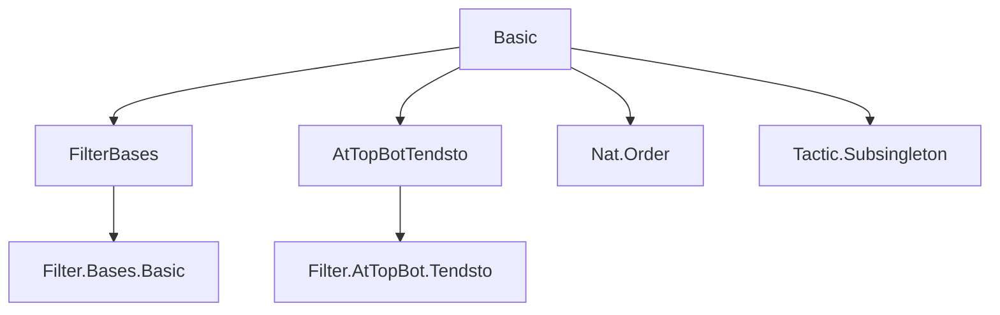
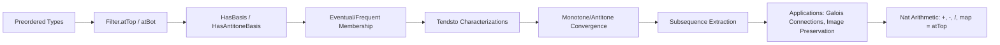
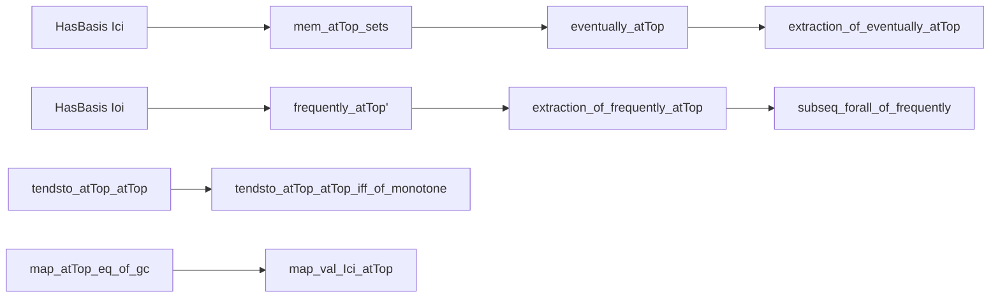

### Technical Brief: `Basic.lean` — Basic Results on `Filter.atTop` and `Filter.atBot`

---

#### **1. Key Definitions & Theorems**

| Name | Type / Signature | Purpose |
|------|------------------|---------|
| `atTop` | `Filter α` (for preordered `α`) | Filter of “eventually large” elements (upward-directed tails). |
| `atBot` | `Filter α` (for preordered `α`) | Filter of “eventually small” elements (downward-directed tails). |
| `HasBasis`, `HasAntitoneBasis` | `Filter α → Prop` | Characterizes a filter via a basis (resp. antitone basis) of sets. |
| `mem_atTop_sets` | `s ∈ atTop ↔ ∃ a, ∀ b ≥ a, b ∈ s` | Membership criterion for `atTop`-eventual sets. |
| `eventually_atTop` | `∀ᶠ x in atTop, p x ↔ ∃ a, ∀ b ≥ a, p b` | Universal quantification over `atTop`. |
| `frequently_atTop` | `∃ᶠ x in atTop, p x ↔ ∀ a, ∃ b ≥ a, p b` | Existential quantification over `atTop`. |
| `tendsto_atTop'` | `Tendsto f atTop l ↔ ∀ s ∈ l, ∃ a, ∀ b ≥ a, f b ∈ s` | Characterization of convergence to a filter along `atTop`. |
| `tendsto_atTop_atTop` | `Tendsto f atTop atTop ↔ ∀ b, ∃ i, ∀ a ≥ i, b ≤ f a` | Characterization of functions tending to $+\infty$. |
| `tendsto_atTop_atTop_iff_of_monotone` | For monotone `f`, `Tendsto f atTop atTop ↔ ∀ b, ∃ a, b ≤ f a` | Simplified criterion for monotone functions. |
| `map_atTop_eq_of_gc_preorder` | Under a Galois connection condition, `map f atTop = atTop` | Shows that certain monotone maps preserve `atTop`. |
| `extraction_of_frequently_atTop` | From `∃ᶠ n in atTop, P n`, extract a strictly increasing subsequence satisfying `P`. | Key tool for extracting subsequences in analysis. |
| `inf_map_atTop_neBot_iff` | `NeBot (F ⊓ map u atTop) ↔ ∀ U ∈ F, ∀ N, ∃ n ≥ N, u n ∈ U` | Links non-emptiness of intersection with “frequently in `U`” behavior. |

---

#### **2. Naming Conventions**

- **Prefixes**:
  - `atTop_`, `atBot_`: for lemmas about the respective filters.
  - `eventually_`, `frequently_`: for quantifier-based characterizations.
  - `tendsto_`: for convergence lemmas.
  - `map_`, `comap_`: for behavior under image/preimage of filters.
  - `extraction_`: for subsequence extraction lemmas.
  - `neBot_`: for non-emptiness of filters.
- **Suffixes**:
  - `_iff`: biconditional characterizations.
  - `_of_`: conditions (e.g., `monotone`, `antitone`, `gc` for Galois connection).
  - `_eq`: equality statements (e.g., `map_atTop_eq_of_gc`).
  - `_sets`, `_principal`: for set membership or principal filter cases.

---

#### **3. Tactic Stack**

Frequently used tactics:
- `simp_rw`, `simp`: for rewriting using lemmas like `mem_atTop_sets`, `eventually_atTop`.
- `exact`, `assumption`, `aesop`: for straightforward proofs and contradiction steps.
- `rcases`, `obtain`, `choose`: for existential elimination and choice.
- `rw`, `apply`, `refine`: for applying lemmas and constructing proofs.
- `filter_upwards`: for filtering-based reasoning in `tendsto` proofs.
- `antisymm`, `le_antisymm`: for proving equality of filters or sets.
- `subsingleton`: for trivial cases when type is subsingleton.
- `lia`, `linarith`: for arithmetic reasoning (especially in `nat`-based lemmas).
- `order_dual` tricks: many `atBot` lemmas are proved by dualizing `atTop` lemmas.

---

#### **4. Proof Logic**

- **Induction / Recursion**: Used in `extraction_forall_of_frequently` via `Nat.recOn`.
- **Case analysis on order properties**: `IsDirectedOrder`, `IsCodirectedOrder`, `NoMaxOrder`, `NoMinOrder`.
- **Order duality**: Many `atBot` lemmas are proved by dualizing to `atTop` on `αᵒᵈ`.
- **Basis-based reasoning**: Leverage `HasBasis` and `HasAntitoneBasis` to reduce to set-theoretic properties.
- **Galois connection arguments**: For `map_atTop_eq_of_gc_*`, use the connection to construct inverses and control images.
- **Subsequence extraction**: Based on `frequently_atTop'` and `eventually_atTop`, then apply `Nat.exists_strictMono_subsequence`.

---

#### **5. Imports**

- `Mathlib.Order.Filter.Bases.Basic`: Basis and antitone basis theory.
- `Mathlib.Order.Filter.AtTopBot.Tendsto`: Tendsto lemmas for `atTop`/`atBot`.
- `Mathlib.Order.Nat`: Natural numbers order theory.
- `Mathlib.Tactic.Subsingleton`: For handling subsingleton types.

---

#### **6. Mermaid Diagrams**

##### **Dependency Graph (Module-Level)**

##### **Overview of Theory Flow**

##### **Key Logical Dependencies**

---

#### **7. Summary**

This file provides foundational structural results for `Filter.atTop` and `Filter.atBot`, especially in the context of directed/codirected preorders. It establishes:
- Basis characterizations (`Ici`, `Ioi`, `Iic`, `Iio`).
- Membership and quantifier characterizations (`eventually`, `frequently`).
- Tendsto criteria for various target filters (`atTop`, `atBot`, principal).
- Subsequence extraction lemmas for analysis.
- Preservation results under monotone maps via Galois connections.
- Arithmetic lemmas for `ℕ` (addition, subtraction, division).

The proofs heavily rely on order-theoretic properties (directedness, no max/min), order duality, and basis-based reasoning — all standard in Lean’s `Mathlib` filter theory.

--- 

Let me know if you'd like a formalized dependency graph in `leanpkg` format or a summary of proof automation patterns.
