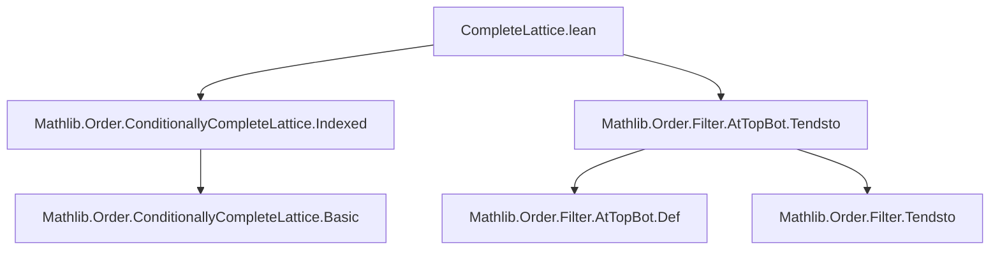
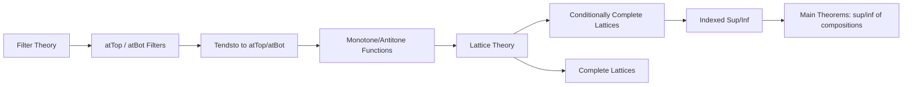

### Technical Brief: `CompleteLattice.lean`

---

#### **1. Key Definitions & Theorems**

| Name | Type / Signature | Purpose |
|------|------------------|---------|
| `Subsingleton.atTop_eq` | `(α) [Subsingleton α] [Preorder α] : atTop = ⊤` | In a subsingleton preorder, `atTop` is the trivial filter (top element). |
| `Subsingleton.atBot_eq` | `(α) [Subsingleton α] [Preorder α] : atBot = ⊤` | Dual of above; `atBot` also equals `⊤` in a subsingleton. |
| `Monotone.ciSup_comp_tendsto_atTop` | `[Preorder β] [ConditionallyCompleteLattice γ] {l : Filter α} [l.NeBot] {f : β → γ} (hf : Monotone f) (hb : BddAbove (range f)) {g : α → β} (hg : Tendsto g l atTop) : ⨆ a, f (g a) = ⨆ b, f b` | For monotone `f` with bounded range, composition with a function tending to `atTop` preserves supremum. |
| `Monotone.ciInf_comp_tendsto_atBot` | Dual of above for infimum and `atBot`. | |
| `Antitone.ciSup_comp_tendsto_atBot` | Same as monotone case but for antitone `f` and `atBot`. | |
| `Antitone.ciInf_comp_tendsto_atTop` | Dual of above. | |
| `Monotone.ciSup_comp_tendsto_atTop_of_linearOrder` | Same as first, but for `ConditionallyCompleteLinearOrder γ`, no boundedness assumption needed. | Uses completeness of linear order to drop boundedness. |
| `Monotone.iSup_comp_tendsto_atTop` | Same as above, but for `ConditionallyCompleteLattice γ` with `OrderTop γ`. | Boundedness automatic due to top element. |
| `Monotone.iInf_comp_tendsto_atBot`, `Antitone.iSup_comp_tendsto_atBot`, `Antitone.iInf_comp_tendsto_atTop` | Analogous variants for complete lattices. | |
| `Monotone.iUnion_comp_tendsto_atTop`, `Monotone.iInter_comp_tendsto_atBot`, etc. | Special cases where codomain is `Set γ`, using lattice operations on sets (union/intersection). | Connects filter behavior with set-theoretic unions/intersections. |

---

#### **2. Naming Conventions**

- **Prefixes**:
  - `ciSup_`, `ciInf_`: *conditionally indexed sup/inf* (used when codomain is conditionally complete).
  - `iSup_`, `iInf_`: *indexed sup/inf* (used when codomain is a complete lattice).
  - `upperBounds_`, `lowerBounds_`: related to boundedness conditions.
  - `comp_tendsto_`: composition with a function tending to a filter.
- **Suffixes**:
  - `_atTop`, `_atBot`: specify target filter (`atTop` or `atBot`).
  - `_of_linearOrder`: indicates stronger codomain assumption (`ConditionallyCompleteLinearOrder`).
- **Function properties**:
  - `Monotone`, `Antitone`: used as prefixes in theorem names.
  - `dual`, `dual_left`: used to derive antitone results from monotone ones via order duality.

---

#### **3. Tactic Stack**

- `refine`, `exact`, `rw`, `rwa`: core rewriting and construction.
- `csSup_of_not_bddAbove`, `csInf_upperBounds_range`: specialized lemmas for conditionally complete lattices.
- `Function.comp_def`: used to unfold composition.
- `nonempty_of_neBot`, `map`, `range_comp_subset_range`: set-theoretic reasoning.
- `top_unique`: to prove equality with `⊤`.
- `self_mem_Ici`: used in subsingleton arguments.

No heavy automation (e.g., `aesop`, `ring`, `simp_rw`) is used — proofs are mostly manual and rely on lattice-theoretic lemmas.

---

#### **4. Proof Logic**

- **Structure**:
  - Most proofs follow a pattern:
    1. Use `nonempty_of_neBot` to get nonemptiness of domain/filter.
    2. Reduce sup/inf expressions using lattice-theoretic characterizations (e.g., `csSup`, `csInf`, `iSup`, `iInf`).
    3. Apply lemmas like `upperBounds_range_comp_tendsto_atTop` to relate bounds of `f ∘ g` and `f`.
    4. Use boundedness assumptions (or completeness to derive them) to conclude equality.
  - For linear orders, proofs branch on boundedness (`if hb : BddAbove ... then ... else ...`) and use `csSup_of_not_bddAbove`.
  - Dual results are obtained via `hf.dual`, `hf.dual_left`, leveraging order duality (`αᵒᵈ`).

- **Induction**: Not used — all arguments are direct and rely on lattice properties and filter convergence.

---

#### **5. Imports**

- `Mathlib.Order.ConditionallyCompleteLattice.Indexed`: provides indexed sup/inf theory in conditionally complete lattices.
- `Mathlib.Order.Filter.AtTopBot.Tendsto`: provides lemmas about `Tendsto` to `atTop`/`atBot`.

These imports define the core order-theoretic and filter-theoretic infrastructure.

---

#### **6. Mermaid Diagrams**

##### **Dependency Graph (Module-Level)**



##### **Overview of Theoretical Flow**



##### **Proof Strategy Flow (Example: `Monotone.ciSup_comp_tendsto_atTop`)**

```mermaid
graph TD
  Start[Given: f monotone, g → atTop] --> CheckNonempty[Check nonemptiness]
  CheckNonempty --> ReduceSup[Reduce sup to csInf of upper bounds]
  ReduceSup --> ApplyLemma[Apply upperBounds_range_comp_tendsto_atTop]
  ApplyLemma --> UseBdd[BddAbove(range f) ⇒ equality]
  UseBdd --> End[Conclusion: ⨆ a, f(g a) = ⨆ b, f b]
```

---

This module formalizes a central theme in order theory: **how monotonicity and convergence to `atTop`/`atBot` interact with suprema/infima**, especially in (conditionally) complete lattices. It is foundational for analysis on filters (e.g., limits of sequences, nets) in ordered structures.
