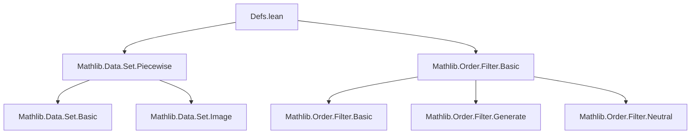

### Technical Brief: `Defs.lean` — Definition and Basic Properties of `Filter.atTop` and `Filter.atBot`

---

#### **1. Key Definitions & Theorems**

| Name | Type / Signature | Purpose |
|------|------------------|---------|
| `atTop` | `[Preorder α] → Filter α` | Represents the filter for limit $x \to +\infty$ on a preordered type; generated by principal filters of upper sets $[a, \infty) = \{b \mid a \le b\}$. |
| `atBot` | `[Preorder α] → Filter α` | Represents the filter for limit $x \to -\infty$; generated by lower sets $(-\infty, a] = \{b \mid b \le a\}$. |
| `mem_atTop` | `(a : α) → {b | a ≤ b} ∈ atTop` | Membership of the principal upper set in `atTop`. |
| `Ici_mem_atTop` | `(a : α) → Ici a ∈ atTop` | Immediate corollary: the closed interval $[a, \infty)$ is in `atTop`. |
| `Ioi_mem_atTop` | `[NoTopOrder α] → (x : α) → Ioi x ∈ atTop` | Open interval $(x, \infty)$ is in `atTop` if no top element exists. |
| `mem_atBot`, `Iic_mem_atBot`, `Iio_mem_atBot` | Analogous to above for `atBot`. | |
| `eventually_ge_atTop`, `eventually_le_atBot` | `(a : α) → ∀ᶠ x in atTop, a ≤ x` | Basic “eventual” properties: eventually all elements are ≥ (resp. ≤) any fixed bound. |
| `eventually_gt_atTop`, `eventually_lt_atBot` | `[NoTop/NoBotOrder α] → ∀ᶠ x, a < x` (resp. $x < a$) | Strict inequalities hold eventually under no-top/no-bot assumptions. |
| `eventually_ne_atTop`, `eventually_ne_atBot` | `[NoTop/NoBotOrder α] → ∀ᶠ x, x ≠ a` | Any fixed point is avoided eventually. |
| `IsTop.atTop_eq`, `IsBot.atBot_eq` | If $a$ is top/bottom, then `atTop = 𝓟 (Ici a)` (resp. `atBot = 𝓟 (Iic a)`) | Triviality when extremal elements exist. |
| `atTop_eq_generate_Ici` | `atTop = generate (range (Ici (α := α)))` | Alternative characterization as generated filter from all $Ici\ a$. |
| `Frequently.forall_exists_of_atTop` | $(\exists^\mathsf{F} x, p\ x) \land a \in α \implies \exists b \ge a,\ p\ b$ | Frequent membership implies existence beyond any bound. |
| `atTop_eq_generate_of_forall_exists_le` | If every $x$ has $y \in s$ with $x \le y$, then `atTop = generate (Ici '' s)` | Generalization of generating set characterization. |
| `atTop_eq_generate_of_not_bddAbove` | `[LinearOrder α] → ¬BddAbove s ⇒ atTop = generate (Ici '' s)` | Special case for unbounded-above sets in linear orders. |
| `Monotone.piecewise_eventually_eq_iUnion` | For monotone $s$, eventually $(s\ i).\text{piecewise}\ f\ g = (\bigcup_i s_i).\text{piecewise}\ f\ g$ | Piecewise definitions stabilize to union-wise definition eventually. |
| `Antitone.piecewise_eventually_eq_iInter` | Dually for antitone $s$, stabilization to intersection. | |

---

#### **2. Naming Conventions**

- **Prefixes**:
  - `mem_`: membership of generating sets in the filter.
  - `Ici_`, `Iic_`, `Ioi_`, `Iio_`: refer to closed/open intervals.
  - `eventually_`: statements about eventual behavior.
  - `Frequently.forall_exists_of_`: connection between frequent and unbounded existence.
- **Suffixes**:
  - `_atTop`, `_atBot`: disambiguate between the two filters.
  - `_eq_`: equality lemmas (e.g., `atTop_eq_generate_Ici`).
- **Module-level**:
  - `public import` used for exposing dependencies (`Piecewise`, `Filter.Basic`).
  - `assert_not_exists Finset`: ensures no `Finset`-related definitions interfere.

---

#### **3. Tactic Stack**

Frequently used tactics in proofs:

| Tactic | Usage |
|--------|-------|
| `rw` / `simp_rw` | Rewriting definitions (`mem_atTop`, `eventually_ge_atTop`, etc.). |
| `simp` | Simplifying set-theoretic expressions (`Ici`, `Iic`, `piecewise`, `compl`, etc.). |
| `exact` / `assumption` | Direct proof steps for membership or inequalities. |
| `apply` / `refine` | Constructing proofs with intermediate goals (e.g., `refine (eventually_ge_atTop i).mono ...`). |
| `rcases` / `cases` | Case analysis on existential or decidable propositions (`em`, `decidablePred`). |
| `convert` | Equational reasoning with congruence closure (e.g., `piecewise_compl`). |
| `filter_upwards` | Standard for proving `∀ᶠ` statements. |
| `mono` | Monotonicity of filters (e.g., using `eventually_gt_atTop` to deduce `eventually_ne`). |
| `antisymm` | Proving equality of filters via mutual inclusion. |
| `le_generate_iff`, `generate_eq_biInf` | Filter generation machinery. |

---

#### **4. Proof Logic**

- **Structure of proofs**:
  - Most lemmas follow a pattern:  
    `def → mem → eventually → strict → equality → stabilization`.
  - **Induction is not used**; proofs rely on:
    - Direct manipulation of filter bases (iInf over principal filters),
    - Set-theoretic reasoning (inclusion, complement, image),
    - Order-theoretic properties (monotonicity, boundedness, existence of elements beyond bounds).
  - **Key logical flow**:
    1. Show generating sets belong to the filter (`mem_atTop`, `Ici_mem_atTop`).
    2. Derive eventual properties from membership.
    3. Strengthen to strict inequalities using `NoTopOrder`/`NoBotOrder` assumptions.
    4. Prove equality of filters via `le_antisymm` and `generate` characterizations.
    5. Use duality (`αᵒᵈ`) for `atBot` results.

- **Duality**:
  - `atBot` is defined via `atTop` on the dual order (`αᵒᵈ`), and many theorems for `atBot` are derived by `..._of_atTop (α := αᵒᵈ) h _`.

---

#### **5. Imports**

| Import | Purpose |
|--------|---------|
| `Mathlib.Data.Set.Piecewise` | Provides `piecewise`, `Ici`, `Iic`, `Ioi`, `Iio`, and related lemmas. |
| `Mathlib.Order.Filter.Basic` | Defines filters, `eventually`, `Frequently`, `generate`, `principal`, `iInf`, and basic filter operations. |

---

#### **6. Mermaid Diagrams**

##### **Dependency Graph (Module-Level)**



##### **Overview of Theory Flow**

```mermaid
flowchart LR
  A[Preorder α] --> B[atTop / atBot Defs]
  B --> C[mem_atTop / mem_atBot]
  C --> D[eventually_ge_atTop / eventually_le_atBot]
  D --> E[eventually_gt_atTop / eventually_lt_atBot]
  E --> F[Equality characterizations]
  F --> G[Stabilization lemmas (piecewise)]
  G --> H[Applications in analysis/limits]
```

##### **Duality between `atTop` and `atBot`**


---

#### **7. Summary**

This file formalizes the foundational theory of “going to infinity” filters (`atTop`, `atBot`) on preordered types. It emphasizes:
- **Generality**: Works for arbitrary preorders (not just linear orders or types with extrema).
- **Duality**: `atBot` is defined and analyzed via order duality.
- **Stabilization**: Key application is showing piecewise-defined functions stabilize to global definitions over filters.

It serves as a base for later developments in analysis (e.g., limits of sequences, nets), measure theory (filtrations), and topology (filters on extended reals).
