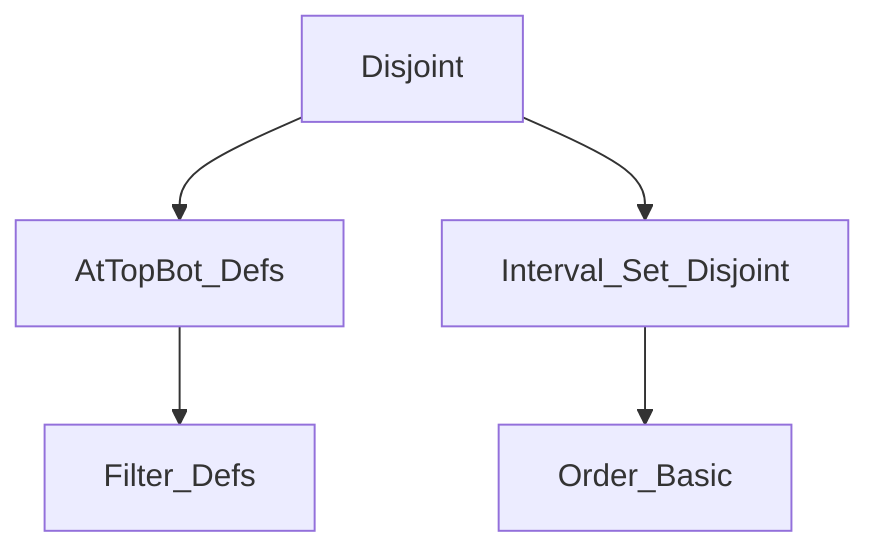
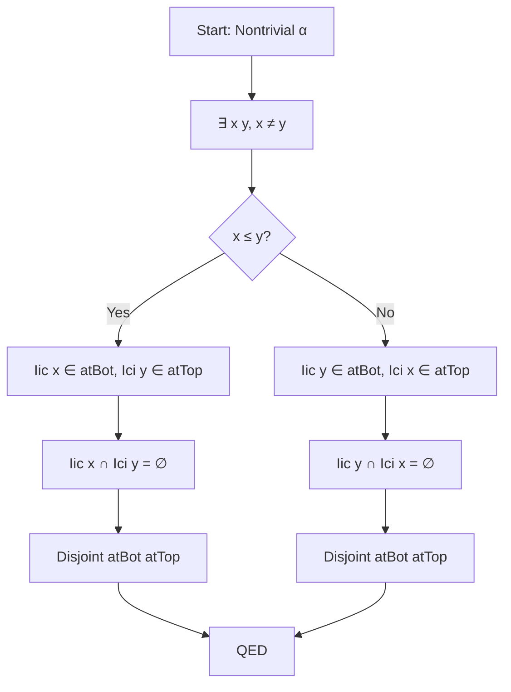

### Technical Brief: `Disjoint.lean` (Mathlib)

---

#### **1. Key Definitions & Theorems**

| Name | Type | Purpose |
|------|------|---------|
| `disjoint_atBot_principal_Ioi` | `∀ x : α, Disjoint atBot (𝓟 (Ioi x))` | Shows `atBot` is disjoint from the principal filter of the open upper interval $(x, ∞)$. |
| `disjoint_atTop_principal_Iio` | `∀ x : α, Disjoint atTop (𝓟 (Iio x))` | Dual of above: `atTop` disjoint from principal filter of $(−∞, x)$. |
| `disjoint_atTop_principal_Iic` | `∀ x : α, Disjoint atTop (𝓟 (Iic x))` | `atTop` disjoint from closed upper interval $(-∞, x]$, requires `NoTopOrder`. |
| `disjoint_atBot_principal_Ici` | `∀ x : α, Disjoint atBot (𝓟 (Ici x))` | `atBot` disjoint from $[x, ∞)$, requires `NoBotOrder`. |
| `disjoint_pure_atTop` | `∀ x : α, Disjoint (pure x) atTop` | A point filter `pure x` is disjoint from `atTop`, assuming no top element. |
| `disjoint_pure_atBot` | `∀ x : α, Disjoint (pure x) atBot` | Dual of above for `atBot`. |
| `disjoint_atBot_atTop` | `Disjoint atBot atTop` | The core result: `atBot` and `atTop` are disjoint in any nontrivial partially ordered type. |
| `disjoint_atTop_atBot` | `Disjoint atTop atBot` | Symmetric version of above. |

All theorems rely on `Disjoint s t`, defined as `s ⊓ t = ⊥`, i.e., their meet is the bottom filter (empty set in the filter lattice).

---

#### **2. Naming Conventions**

- **Prefixes**:
  - `disjoint_`: indicates a disjointness theorem.
  - `atBot`, `atTop`: refer to the filter of neighborhoods of “bottom” and “top” infinities.
  - `principal_`: refers to principal filters (`𝓟 s`).
  - `pure_`: refers to point filters (`pure x`).
- **Suffixes**:
  - `_Ioi`, `_Iio`, `_Iic`, `_Ici`: standard interval notation:
    - `Ioi x = (x, ∞)`, `Iio x = (−∞, x)`, `Iic x = (−∞, x]`, `Ici x = [x, ∞)`.
- **Duality**:
  - Theorems for `atTop` often use `αᵒᵈ` (opposite order) to reuse `atBot` results.
  - E.g., `disjoint_atTop_principal_Iio := @disjoint_atBot_principal_Ioi αᵒᵈ _ _`.

---

#### **3. Tactic Stack**

- **Core tactics**:
  - `disjoint_of_disjoint_of_mem`: main workhorse for proving disjointness via containment of disjoint sets.
  - `mono_right`, `mono_left`: monotonicity of filter meet.
  - `symm`: to flip `Disjoint` arguments.
  - `self_mem_Iic`, `mem_pure`, `mem_principal_self`: membership lemmas.
  - `le_principal_iff.2`: to prove inclusion into principal filter.
- **Order-specific**:
  - `Iic_disjoint_Ioi`, `Iic_disjoint_Ici`: interval disjointness lemmas.
  - `Iic_mem_atBot`, `Ioi_mem_atTop`, `Ici_mem_atTop`, `Iic_mem_atBot`: interval membership in `atBot`/`atTop`.
- **Proof automation**:
  - `rcases exists_pair_ne α with ⟨x, y, hne⟩`: extracts two distinct elements from `Nontrivial α`.
  - `by_cases hle : x ≤ y`: case analysis on order relation.
  - `.not_ge`, `.lt_of_ne`: order reasoning.

---

#### **4. Proof Logic**

- **Structure**:
  - Most proofs follow a pattern:  
    `disjoint_of_disjoint_of_mem` + known disjointness of intervals + membership in respective filters.
  - For `disjoint_atBot_atTop`, the proof uses:
    1. `Nontrivial α` to get two distinct points $x, y$.
    2. Case analysis on $x ≤ y$.
    3. In each case, pick appropriate intervals (e.g., $Iic(x)$ and $Ici(y)$) that are disjoint and belong to `atBot` and `atTop`, respectively.
- **Duality**:
  - Many theorems are proven by order duality (`αᵒᵈ`) to avoid repetition.
- **NoTop/NoBot assumptions**:
  - Required to ensure that intervals like $Ioi(x)$ or $Ici(x)$ are eventually in `atTop`/`atBot`.

---

#### **5. Imports**

- `Mathlib.Order.Filter.AtTopBot.Defs`: definitions of `atTop`, `atBot`, and related filters.
- `Mathlib.Order.Interval.Set.Disjoint`: interval disjointness lemmas (`Iic_disjoint_Ioi`, etc.).

> **Scope**: This module formalizes foundational disjointness properties of “ends” of ordered types, especially relevant for convergence at infinity, limits, and topology on ordered spaces.

---

#### **8. Mermaid Diagrams**

##### **Dependency Graph (Module-Level)**



##### **Theoretical Overview (This File)**

```mermaid
flowchart LR
  A[Preorder α] --> B[Disjointness of atBot & atTop with principal filters]
  A --> C[NoTop/NoBot assumptions]
  C --> D[Disjointness of point filters & atTop/atBot]
  A & C --> E[Disjointness of atBot & atTop (main result)]
  E --> F[Applications: limits, convergence, topology]
```

##### **Proof Strategy Flow (for `disjoint_atBot_atTop`)**



--- 

Let me know if you'd like a formalized dependency graph of the entire `Mathlib.Order` hierarchy or a visualization of how `Disjoint` interacts with `Filter` operations like `map`, `bind`, etc.
