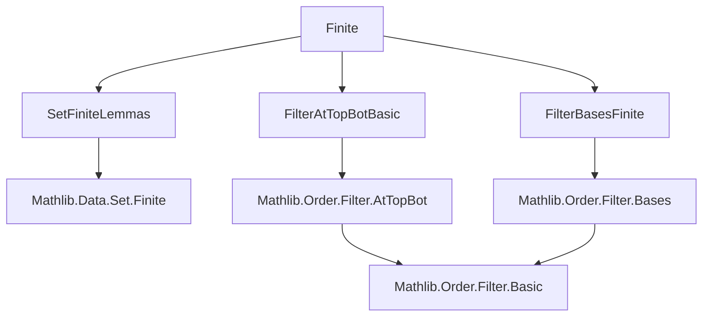
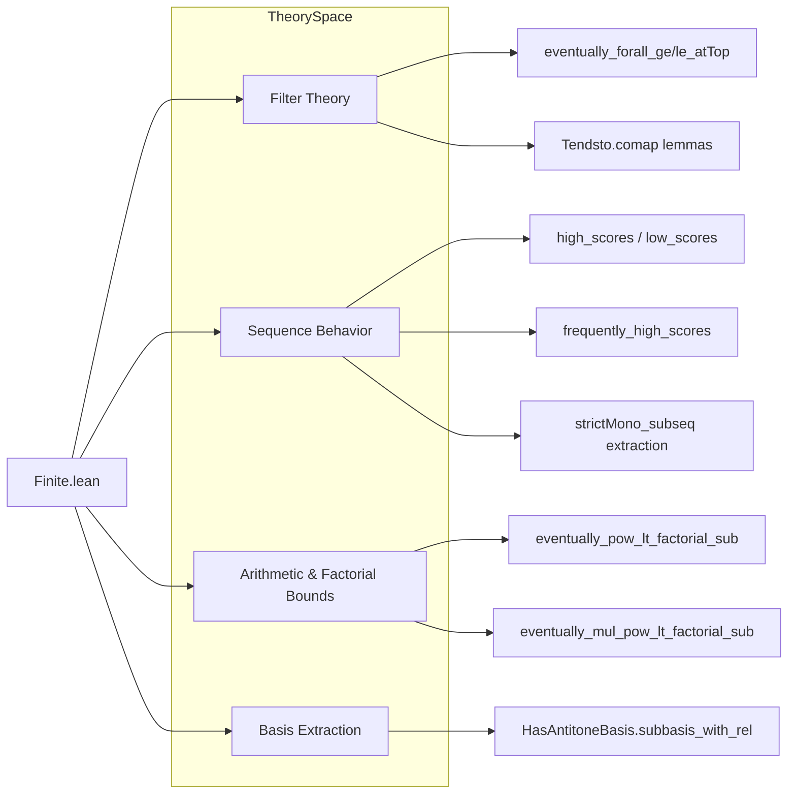

### Technical Brief: `Finite.lean` — Finiteness and Filters `atTop` / `atBot`

---

#### **1. Key Definitions & Theorems**

| Name | Type / Signature | Purpose |
|------|------------------|---------|
| `eventually_forall_ge_atTop` | `[Preorder α] → (p : α → Prop) → (∀ᶠ x in atTop, ∀ y, x ≤ y → p y) ↔ ∀ᶠ x in atTop, p x` | Equates “eventually all future values satisfy `p`” with “eventually `p` holds”, using finite basis of `atTop`. |
| `eventually_forall_le_atBot` | `[Preorder α] → (p : α → Prop) → (∀ᶠ x in atBot, ∀ y, y ≤ x → p y) ↔ ∀ᶠ x in atBot, p x` | Dual of `eventually_forall_ge_atTop` for `atBot`, via order dual. |
| `Tendsto.eventually_forall_ge_atTop` | `[Preorder β] → Tendsto f l atTop → (∀ᶠ x in atTop, p x) → ∀ᶠ x in l, ∀ y, f x ≤ y → p y` | Pulls back “eventually all future values satisfy `p`” along a tendsto map. |
| `Tendsto.eventually_forall_le_atBot` | `[Preorder β] → Tendsto f l atBot → (∀ᶠ x in atBot, p x) → ∀ᶠ x in l, ∀ y, y ≤ f x → p y` | Dual of previous for `atBot`. |
| `high_scores` | `[LinearOrder β] [NoMaxOrder β] → Tendsto u atTop atTop → ∀ N, ∃ n ≥ N, ∀ k < n, u k < u n` | For unbounded-above sequences, after any index `N`, there is a *new record high* at `n`. |
| `low_scores` | `[LinearOrder β] [NoMinOrder β] → Tendsto u atTop atBot → ∀ N, ∃ n ≥ N, ∀ k < n, u n < u k` | Dual of `high_scores` for unbounded-below sequences. |
| `frequently_high_scores` | `[LinearOrder β] [NoMaxOrder β] → Tendsto u atTop atTop → ∃ᶠ n in atTop, ∀ k < n, u k < u n` | Records are hit *frequently* (infinitely often). |
| `frequently_low_scores` | `[LinearOrder β] [NoMinOrder β] → Tendsto u atTop atBot → ∃ᶠ n in atTop, ∀ n < k, u n < u k` | Dual of `frequently_high_scores`. |
| `strictMono_subseq_of_tendsto_atTop` | `[LinearOrder β] [NoMaxOrder β] → Tendsto u atTop atTop → ∃ φ, StrictMono φ ∧ StrictMono (u ∘ φ)` | Extracts a strictly increasing subsequence of a sequence tending to `atTop`. |
| `strictMono_subseq_of_id_le` | `(u : ℕ → ℕ) → (∀ n, n ≤ u n) → ∃ φ, StrictMono φ ∧ StrictMono (u ∘ φ)` | Special case: if `u(n) ≥ n`, then `u` has a strictly increasing subsequence. |
| `Eventually.atTop_of_arithmetic` | `(p : ℕ → Prop) → n ≠ 0 → (∀ k < n, ∀ᶠ a in atTop, p (n * a + k)) → ∀ᶠ a in atTop, p a` | If `p` holds eventually on each arithmetic progression mod `n`, then `p` holds eventually everywhere. |
| `HasAntitoneBasis.subbasis_with_rel` | `f.HasAntitoneBasis s → (∀ m, ∀ᶠ n in atTop, r m n) → ∃ φ, StrictMono φ ∧ (∀ m < n, r (φ m) (φ n)) ∧ f.HasAntitoneBasis (s ∘ φ)` | Refines an antitone basis by extracting a subsequence satisfying a pairwise relation `r`. |
| `eventually_pow_lt_factorial_sub` | `(c d : ℕ) → ∀ᶠ n in atTop, c ^ n < (n - d)!` | Exponential growth is dominated by factorial (shifted). |
| `eventually_mul_pow_lt_factorial_sub` | `(a c d : ℕ) → ∀ᶠ n in atTop, a * c ^ n < (n - d)!` | Multiplying exponential by constant still dominated by factorial. |

---

#### **2. Naming Conventions**

- **`eventually_*_atTop` / `eventually_*_atBot`**: Properties about filters `atTop` / `atBot`.
- **`*_scores`**: Record-breaking behavior of sequences (high/low scores).
- **`frequently_*`**: Infinitely often occurrences.
- **`strictMono_subseq_*`**: Extraction of strictly monotone subsequences.
- **`*_of_*`**: Implication-style theorems (e.g., `atTop_of_arithmetic`).
- **`*_with_*`**: Refinement/selection lemmas (e.g., `subbasis_with_rel`).
- **`*_sub`**: Subtraction in factorial bounds (e.g., `(n - d)!`).
- **Prefix `eventually_`**: Used for universal eventual quantification (`∀ᶠ`).
- **Prefix `frequently_`**: Used for existential eventual quantification (`∃ᶠ`).

---

#### **3. Tactic Stack**

| Tactic | Usage Frequency | Purpose |
|--------|-----------------|---------|
| `rw` | High | Rewriting definitions (`eventually_atTop`, `eventually_gt_atTop`, etc.). |
| `simp` / `simp only` | High | Simplifying `eventually`, `mem_iInf`, `Ici`, `Iio`, `Finset.sup`, etc. |
| `exact` / `refine` | High | Constructing proofs with minimal backtracking. |
| `rcases` / `obtain` | High | Extracting witnesses from existential statements (e.g., `exists_max_image`, `findX`). |
| `push_neg` | Medium | Negating universal quantifiers in negated goals. |
| `filter_upwards` | Medium | Proving `∀ᶠ` statements by upward closure. |
| `convert_to` | Medium | Aligning goals for congruence (used in factorial bound proofs). |
| `lia` / `linarith` | Medium | Linear arithmetic over `ℕ` (e.g., bounding indices). |
| `apply` / `exact` | Medium | Applying lemmas like `le_trans`, `mul_lt_mul_of_le_of_lt`. |
| `congr` | Low | Congruence steps (e.g., `congr 1`). |
| `eventually_all_finite` | Low | Handling finite intersections in `atTop`. |

---

#### **4. Proof Logic**

- **Induction / Well-foundedness**: Used implicitly via `exists_max_image` (finite max over bounded set).
- **Case analysis on order**: `le_total`, `le_or_gt`, `eq_zero_or_pos`.
- **Extraction via `findX` / `extraction_of_frequently_atTop`**: Constructive selection of indices satisfying record properties.
- **Filter basis reasoning**: Exploiting `HasBasis.iInf_principal_finite` and `eventually_iff` to reduce to finite intersections.
- **Order duality**: `αᵒᵈ` used to dualize `atTop` ↔ `atBot` and `ge` ↔ `le`.
- **Arithmetic decomposition**: `div_add_mod` to reduce to residue classes mod `n`.
- **Factorial domination**: Inductive or combinatorial bounding via `factorial_mul_pow_le_factorial`, `pow_lt_pow_left`, etc.

---

#### **5. Imports**

| Module | Role |
|--------|------|
| `Mathlib.Data.Set.Finite.Lemmas` | Finite set theory (e.g., `finite_le_nat`, `exists_max_image`). |
| `Mathlib.Order.Filter.Bases.Finite` | Filter bases with finite index sets (`HasBasis.iInf_principal_finite`). |
| `Mathlib.Order.Filter.AtTopBot.Basic` | Definitions and basic lemmas for `atTop`, `atBot`, `tendsto`, `eventually`, `frequently`. |

---

#### **6. Mermaid Diagrams**

##### **Dependency Graph (Module-Level)**

##### **Overview of File Structure**

---

#### **7. Domain-Specific AI Agent Notes**

- **Focus Areas**: The file bridges *order theory*, *filter theory*, and *combinatorics on ℕ*.
- **Common Patterns**:
  - Use of `eventually`/`frequently` to reason about asymptotic behavior.
  - Extraction of monotone subsequences from divergent sequences.
  - Factorial vs. exponential growth comparisons.
- **Key Proof Techniques**:
  - Finite maxima (via `finite_le_nat`).
  - Order dualization (`αᵒᵈ`) to avoid duplication.
  - Arithmetic decomposition (`div_add_mod`) for modular eventual properties.
- **Automation Potential**:
  - `eventually_*` lemmas are highly automatable via `aesop` + `simp`.
  - `strictMono_subseq_of_tendsto_atTop` pattern suggests a reusable extraction tactic.

--- 

Let me know if you'd like a **Lean 4 tactic sketch** for automating `high_scores`-style arguments or a **formalized metatheorem** for factorial domination.
