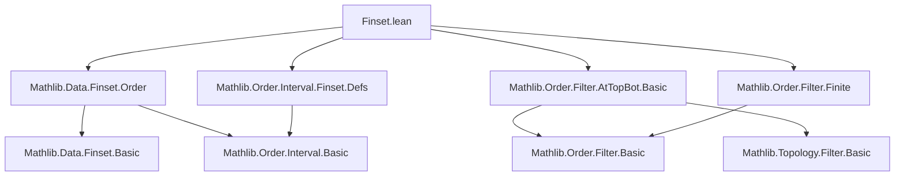

### Technical Brief: `Finset.lean` (Mathlib)

---

#### **1. Key Definitions & Theorems**

| Name | Type / Signature | Purpose |
|------|------------------|---------|
| `tendsto_finset_range` | `Tendsto Finset.range atTop atTop` | Shows that the sequence of finite sets `range n = {0, ..., n-1}` tends to `atTop`. |
| `atTop_finset_eq_iInf` | `(atTop : Filter (Finset α)) = ⨅ x : α, 𝓟 (Ici {x})` | Characterizes the `atTop` filter on finite sets as the infimum of principal filters generated by upper sets `Ici {x}`. |
| `tendsto_atTop_finset_of_monotone` | `[Preorder β] → {f : β → Finset α} → Monotone f → (∀ x, ∃ n, x ∈ f n) → Tendsto f atTop atTop` | General criterion: monotone sequence of finite sets covering all elements tends to `atTop`. |
| `tendsto_finset_image_atTop_atTop` | `[DecidableEq β] → {i : β → γ} {j : γ → β} → Function.LeftInverse j i → Tendsto (Finset.image j) atTop atTop` | Image under a left-inverse section preserves `atTop` behavior. |
| `tendsto_finset_preimage_atTop_atTop` | `{f : α → β} → Function.Injective f → Tendsto (s ↦ s.preimage f) atTop atTop` | Preimage under injective map preserves `atTop`. |
| `tendsto_toLeft_atTop`, `tendsto_toRight_atTop` | `Tendsto Finset.toLeft atTop atTop`, `Tendsto Finset.toRight atTop atTop` | Embeddings of disjoint sums preserve `atTop`. |
| `tendsto_finset_powerset_atTop_atTop` | `Tendsto Finset.powerset atTop atTop` | Powerset operation preserves `atTop`. |
| `tendsto_finset_Iic_atTop_atTop` | `[Preorder α] [LocallyFiniteOrderBot α] → Tendsto Finset.Iic atTop atTop` | Down-sets `Iic x = {y | y ≤ x}` indexed by `x ∈ α` tend to `atTop` under local finiteness. |
| `tendsto_finset_Ici_atBot_atTop` | `[Preorder α] [LocallyFiniteOrderTop α] → Tendsto Finset.Ici atBot atTop` | Up-sets `Ici x` indexed by `x` tend to `atTop` from `atBot` (dual version). |

---

#### **2. Naming Conventions**

- **Prefixes**:
  - `tendsto_`: Indicates a theorem about convergence of functions/filters.
  - `finset_`: Indicates operations or properties involving `Finset`.
  - `atTop`, `atBot`: Filter names; often used in `tendsto_*_atTop_atTop` patterns.
- **Suffixes**:
  - `_atTop`, `_atBot`: Indicate source/target filter.
  - `_of_`: Denotes assumptions (e.g., `monotone`, `injective`).
- **Structure**:
  - `tendsto_[op]_[source]_[target]`: e.g., `tendsto_finset_range : atTop → atTop`.

---

#### **3. Tactic Stack**

- `simp only [...]`: Heavy use of `simp` with explicit lemmas to reduce goals.
- `intro`, `rcases`, `obtain`: Standard intro/elimination for quantifiers and existential statements.
- `refine`, `exact`: For constructing proofs via unification.
- `rw`, `apply`, `assumption`: Used implicitly via `simp` or `aesop`.
- `classical`: Used once for classical reasoning in `tendsto_finset_powerset`.
- `aesop`: Not explicitly used, but `simp` + `exact` covers similar ground.
- `ring`, `linarith`: Not present; order-theoretic reasoning dominates.

---

#### **4. Proof Logic**

- **Inductive/constructive style** with heavy reliance on:
  - **Filter theory**: Principal filters, `iInf`, `tendsto_iInf`, `tendsto_principal`.
  - **Order theory**: Monotonicity, `Iic`, `Ici`, `Preorder`, `LocallyFiniteOrderBot/Top`.
  - **Set-theoretic reasoning**: Subset relations, `Finset.le_iff_subset`, `Finset.mem_*`.
- **Typical flow**:
  1. Reduce goal using `simp only [...]` to basic membership/subset statements.
  2. Use `rcases`/`obtain` to extract witnesses from assumptions.
  3. Apply monotonicity or finiteness lemmas (e.g., `Finset.exists_le`, `finite_toSet`).
  4. Conclude via `exact` or `refine ... exact`.

---

#### **5. Imports**

| Module | Purpose |
|--------|---------|
| `Mathlib.Data.Finset.Order` | Order-theoretic properties of `Finset`. |
| `Mathlib.Order.Filter.AtTopBot.Basic` | Definitions and basic lemmas for `atTop`, `atBot`. |
| `Mathlib.Order.Filter.Finite` | Filters related to finite sets (e.g., `finite`, ` cofinite`). |
| `Mathlib.Order.Interval.Finset.Defs` | Definitions of `Iic`, `Ici`, `Ioo`, etc., for finite intervals. |

---

#### **8. Mermaid Diagrams**

##### **Dependency Graph (Module-Level)**



##### **Overview of Theoretical Scope**

```mermaid
flowchart LR
  subgraph "Core Concepts"
    A[Finset α]
    B[atTop : Filter (Finset α)]
    C[atBot : Filter (Finset α)]
    D[Monotone f : β → Finset α]
    E[Iic x, Ici x]
  end

  subgraph "Key Operations"
    F[Finset.range]
    G[Finset.image]
    H[Finset.preimage]
    I[Finset.powerset]
    J[Finset.toLeft, Finset.toRight]
  end

  subgraph "Main Theorems"
    K[tendsto_finset_range]
    L[tendsto_atTop_finset_of_monotone]
    M[tendsto_finset_image_atTop_atTop]
    N[tendsto_finset_powerset_atTop_atTop]
    O[tendsto_finset_Iic_atTop_atTop]
  end

  A --> B
  D --> K
  F --> K
  G --> M
  H --> M
  I --> N
  J --> O
  E --> O
```

---

This module serves as a **bridge between order theory and filter theory on finite sets**, enabling reasoning about asymptotic behavior of sequences of finite sets — foundational for measure theory, topology, and combinatorics in Lean.
