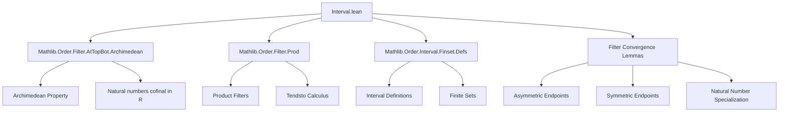
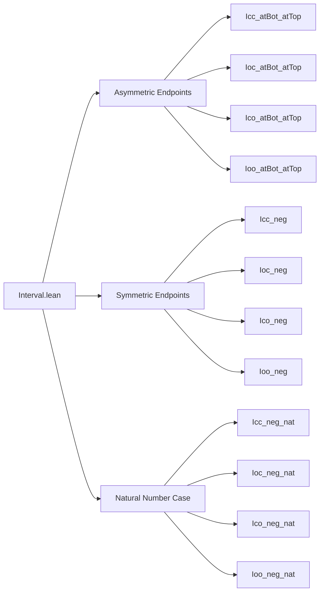

### Technical Brief: `Interval.lean`

---

#### **1. Key Definitions & Theorems**

| Name | Type | Purpose |
|------|------|---------|
| `Icc`, `Ioc`, `Ico`, `Ioo` | `α → α → Finset α` | Standard interval constructors: closed-closed, open-closed, closed-open, open-open. Defined via `Finset.Defs`. |
| `tendsto_Icc_atBot_prod_atTop` | `Tendsto (fun p : α × α ↦ Icc p.1 p.2) (atBot ×ˢ atTop) atTop` | As endpoints go to $-\infty$ and $+\infty$, the interval $[a,b]$ eventually contains any fixed finite set. |
| `tendsto_Ioc_atBot_prod_atTop` | `Tendsto (fun p : α × α ↦ Ioc p.1 p.2) (atBot ×ˢ atTop) atTop` | Same as above for half-open intervals $(a,b]$, requiring `NoBotOrder`. |
| `tendsto_Ico_atBot_prod_atTop` | `Tendsto (fun p : α × α ↦ Ico p.1 p.2) (atBot ×ˢ atTop) atTop` | Same for $[a,b)$, requiring `NoTopOrder`. |
| `tendsto_Ioo_atBot_prod_atTop` | `Tendsto (fun p : α × α ↦ Ioo p.1 p.2) (atBot ×ˢ atTop) atTop` | Same for open intervals $(a,b)$, requiring both `NoBotOrder` and `NoTopOrder`. |
| `tendsto_Icc_neg_atTop_atTop` | `Tendsto (fun a : α ↦ Icc (-a) a) atTop atTop` | Symmetric intervals $[-a,a]$ grow to cover all finite sets as $a \to +\infty$. |
| `tendsto_Ioc_neg_atTop_atTop`, `tendsto_Ico_neg_atTop_atTop`, `tendsto_Ioo_neg_atTop_atTop` | Analogous to above | Symmetric variants for other interval types. |
| `tendsto_Icc_neg`, `tendsto_Ioc_neg`, `tendsto_Ico_neg`, `tendsto_Ioo_neg` | `Tendsto (fun n : ℕ ↦ Ixx (-n : R) n) atTop atTop` | Specialization to natural numbers in an Archimedean ordered ring $R$. |

---

#### **2. Naming Conventions**

- **Prefixes**:
  - `tendsto_`: Indicates a filter convergence statement.
  - `Ixx_`: Interval type (`cc`, `oc`, `co`, `oo`) — `c` = closed, `o` = open.
  - `neg_`: Symmetric intervals centered at 0.
  - `atBot_prod_atTop`: Asymmetric endpoints going to $-\infty$ and $+\infty$.
  - `atTop_atTop`: Symmetric growth $[-a,a]$ as $a \to +\infty$.
- **Suffixes**:
  - `_atBot_prod_atTop`: Convergence w.r.t. product filter `atBot ×ˢ atTop`.
  - `_atTop`: Convergence w.r.t. `atTop` on codomain.

---

#### **3. Tactic Stack**

- `simpa [...] using ...`: Core proof pattern.
  - `← coe_subset`: Converts `↑s ⊆ ↑t` to `s ⊆ t`.
  - `Set.subset_def`: Unfolds subset definition.
  - `-eventually_and`: Removes unnecessary `eventually` conjunctions.
- `tendsto_*` lemmas are composed using:
  - `.comp`: Composition of `Tendsto`.
  - `prodMk`: Product of two `Tendsto` functions.
  - `tendsto_neg_atTop_atBot`: Known lemma for negation reversing order.
  - `tendsto_id`: Identity map tends to itself.
  - `tendsto_natCast_atTop_atTop`: Natural numbers embed cofinally in Archimedean ordered rings.

---

#### **4. Proof Logic**

- **Structure**: All proofs follow a uniform pattern:
  1. Reduce to showing: for all `i : α`, eventually `i ∈ Ixx p.1 p.2`.
  2. Use `tendsto_atTop` ↔ `∀ i, eventually (i ∈ Ixx p.1 p.2)`.
  3. Apply `eventually_le_atBot` / `eventually_lt_atBot` and `eventually_ge_atTop` / `eventually_gt_atTop` to bound endpoints.
  4. Combine using `prod_mk` for product filters.
  5. For symmetric cases, precompose with `a ↦ (-a, a)` using `tendsto_neg_atTop_atBot.prodMk tendsto_id`.
  6. For `ℕ`-indexed cases, compose with `tendsto_natCast_atTop_atTop`.

- **Induction**: Not used — all proofs are direct filter-theoretic arguments.

---

#### **5. Imports**

| Module | Purpose |
|--------|---------|
| `Mathlib.Order.Filter.AtTopBot.Archimedean` | Provides `tendsto_natCast_atTop_atTop`, Archimedean properties. |
| `Mathlib.Order.Filter.Prod` | Product filters (`×ˢ`), basic `Tendsto` calculus. |
| `Mathlib.Order.Interval.Finset.Defs` | Definitions of `Icc`, `Ioc`, `Ico`, `Ioo` as finite sets. |

---

#### **6. Theory Scope & Dependencies**

- **Domain**: Order theory + filter theory + finite sets.
- **Context**: Locally finite preorders (so intervals are finite), extended to additive ordered groups/rings for symmetry and Archimedean behavior.
- **Goal**: Understand asymptotic behavior of finite intervals under filters — foundational for measure theory, integration, or density arguments.

---

#### **7. Mermaid Diagrams**

##### **Dependency Graph**

##### **Overview of File Structure**

---

#### **8. Summary**

This file formalizes how finite intervals grow to cover all elements as their endpoints tend to infinity (asymmetrically or symmetrically), using filter-theoretic language. It leverages:
- `LocallyFiniteOrder` to ensure intervals are finite,
- `NoBotOrder`/`NoTopOrder` for strict inequalities,
- `Archimedean` for embedding $\mathbb{N}$ cofinally.

The structure is clean and modular, with proofs built from standard filter lemmas and composition rules — a good example of Lean’s strength in asymptotic analysis.
