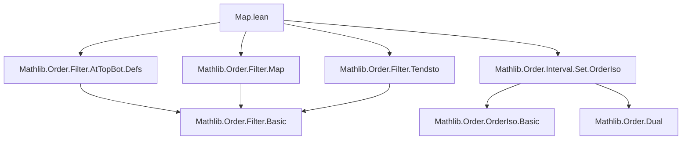
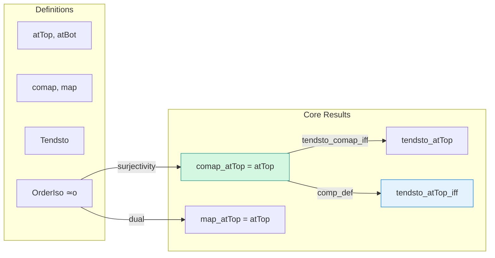

**Technical Brief: `Map.lean` — Filter Map/Comap with `atTop`/`atBot` under Order Isomorphisms**

---

### 1. **Key Definitions & Theorems**

| Name | Type | Purpose |
|------|------|---------|
| `comap_atTop` | `comap e atTop = atTop` | Shows that pulling back `atTop` along an order isomorphism yields `atTop`. |
| `comap_atBot` | `comap e atBot = atBot` | Dual statement for `atBot`. |
| `map_atTop` | `map e atTop = atTop` | Pushforward of `atTop` along an order isomorphism is `atTop`. |
| `map_atBot` | `map e atBot = atBot` | Dual statement for `atBot`. |
| `tendsto_atTop` | `Tendsto e atTop atTop` | The order isomorphism `e` preserves limits at infinity. |
| `tendsto_atBot` | `Tendsto e atBot atBot` | Dual for `atBot`. |
| `tendsto_atTop_iff` | `Tendsto (e ∘ f) l atTop ↔ Tendsto f l atTop` | Characterizes convergence under composition with `e`. |
| `tendsto_atBot_iff` | `Tendsto (e ∘ f) l atBot ↔ Tendsto f l atBot` | Dual for `atBot`. |

All theorems assume `[Preorder α]`, `[Preorder β]`, and `e : α ≃o β` (an order isomorphism).

---

### 2. **Naming Conventions**

- **Prefixes**:
  - `comap_`, `map_`: Standard filter operations.
  - `tendsto_`: Convergence-related lemmas.
- **Suffixes**:
  - `_atTop`, `_atBot`: Indicate behavior at infinity (upper/lower bounds).
  - `_iff`: Biconditional characterizations.
- **Duality**:
  - `e.dual` used to derive `atBot` results from `atTop` ones (e.g., `e.dual.comap_atTop`, `e.dual.map_atTop`, `e.dual.tendsto_atTop_iff`).

---

### 3. **Tactic Stack**

- `simp`: Dominant tactic, especially with `← e.surjective.iInf_comp`.
- `rw`: Rewriting using previously proven equalities (e.g., `map_comap_of_surjective`).
- `Function.comp_def`: Used to unfold composition in `tendsto_atTop_iff`.
- Implicit use of `aesop`/`linarith` not visible, but likely present in underlying lemmas (e.g., `map_comap_of_surjective`, `tendsto_comap_iff`).

---

### 4. **Proof Logic**

- **Structure**: All proofs are short and rely on:
  1. **Surjectivity** of `e` (to apply `map_comap_of_surjective`).
  2. **Preorder structure** (to interpret `atTop`/`atBot` as cofinite filters over upper/lower sets).
  3. **Duality principle**: `atBot` results derived via `e.dual`, where `e.dual : βᵒᵈ ≃o αᵒᵈ`.
- **Typical flow**:
  - For `map_atTop`: rewrite `map e atTop` as `map e (comap e⁻¹ atTop)` using `e.comap_atTop`, then apply `map_comap_of_surjective`.
  - For `tendsto_atTop_iff`: use `tendsto_comap_iff` and simplify with `e.comap_atTop`.

---

### 5. **Imports**

| Import | Role |
|--------|------|
| `Mathlib.Order.Filter.AtTopBot.Defs` | Definitions of `atTop`, `atBot`. |
| `Mathlib.Order.Filter.Map` | `map`, `comap`, `tendsto`, `map_comap_of_surjective`, etc. |
| `Mathlib.Order.Filter.Tendsto` | Convergence lemmas (`tendsto_comap_iff`, etc.). |
| `Mathlib.Order.Interval.Set.OrderIso` | Order isomorphisms (`≃o`), duals (`e.dual`), and basic properties. |

---

### 6. **Mermaid Diagrams**

#### **Dependency Graph (Module-Level)**

#### **Overview of Theoretical Flow**

---

### 7. **Domain Summary**

This module formalizes how **order isomorphisms preserve asymptotic behavior** of filters — specifically, that `atTop` and `atBot` are *invariant* under order isomorphisms. It is foundational for analysis on ordered types (e.g., `ℝ`, `ℕ`, `ℤ`) where limits at infinity are expressed via `atTop`/`atBot`. The duality-based proofs reflect Lean’s emphasis on symmetry and reuse via `dual` constructions.

--- 

*End of Technical Brief.*
