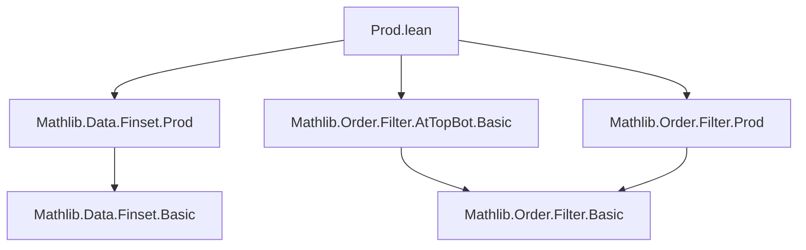

### Technical Brief: `Prod.lean` — Filter Products on `atTop` and `atBot`

---

#### **1. Key Definitions & Theorems**

| Name | Type / Signature | Purpose |
|------|------------------|---------|
| `prod_atTop_atTop_eq` | `[Preorder α] [Preorder β] ⇒ (atTop : Filter α) ×ˢ (atTop : Filter β) = (atTop : Filter (α × β))` | Shows product of `atTop` filters equals `atTop` on product type. |
| `prod_atBot_atBot_eq` | `[Preorder α] [Preorder β] ⇒ (atBot : Filter α) ×ˢ (atBot : Filter β) = (atBot : Filter (α × β))` | Dual of above for `atBot`, via order dual. |
| `prod_map_atTop_eq` | `[Preorder β₁] [Preorder β₂] ⇒ map u₁ atTop ×ˢ map u₂ atTop = map (Prod.map u₁ u₂) atTop` | Commutes product of mapped filters with mapping of product. |
| `prod_map_atBot_eq` | `[Preorder β₁] [Preorder β₂] ⇒ map u₁ atBot ×ˢ map u₂ atBot = map (Prod.map u₁ u₂) atBot` | Dual version for `atBot`. |
| `tendsto_atTop_diagonal` | `[Preorder α] ⇒ Tendsto (λ a ↦ (a, a)) atTop atTop` | Diagonal map is `atTop`-continuous. |
| `tendsto_atBot_diagonal` | `[Preorder α] ⇒ Tendsto (λ a ↦ (a, a)) atBot atBot` | Diagonal map is `atBot`-continuous. |
| `Tendsto.prod_map_prod_atTop` | `[Preorder γ] ⇒ Tendsto f F atTop → Tendsto g G atTop → Tendsto (Prod.map f g) (F ×ˢ G) atTop` | Product of convergent maps converges under product filter. |
| `Tendsto.prod_map_prod_atBot` | `[Preorder γ] ⇒ Tendsto f F atBot → Tendsto g G atBot → Tendsto (Prod.map f g) (F ×ˢ G) atBot` | Dual for `atBot`. |
| `eventually_atTop_prod_self` | `[Nonempty α] [Preorder α] [IsDirectedOrder α] ⇒ (∀ᶠ x in atTop, p x) ↔ ∃ a, ∀ k l, a ≤ k ∧ a ≤ l → p (k, l)` | Characterizes eventual behavior of predicates on `α × α` w.r.t. `atTop`. |
| `eventually_atBot_prod_self` | `[Nonempty α] [Preorder α] [IsCodirectedOrder α] ⇒ (∀ᶠ x in atBot, p x) ↔ ∃ a, ∀ k l, k ≤ a ∧ l ≤ a → p (k, l)` | Dual for `atBot`. |
| `eventually_atTop_curry` | `[Preorder α] [Preorder β] ⇒ (∀ᶠ (x : α × β) in atTop, p x) → ∀ᶠ k in atTop, ∀ᶠ l in atTop, p (k, l)` | Currying of eventual statements for `atTop`. |
| `tendsto_finset_prod_atTop` | `Tendsto (λ (p : Finset ι × Finset ι') ↦ p.1 ×ˢ p.2) atTop atTop` | Product of finite sets (as pairs) tends to `atTop` in the product filter sense. |

---

#### **2. Naming Conventions**

- **Prefixes**:
  - `prod_`: product-related constructions (e.g., `prod_atTop_atTop_eq`, `prod_map_atTop_eq`)
  - `tendsto_`: continuity/convergence lemmas (e.g., `tendsto_atTop_diagonal`)
  - `eventually_`: eventual behavior lemmas (e.g., `eventually_atTop_prod_self`)
- **Suffixes**:
  - `_eq`: equality of filters (e.g., `prod_atTop_atTop_eq`)
  - `_atTop` / `_atBot`: specifies filter type
  - `_prod_self`: product with itself (diagonal-like)
  - `_curry`: currying of quantifiers/events

---

#### **3. Tactic Stack**

Frequent tactics used in proofs:
- `rw`: rewriting using equalities (especially `prod_atTop_atTop_eq`, `prod_atBot_atBot_eq`)
- `simp` / `simp only`: simplification with definitions and lemmas (e.g., `atTop_basis`, `prod_self.eventually_iff`)
- `exact`: direct application of hypotheses
- `cases`: case analysis on emptiness (`isEmpty_or_nonempty`)
- `subsingleton`: for trivial cases when types are empty or subsingletons
- `apply ... .prodMk`: constructing tendsto proofs via product maps
- `Monotone.tendsto_atTop_atTop`: monotonicity-based convergence criterion
- `eventually_atTop_curry` / `curry`: for currying/un-currying filters

---

#### **4. Proof Logic**

- **Structure**:
  - Most proofs follow a pattern:
    1. Reduce to known equalities (e.g., `rw [← prod_atTop_atTop_eq]`)
    2. Apply general lemmas (`tendsto_id.prodMk`, `hf.prodMap hg`)
    3. Use order-theoretic properties (directed/codirected, monotonicity)
    4. For `eventually_*` lemmas: reduce via basis representations (`atTop_basis`, `prod_self.eventually_iff`)
- **Induction / Cases**:
  - `isEmpty_or_nonempty` used to handle degenerate cases (empty types).
  - Order dual (`αᵒᵈ`) used to derive `atBot` results from `atTop` ones.

---

#### **5. Imports**

- `Mathlib.Data.Finset.Prod`: finite set product constructions
- `Mathlib.Order.Filter.AtTopBot.Basic`: definitions and basic properties of `atTop`/`atBot`
- `Mathlib.Order.Filter.Prod`: general theory of product filters

---

#### **6. Mermaid Diagrams**

##### **Dependency Graph (Module-Level)**



##### **Theoretical Overview (Conceptual Flow)**

```mermaid
graph LR
  subgraph "Order Theory"
    O1[Preorder α] --> O2[atTop / atBot]
  end

  subgraph "Filter Theory"
    F1[Filter α] --> F2[Filter (α × β)]
    F3[×ˢ] --> F2
  end

  subgraph "Convergence"
    C1[Tendsto f F G] --> C2[prod_map / diagonal]
  end

  O2 --> F1
  O1 --> C1
  F2 --> C2
```

##### **Proof Strategy Flow (Example: `prod_atTop_atTop_eq`)**

```mermaid
graph TD
  A[Goal: (atTop ×ˢ atTop) = atTop] --> B{Is α empty?}
  B -->|Yes| C[Subsingleton]
  B -->|No| D{Is β empty?}
  D -->|Yes| C
  D -->|No| E[Use iInf_comm on basis]
  E --> F[Apply prod_iInf_left/right]
  F --> G[Simpa]
```

---

#### **7. Summary**

This module formalizes foundational properties of product filters with respect to `atTop` and `atBot`, especially in the context of preordered types. It establishes:
- Equality of product filters and filter of product,
- Compatibility of mapping and product operations,
- Characterizations of eventual behavior on product spaces,
- Continuity of diagonal and product maps.

It leverages order duality (`αᵒᵈ`) to avoid duplication, and uses filter basis machinery (`atTop_basis`, `prod_self.eventually_iff`) for eventual statements. The proofs are largely mechanical, relying on `simp`, `rw`, and structural lemmas from `Mathlib.Order.Filter`.
