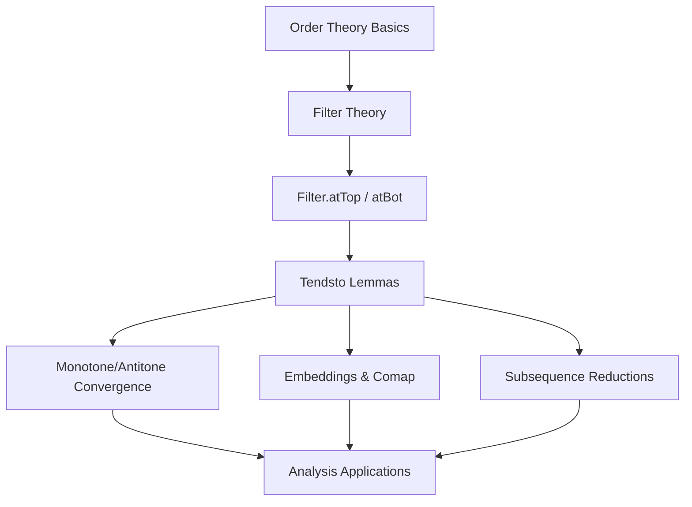
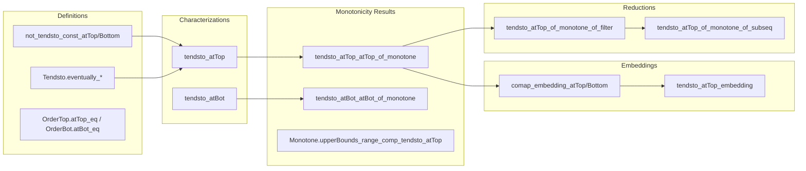

### Technical Brief: `Tendsto.lean` — Limits of `Filter.atTop` and `Filter.atBot`

---

#### **1. Key Definitions & Theorems**

| Name | Type / Signature | Purpose |
|------|------------------|---------|
| `not_tendsto_const_atTop` | `[Preorder α] [NoTopOrder α] → x : α → l : Filter β [l.NeBot] → ¬Tendsto (fun _ ↦ x) l atTop` | Shows constant functions do **not** tend to `atTop`. |
| `not_tendsto_const_atBot` | `[Preorder α] [NoBotOrder α] → x : α → l : Filter β [l.NeBot] → ¬Tendsto (fun _ ↦ x) l atBot` | Dual: constant functions do **not** tend to `atBot`. |
| `Tendsto.eventually_gt_atTop` | `[Preorder β] [NoTopOrder β] → Tendsto f l atTop → ∀ c, ∀ᶠ x in l, c < f x` | If `f → ∞`, then eventually `f(x) > c`. |
| `Tendsto.eventually_lt_atBot` | `[Preorder β] [NoBotOrder β] → Tendsto f l atBot → ∀ c, ∀ᶠ x in l, f x < c` | If `f → -∞`, then eventually `f(x) < c`. |
| `OrderTop.atTop_eq` | `[PartialOrder α] [OrderTop α] → atTop = pure ⊤` | When top element exists, `atTop` is the principal filter at `⊤`. |
| `OrderBot.atBot_eq` | `[PartialOrder α] [OrderBot α] → atBot = pure ⊥` | Dual: `atBot = pure ⊥`. |
| `tendsto_atTop` | `[Preorder β] → Tendsto m f atTop ↔ ∀ b, ∀ᶠ a in f, b ≤ m a` | Characterization of convergence to `atTop`. |
| `tendsto_atBot` | `[Preorder β] → Tendsto m f atBot ↔ ∀ b, ∀ᶠ a in f, m a ≤ b` | Dual characterization for `atBot`. |
| `tendsto_atTop_atTop_of_monotone` | `[Preorder α] [Preorder β] → Monotone f → (∀ b, ∃ a, b ≤ f a) → Tendsto f atTop atTop` | Monotone + unbounded above ⇒ tends to `∞`. |
| `tendsto_atBot_atBot_of_monotone` | `[Preorder α] [Preorder β] → Monotone f → (∀ b, ∃ a, f a ≤ b) → Tendsto f atBot atBot` | Monotone + unbounded below ⇒ tends to `-∞`. |
| `StrictMono.tendsto_atTop` | `StrictMono φ : ℕ → ℕ → Tendsto φ atTop atTop` | Strictly increasing sequence on `ℕ` tends to `∞`. |
| `Monotone.upperBounds_range_comp_tendsto_atTop` | `[Preorder β] [Preorder γ] → Monotone f → Tendsto g l atTop [l.NeBot] → upperBounds (range (f ∘ g)) = upperBounds (range f)` | For monotone `f`, upper bounds of `f ∘ g` equal those of `f` if `g → ∞`. |
| `comap_embedding_atTop` | `[Preorder β] [Preorder γ] → e : β → γ (order-embedding w/ cofinal image) → comap e atTop = atTop` | Order-embedding with cofinal image preserves `atTop`. |
| `tendsto_atTop_embedding` | `[Preorder β] [Preorder γ] → e order-embedding w/ cofinal image → Tendsto (e ∘ f) l atTop ↔ Tendsto f l atTop` | Embedding preserves convergence to `atTop`. |
| `tendsto_atTop_of_monotone_of_filter` | `[Preorder ι] [Preorder α] → Monotone u → [NeBot l] → Tendsto u l atTop → Tendsto u atTop atTop` | If monotone `u` tends to `∞` along *some* nontrivial filter, then along `atTop`. |
| `tendsto_atTop_of_monotone_of_subseq` | `[Preorder ι] [Preorder α] → Monotone u → Tendsto (u ∘ φ) l atTop [l.NeBot] → Tendsto u atTop atTop` | If a subsequence of monotone `u` tends to `∞`, then `u` itself does. |

---

#### **2. Naming Conventions**

- **Prefixes**:
  - `tendsto_`: convergence lemmas involving `Tendsto`.
  - `not_tendsto_`: negative convergence results.
  - `eventually_`: properties holding eventually (e.g., `eventually_gt_atTop`).
  - `upperBounds_`, `lowerBounds_`: bounds of ranges under composition.
  - `comap_`: behavior of filters under pullback.

- **Suffixes**:
  - `_atTop`, `_atBot`: specify target filter (`atTop` or `atBot`).
  - `_mono`, `_antitone`: monotonicity assumptions.
  - `_embedding`: for order embeddings.
  - `_of_`: conditions (e.g., `of_monotone`, `of_filter`, `of_subseq`).

- **Duals**:
  - Use `dual`, `dual_left`, `dual_right`, or `βᵒᵈ`/`αᵒᵈ` to derive `atBot` versions from `atTop` ones.

---

#### **3. Tactic Stack**

- `simp only [...]`: used to simplify using definitions (`atTop`, `tendsto_iInf`, etc.).
- `filter_upwards [...]`: standard for proving `∀ᶠ` statements.
- `rw [...]`: rewriting with equalities like `OrderTop.atTop_eq`.
- `apply ...`: e.g., `apply h.tendsto_atTop_atTop`.
- `let ⟨a, ha⟩ := ...`: destruct existential quantifiers.
- `exact ...`, `refine ...`, `intro ...`, `cases ...`: basic proof scripting.
- `le_antisymm`: to prove equality of sets (e.g., bounds).
- `mono`: for monotonicity reasoning (e.g., `le_trans` in `tendsto_atTop_mono'`).

---

#### **4. Proof Logic**

- **Induction/Case Analysis**: Not used directly (no induction on naturals in this file).
- **Filter-based reasoning**:
  - Most proofs reduce to manipulating `∀ᶠ` (eventually) statements.
  - Use `tendsto_atTop`/`tendsto_atBot` characterizations to convert convergence to universal bounds.
- **Monotonicity + cofinality**:
  - Key pattern: monotone function + unboundedness ⇒ convergence to `∞`/`-∞`.
  - Often uses `tendsto_iInf`/`tendsto_principal` to reduce to set-theoretic containment.
- **Duality**:
  - `atBot` lemmas derived via order duals (`αᵒᵈ`, `βᵒᵈ`) and `dual`/`dual_left`/`dual_right` methods.
- **Embedding arguments**:
  - Prove equality of filters via `le_antisymm`, using `comap` and `tendsto` adjointness.

---

#### **5. Imports**

- `Mathlib.Order.Filter.AtTopBot.Disjoint`: used for `disjoint_pure_atTop`, `disjoint_pure_atBot`.
- `Mathlib.Order.Filter.Tendsto`: core definitions and basic lemmas on `Tendsto`.

> **Scope**: This module focuses on *asymptotic behavior* of functions into preordered types, especially convergence to `∞` (`atTop`) and `-∞` (`atBot`). It is foundational for analysis on `ℝ`, sequences, and nets.

---

#### **6. Mermaid Diagrams**

##### **Dependency Graph (High-Level)**

##### **Overview of File Structure**

---

#### **7. Theory Context**

- **Role in Mathlib**: This module is part of the `Mathlib.Order.Filter` hierarchy, serving as a bridge between:
  - *Order theory* (preorders, monotonicity, bounds),
  - *Filter theory* (`atTop`, `atBot`, `Tendsto`, `comap`),
  - *Analysis* (limits of sequences, nets, monotone functions on `ℝ`).
- **Key Applications**:
  - Reducing real-indexed limits to sequences (via `tendsto_atTop_of_monotone_of_subseq`).
  - Proving convergence of monotone sequences (e.g., monotone convergence theorem).
  - Handling extended reals (`ℝ ∪ {±∞}`) via `atTop`/`atBot`.

--- 

Let me know if you'd like a **dependency tree** of related files (e.g., `Filter.lean`, `Monotone.lean`, `Bounded.lean`) or a **proof sketch** of a specific theorem.
