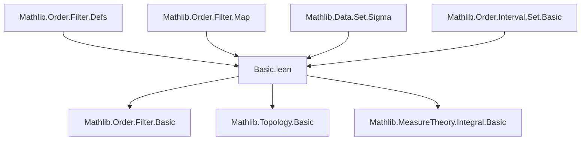
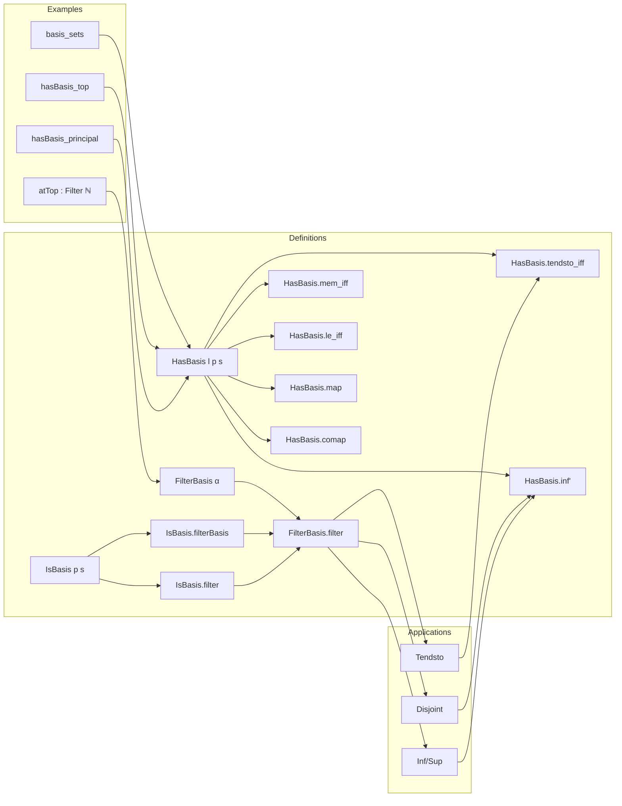

**Technical Brief: Filter Bases in Lean 4 (`Basic.lean`)**  
*Based on the file `Basic.lean` from Mathlib (likely part of `Mathlib.Order.Filter.Basic` or similar)*

---

### 1. **Key Definitions & Theorems**

| Name | Type / Signature | Purpose |
|------|------------------|---------|
| `FilterBasis α` | `Type u → Type u` (structure) | A nonempty collection of sets closed under finite intersections up to inclusion (i.e., directed downwards). |
| `FilterBasis.sets` | `B.sets : Set (Set α)` | The underlying collection of sets. |
| `FilterBasis.nonempty` | `B.nonempty : B.sets.Nonempty` | Ensures the basis is nonempty. |
| `FilterBasis.inter_sets` | `B.inter_sets : x ∈ B → y ∈ B → ∃ z ∈ B, z ⊆ x ∩ y` | Downward-directedness (intersection condition). |
| `FilterBasis.filter` | `B.filter : Filter α` | Filter generated by a basis: $U \in B.filter \iff \exists s \in B, s \subseteq U$. |
| `Filter.IsBasis p s` | `Prop` | Predicate stating that the family $(s_i)_{p(i)}$ forms a filter basis: nonempty and downward-directed. |
| `Filter.IsBasis.filterBasis` | `h.filterBasis : FilterBasis α` | Construct a `FilterBasis` from an `IsBasis`. |
| `Filter.HasBasis l p s` | `Prop` | States that $l$ has basis $(s_i)_{p(i)}$: $t \in l \iff \exists i, p(i) \land s_i \subseteq t$. |
| `Filter.basis_sets` | `l.HasBasis (fun s => s ∈ l) id` | Every filter is generated by its own sets. |
| `Filter.HasBasis.mem_iff` | $t \in l \leftrightarrow \exists i, p(i) \land s_i \subseteq t$ | Core equivalence of membership in terms of basis. |
| `Filter.HasBasis.le_iff` | $l \le l' \leftrightarrow \forall t \in l', \exists i, p(i) \land s_i \subseteq t$ | Order comparison via basis. |
| `Filter.HasBasis.inf'` | $(l \sqcap l').HasBasis (\lambda (i, i'), p(i) \land p'(i')) (\lambda (i, i'), s_i \cap s'_{i'})$ | Basis for infimum of two filters. |
| `Filter.HasBasis.map` | $(l.map f).HasBasis\ p\ (f '' s \cdot)$ | Basis for pushforward (map) of a filter. |
| `Filter.HasBasis.comap` | $(l.comap f).HasBasis\ p\ (f^{-1} '' s \cdot)$ | Basis for pullback (comap) of a filter. |
| `Filter.HasBasis.tendsto_iff` | $Tendsto\ f\ l\ l' \leftrightarrow \forall i', p'(i') \to \exists i, p(i) \land s_i \subseteq f^{-1}(s'_{i'})$ | Characterization of continuity (tendsto) in terms of bases. |
| `Filter.HasBasis.index` | $t \in l \mapsto \{i // p(i)\}$ | Choice function returning an index such that $s_i \subseteq t$. |
| `Filter.HasAntitoneBasis` | `Prop` | `HasBasis` with antitone (decreasing) basis. |

---

### 2. **Naming Conventions**

- **Prefixes**:
  - `is_`: e.g., `IsBasis`, `IsAntitoneBasis` — properties of families of sets.
  - `has_`: e.g., `HasBasis`, `HasAntitoneBasis` — existence of a basis for a given filter.
  - `mem_`, `set_`, `filter_`: e.g., `mem_filter_iff`, `set_index_mem`, `filter_eq_generate`.
  - `principal_`, `pure_`, `disjoint_`, `tendsto_`: domain-specific operations.

- **Suffixes**:
  - `_iff`: equivalence statements (e.g., `mem_iff`, `le_iff`, `tendsto_iff`).
  - `_right_iff`, `_left_iff`: directional variants (e.g., `tendsto_right_iff`).
  - `_principal`, `_pure`: for principal/pure filters.
  - `_neBot_iff`: non-emptiness (non-bottom) criteria.

- **Notable patterns**:
  - `h : l.HasBasis p s` is standardly named `hl`, `hla`, `hlb`, etc.
  - `p : ι → Prop`, `s : ι → Set α` are standard for indexed families.
  - `PProd`, `Sigma`, `Prod` used for product-indexed bases (e.g., `inf'`, `sup'`).

---

### 3. **Tactic Stack**

Frequently used tactics in proofs:

| Tactic | Usage |
|--------|-------|
| `simp only [...]` | Rewriting definitions (`mem_filter_iff`, `mem_iff`, etc.), often with `and_assoc`, `exists_and_right`, `true_and`, `forall_const`, `exists_const`. |
| `rw [...]` | Rewriting using `mem_iff`, `le_def`, `Tendsto`, `inf_eq_inter`, etc. |
| `exact`, `apply`, `refine` | Constructing witnesses (e.g., for `∃` goals). |
| `aesop` | Automated reasoning (e.g., in `ker_filter`, `eq_iInf_principal`). |
| `ext` | Extensionality for filters/sets. |
| `cases`, `rcases`, `obtain` | Destructing existential hypotheses. |
| `push_neg` | Pushing negations inward (e.g., in `notMem_iff_inf_principal_compl`). |
| `simp_rw` | Rewriting with simplification (e.g., in `sup'`). |
| `apply le_antisymm` | Proving equality of filters via mutual inclusion. |
| `use`, `existsi` | Providing witnesses for existential goals. |

---

### 4. **Proof Logic**

Typical proof structure:

1. **Unfold definitions** using `simp only [mem_filter_iff, HasBasis.mem_iff]`.
2. **Reduce to basis elements** via `mem_iff` or `le_iff`.
3. **Construct witnesses** using `∃i, ...` and properties like `inter`, `nonempty`.
4. **Use directedness** (`inter_sets`, `Directed`) to handle intersections/unions.
5. **Apply extensionality** (`Filter.ext`, `Set.ext`) to prove filter/set equality.
6. **Leverage `index`** to avoid manual `cases` on `mem_iff`.
7. **Use `to_hasBasis'`/`to_hasBasis`** to transfer bases between equivalent characterizations.

Example pattern:
```lean
apply le_antisymm
· rw [hl.le_basis_iff hl']
  intro i' hi'
  rcases h i' hi' with ⟨i, hi, hs⟩
  exact ⟨i, hi, hs⟩
· rw [hl'.le_basis_iff hl]
  intro i hi
  rcases h' i hi with ⟨i', hi', hs'⟩
  exact ⟨i', hi', hs'⟩
```

---

### 5. **Imports**

Core dependencies defining the module’s scope:

- `Mathlib.Data.Set.Sigma` — for sigma types and set operations.
- `Mathlib.Order.Filter.Defs` — basic filter definitions (`Filter`, `mem`, `univ_mem`, `inter_mem`, etc.).
- `Mathlib.Order.Filter.Map` — map/comap definitions.
- `Mathlib.Order.Interval.Set.Basic` — interval sets (used in examples like `atTop` on `ℕ`).

> **Note**: The file builds on top of standard filter theory (e.g., `Filter`, `Principal`, `Pure`, `Inf`, `Sup`, `Tendsto`) defined in earlier modules.

---

### 6. **Mermaid Diagrams**

#### **Dependency Graph (High-Level)**



#### **Overview of `Basic.lean` Theory**



---

### 7. **Summary**

This file formalizes the foundational theory of **filter bases** in Lean 4, enabling reasoning about filters via generating families of sets. It provides:

- A robust framework for constructing filters from bases (`FilterBasis`, `IsBasis`, `HasBasis`);
- Tools to manipulate and compare filters via basis properties (`le_iff`, `tendsto_iff`);
- Combinators for standard filter operations (`inf`, `sup`, `map`, `comap`);
- Practical utilities like `HasBasis.index` to automate index selection.

The design prioritizes flexibility (using indexed families with predicates) to support rich examples like metric space neighborhoods (`𝓝 x`) and directed families (e.g., `atTop` on `ℕ`).
