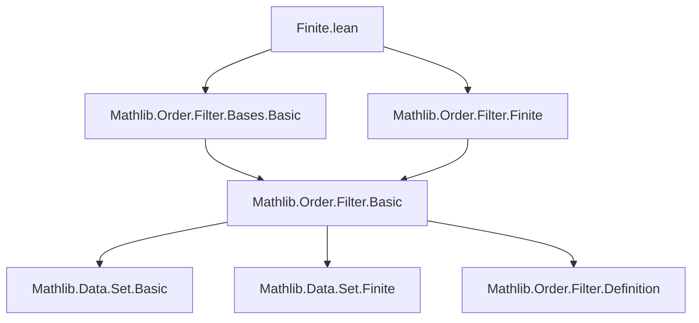

### Technical Brief: `Finite.lean` — Finiteness Results on Filter Bases

---

#### **1. Key Definitions & Theorems**

| Name | Type / Signature | Purpose |
|------|------------------|---------|
| `hasBasis_generate` | `(s : Set (Set α)) : (generate s).HasBasis (fun t => Set.Finite t ∧ t ⊆ s) fun t => ⋂₀ t` | Shows that the filter generated by a collection `s` has a basis of *finite intersections* of sets from `s`. |
| `FilterBasis.ofSets` | `(s : Set (Set α)) : FilterBasis α` | Constructs the smallest filter basis containing `s`, by closing under finite intersections (via `sInter`). |
| `generate_eq_generate_inter` | `(s : Set (Set α)) : generate s = generate (sInter '' { t | Set.Finite t ∧ t ⊆ s })` | Equates the filter generated by `s` with that generated by finite intersections of subsets of `s`. |
| `ofSets_filter_eq_generate` | `(s : Set (Set α)) : (FilterBasis.ofSets s).filter = generate s` | Connects the filter associated to `FilterBasis.ofSets s` with `generate s`. |
| `generate_neBot_iff` | `(s : Set (Set α)) : NeBot (generate s) ↔ ∀ t, t ⊆ s → t.Finite → (⋂₀ t).Nonempty` | Gives a criterion for when the generated filter is nontrivial (i.e., not the bottom filter). |
| `HasBasis.iInf'` | `(hl : ∀ i, (l i).HasBasis (p i) (s i)) : (⨅ i, l i).HasBasis ...` | Describes a basis for the infimum of a family of filters, using finite intersections across indices. |
| `HasBasis.iInf` | Similar to `iInf'`, but uses dependent sums (`Σ`) instead of pairs of sets and functions. |
| `Pairwise.exists_mem_filter_basis_of_disjoint` | Under finite index set and pairwise disjoint filters, picks basis elements that remain pairwise disjoint. | Enables selection of disjoint basic neighborhoods in disjoint filter families. |
| `Set.PairwiseDisjoint.exists_mem_filter_basis` | Finite subset `S` of pairwise disjoint filters → pick basis elements still pairwise disjoint over `S`. | Refinement of the above for finite subsets. |
| `hasBasis_iInf_principal_finite` | `(s : ι → Set α) : (⨅ i, 𝓟 (s i)).HasBasis (fun t : Set ι => t.Finite) fun t => ⋂ i ∈ t, s i` | Basis for the infimum of principal filters: finite intersections of the `s i`. |

---

#### **2. Naming Conventions**

- **Prefixes**:
  - `hasBasis_`: asserts existence of a basis with certain properties.
  - `ofSets`: constructs a basis from a collection of sets.
  - `generate`: relates to generating filters from sets or bases.
  - `iInf`, `iInter`: indexed infima / intersections.

- **Suffixes**:
  - `_iff`: characterizes a property via equivalence.
  - `_finite`: emphasizes finiteness condition (e.g., finite intersections).
  - `_disjoint`: relates to disjointness or pairwise disjointness.

- **Notable patterns**:
  - `fun If : Set ι × ∀ i, ι' i => ...` — uses product type to encode finite index sets and choice functions.
  - `⟨I, f⟩` or `⟨I, fun i => f i⟩` — encodes finite subsets with choice functions.

---

#### **3. Tactic Stack**

Frequent tactics used in proofs:

| Tactic | Usage |
|--------|-------|
| `simp only [...]` | Simplify using local equivalences, especially for `mem_iff`, `iInf`, `filter_eq`, etc. |
| `rintro` / `intro` | Introduce hypotheses and decompose conjunctions/implications. |
| `exact` / `refine` | Construct witnesses for existential goals (e.g., basis elements). |
| `choose` | Use `choose` to select functions from existential quantifiers (e.g., `choose ind hp ht using ...`). |
| `rw [...]` | Rewrite using equalities like `generate_eq_generate_inter`. |
| `convert` / `trans` | Chain equalities or convert goals via intermediate terms. |
| `cases` | Eliminate finite/nonempty/fintype hypotheses (e.g., `hI.nonempty_fintype`). |
| `subset` / `set_tac` | Prove subset relations (e.g., `union_subset`, `empty_subset`). |
| `aesop` / `tauto` | Not explicitly used here — proofs are mostly constructive and manual. |

---

#### **4. Proof Logic**

- **Inductive/constructive style**: Proofs are mostly direct constructions:
  - To show a filter has a basis, construct the candidate basis explicitly (e.g., finite intersections).
  - To prove existence of disjoint basis elements, use disjointness of filters to get disjoint neighborhoods, then pick basis elements inside them.

- **Common flow**:
  1. **Unfold definitions** (`generate`, `HasBasis`, `filter`, `FilterBasis`).
  2. **Reduce to membership criteria** using `mem_iff` or `mem_generate_iff`.
  3. **Construct witness** (e.g., finite intersection, choice function).
  4. **Verify properties** (e.g., finiteness, inclusion, disjointness).
  5. **Use lemmas** like `iInter_mem`, `biInter_mem`, `mem_of_superset`.

- **Key reasoning principles**:
  - **Finite intersection property** for nontriviality (`generate_neBot_iff`).
  - **Basis refinement**: if each filter has a basis, the infimum has a basis of finite intersections.
  - **Disjointness lifting**: disjoint filters admit disjoint basic neighborhoods (finite choice via `finite`/`finite_index` assumptions).

---

#### **5. Imports**

| Import | Role |
|--------|------|
| `Mathlib.Order.Filter.Bases.Basic` | Core definitions: `FilterBasis`, `HasBasis`, `generate`, `filter`, etc. |
| `Mathlib.Order.Filter.Finite` | Finiteness lemmas for filters (e.g., `iInf_finite`, `mem_iInf_finite`). |

> These imports define the foundational filter theory and finiteness machinery used throughout.

---

#### **8. Mermaid Diagrams**

##### **Dependency Graph (Module-Level)**



##### **Overview of File Structure**

```mermaid
flowchart LR
  subgraph "Core Concepts"
    A[FilterBasis.ofSets] --> B[generate s]
    B --> C[hasBasis_generate]
    C --> D[Finite intersections as basis]
  end

  subgraph "Infimum Basis"
    E[HasBasis.iInf'] --> F[⨅ i, l i]
    E --> G[Finite index subsets + choice functions]
  end

  subgraph "Disjointness & Selection"
    H[PairwiseDisjoint] --> I[exists_mem_filter_basis]
    I --> J[Disjoint basic neighborhoods]
  end

  subgraph "Principal Filters"
    K[hasBasis_iInf_principal_finite] --> L[⨅ i, 𝓟 (s i)]
    L --> M[Finite intersections of s i]
  end

  C --> D
  G --> F
  J --> I
  M --> L
```

##### **Theoretical Context**

This file sits in the **filter basis theory** layer of Mathlib, bridging:
- **Set-theoretic constructions** (`generate`, `sInter`, finite intersections),
- **Filter-theoretic properties** (`HasBasis`, `iInf`, `neBot`),
- **Combinatorial selection** (disjointness, finite choice).

It enables:
- Construction of filters from generating families,
- Reasoning about nontriviality via finite intersection property,
- Refinement of basis elements under disjointness constraints — crucial for measure theory, topology, and integration.

--- 

Let me know if you'd like a formalized dependency graph (e.g., for `leanpkg`), or a visualization of the `FilterBasis.ofSets` construction.
