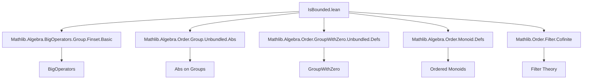
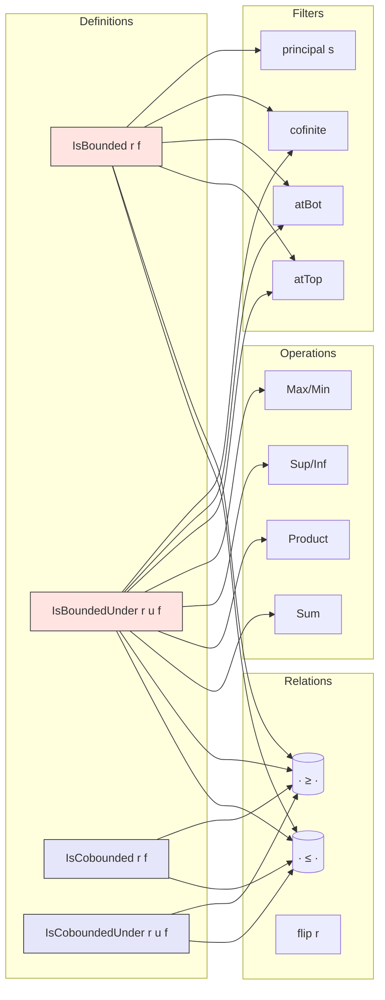

### Technical Brief: `IsBounded.lean`

---

#### **1. Key Definitions & Theorems**

| Name | Type / Signature | Purpose |
|------|------------------|---------|
| `IsBounded r f` | `Prop` | Filter `f` is *eventually bounded* w.r.t. binary relation `r`: ∃b, ∀ᶠ x in f, r x b |
| `IsBoundedUnder r u f` | `Prop` | Function `u : β → α` is *eventually bounded under `r`* along filter `f`: ∃b, ∀ᶠ x in f, r (u x) b |
| `IsCobounded r f` | `Prop` | Filter `f` is *frequently bounded* (cobounded) w.r.t. `r`: ∃b, ∀ s ∈ f, ∃ x ∈ s, r b x |
| `IsCoboundedUnder r u f` | `Prop` | Function `u` is *frequently bounded under `r`* along `f`: ∃b, ∀ s ∈ f, ∃ x ∈ s, r b (u x) |

| Theorem | Type | Purpose |
|---------|------|---------|
| `isBounded_iff` | `f.IsBounded r ↔ ∃ s ∈ f.sets, ∃ b, s ⊆ { x | r x b }` | Characterizes `IsBounded` via sets in the filter |
| `isBoundedUnder_of` | `(∃ b, ∀ x, r (u x) b) → f.IsBoundedUnder r u` | Global bound ⇒ eventual bound |
| `isBounded_bot` | `IsBounded r ⊥ ↔ Nonempty α` | Trivial filter bounded iff type nonempty |
| `isBounded_top` | `IsBounded r ⊤ ↔ ∃ t, ∀ x, r x t` | Top filter bounded iff globally bounded |
| `isBounded_sup` | `[IsTrans r] [IsDirected r] ⇒ IsBounded f → IsBounded g → IsBounded (f ⊔ g)` | Sup of bounded filters is bounded (requires transitivity & directedness) |
| `IsBounded.mono` | `f ≤ g ⇒ IsBounded g → IsBounded f` | Monotonicity of `IsBounded` in filter argument |
| `isBoundedUnder_const` | `[Std.Refl r] ⇒ IsBoundedUnder r l (fun _ => a)` | Constant functions are bounded |
| `isBoundedUnder_iff_eventually_bddAbove` | `f.IsBoundedUnder (· ≤ ·) u ↔ ∃ s, BddAbove (u '' s) ∧ ∀ᶠ x in f, x ∈ s` | Relates eventual boundedness to bounded image on a set |
| `bddAbove_range.isBoundedUnder_of_range` | `BddAbove (range u) ⇒ f.IsBoundedUnder (· ≤ ·) u` | Globally bounded above function ⇒ eventually bounded above |
| `not_isBoundedUnder_of_tendsto_atTop` | `[NoMaxOrder β] ⇒ Tendsto f l atTop ⇒ ¬IsBoundedUnder (· ≤ ·) l f` | Functions tending to `atTop` are not eventually bounded above |
| `isBoundedUnder_sum` | `[AddCommMonoid R] ⇒ (∀ v₁ v₂, … → … → …) ⇒ … → f.IsBoundedUnder r (∑ s u)` | Sums of bounded functions are bounded (under suitable assumptions) |
| `isBoundedUnder_le_add`, `isBoundedUnder_ge_add` | `[AddLeftMono R] [AddRightMono R] ⇒ …` | Sum of ≤-bounded (resp. ≥-bounded) functions is ≤-bounded (resp. ≥-bounded) |
| `isBoundedUnder_le_mul_of_nonneg` | `[PosMulMono α] [MulPosMono α] ⇒ …` | Product of nonnegative ≤-bounded functions is ≤-bounded |
| `isCoboundedUnder_le_max` | `[LinearOrder β] ⇒ (cobdd u ∨ cobdd v) ⇒ cobdd (max ∘ ⟨u,v⟩)` | Max of cobounded functions is cobounded |
| `isBoundedUnder_le_finset_sup`, `isBoundedUnder_ge_finset_inf` | `[LinearOrder β] ⇒ …` | Finite sup/inf of bounded functions is bounded |
| `isBoundedUnder_le_abs` | `[LinearOrder α] [IsOrderedAddMonoid α] ⇒ …` | Absolute value bounded ⇔ function bounded above and below |
| `isBoundedDefault` macro | tactic | Auto-proves boundedness in lattices with top/bottom using `isBounded_le_of_top`, etc. |

---

#### **2. Naming Conventions**

- **Prefixes**:
  - `isBounded`: for filter-level boundedness (`IsBounded r f`)
  - `isBoundedUnder`: for function-level boundedness (`IsBoundedUnder r u f`)
  - `isCobounded`, `isCoboundedUnder`: for *frequent* (not eventual) boundedness
- **Suffixes**:
  - `_le`, `_ge`: for relations `(· ≤ ·)` and `(· ≥ ·)`
  - `_flip`: for swapping relation direction (e.g., `isCobounded_flip`)
  - `_comp`: for composition with functions
  - `_of_eventually_*`, `_of_*`: introduction rules from eventual/frequent statements
  - `_iff_*`: characterizations (↔)
- **Other**:
  - `_sup`, `_inf`, `_max`, `_min`, `_sum`, `_mul`: algebraic operations
  - `_finset_*`: finite sup/inf over `Finset`

---

#### **3. Tactic Stack**

Frequently used tactics:
- `simp` / `simp only` / `simp +contextual`
- `rw` / `rw [← …]`
- `filter_upwards` (for filter-based reasoning)
- `tauto`, `exact`, `assumption`
- `cases`, `rcases`, `obtain`
- `apply`, `intro`, `intro h`, `intro x`
- `mono` (monotonicity)
- `trans`, `le_trans`, `lt_of_le_of_lt`, etc.
- `isBoundedDefault` (custom macro)
- `induction s using Finset.cons_induction` (induction on finite sets)
- `swap` (for flipping binary relations, e.g., `swap hv`)

---

#### **4. Proof Logic**

- **Inductive structure**: Proofs often proceed by:
  1. Unfolding definitions (`IsBounded`, `IsBoundedUnder`, etc.)
  2. Extracting witnesses (`obtain ⟨b, hb⟩`)
  3. Using filter properties (`eventually_map`, `eventually_sup`, `eventually_all_finset`)
  4. Applying monotonicity or algebraic lemmas (`add_le_add`, `mul_le_mul_of_nonneg_right`)
  5. Using lattice properties (`sup_le_sup`, `le_sup_left`, etc.)
- **Common patterns**:
  - *Eventual boundedness* → construct witness from bound on a set in the filter.
  - *Frequent boundedness* → use `IsCobounded.mk` with witness `a` and show `∀ s ∈ f, ∃ x ∈ s, r a x`.
  - *Equivalences* (`↔`) proven via `constructor` + `intro` + `rw`.
  - *Finite cases* use `Finset` induction or `Finset.sup`/`inf` lemmas.
  - *Order duals* (`αᵒᵈ`) used to reuse lemmas for ≥-boundedness.

---

#### **5. Imports**

Core dependencies defining scope:

```lean
Mathlib.Algebra.BigOperators.Group.Finset.Basic
Mathlib.Algebra.Order.Group.Unbundled.Abs
Mathlib.Algebra.Order.GroupWithZero.Unbundled.Defs
Mathlib.Algebra.Order.Monoid.Defs
Mathlib.Order.Filter.Cofinite
```

- **Algebraic structure**: additive/multiplicative monoids, groups, ordered monoids.
- **Order theory**: preorders, linear orders, lattices, directed/codirected orders.
- **Filter theory**: cofinite filter, `atTop`, `atBot`, `map`, `sup`, `tendsto`.
- **Boundedness concepts**: unbundled order theory (no `Bounded` type class used).

---

#### **6. Mermaid Diagrams**

##### **Dependency Graph (Module-Level)**



##### **Conceptual Overview (Theory Flow)**



- **Red boxes**: *eventual* boundedness (filter/function-level)
- **Purple boxes**: *frequent* boundedness (cobounded)
- Arrows indicate usage or instantiation.

---

#### **7. Theory Scope Summary**

- **Domain**: Order theory + filter theory + algebraic structures (monoids, groups, lattices).
- **Goal**: Formalize boundedness/frequent boundedness for filters and functions, especially in ordered algebraic structures.
- **Key applications**:
  - Asymptotic analysis (`atTop`, `atBot`, `cofinite`)
  - Series and products convergence (via boundedness of partial sums/products)
  - Monotone/antitone function behavior
  - Completeness and compactness arguments (via bounded ranges)

This module serves as a foundational toolkit for analysis and topology in Lean’s `Mathlib`, especially in contexts involving limits, convergence, and compactness.
