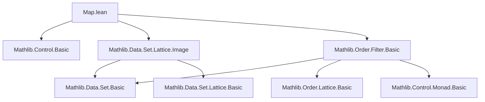

### Technical Brief: `Map.lean` — Theorems about `map` and `comap` on Filters

---

#### **1. Key Definitions & Theorems**

| Name | Type / Signature | Purpose |
|------|------------------|---------|
| `map` | `map : (α → β) → Filter α → Filter β` | Pushforward (image) of a filter along a function. |
| `comap` | `comap : (α → β) → Filter β → Filter α` | Pullback (preimage) of a filter along a function. |
| `kernMap` | `kernMap : (α → β) → Filter α → Filter β` | Right adjoint to `comap`; defined via `kernImage`. |
| `mem_map` | `t ∈ map m f ↔ m ⁻¹' t ∈ f` | Membership characterization of `map`. |
| `mem_comap` | `s ∈ comap m g ↔ ∃ t ∈ g, m ⁻¹' t ⊆ s` | Membership characterization of `comap`. |
| `mem_kernMap` | `s ∈ kernMap m f ↔ ∃ t ∈ f, kernImage m t = s` | Membership in `kernMap`. |
| `map_id` | `map id f = f` | Identity preservation for `map`. |
| `map_compose` | `map m' ∘ map m = map (m' ∘ m)` | Functoriality of `map`. |
| `map_map` | `map m' (map m f) = map (m' ∘ m) f` | Composition law for `map`. |
| `comap_id` | `comap id f = f` | Identity preservation for `comap`. |
| `comap_comap` | `comap m (comap n f) = comap (n ∘ m) f` | Composition law for `comap`. |
| `map_le_iff_le_comap` | `map m f ≤ g ↔ f ≤ comap m g` | Galois connection: `map ⊣ comap`. |
| `gc_map_comap` | `GaloisConnection (map m) (comap m)` | Formalizes the above as a Galois connection. |
| `gc_comap_kernMap` | `GaloisConnection (comap m) (kernMap m)` | `comap ⊣ kernMap`. |
| `map_congr` | `m₁ =ᶠ[f] m₂ ⇒ map m₁ f = map m₂ f` | Congruence for `map` under eventual equality. |
| `map_injective` | `Injective m ⇒ Injective (map m)` | `map` preserves injectivity of functions. |
| `map_inj` | `Injective m ⇒ map m f = map m g ↔ f = g` | `map` is injective on filters when `m` is injective. |
| `map_eq_bot_iff` | `map m f = ⊥ ↔ f = ⊥` | `map` preserves non-emptiness (neBot). |
| `comap_neBot_iff` | `NeBot (comap m f) ↔ ∀ t ∈ f, ∃ a, m a ∈ t` | Characterizes when `comap` preserves non-emptiness. |
| `push_pull` | `map f (F ⊓ comap f G) = map f F ⊓ G` | Key identity used in uniform space theory. |
| `map_swap_eq_comap_swap` | `map Prod.swap f = comap Prod.swap f` | Symmetry of swap under `map`/`comap`. |
| `map_equiv_symm` | `map e.symm f = comap e f` for `e : α ≃ β` | Equivalence-induced identity between `map` and `comap`. |

---

#### **2. Naming Conventions**

- **Prefixes**:
  - `map_`, `comap_`, `kernMap_`, `pure_`, `principal_`: indicate the operation.
  - `eventually_`, `frequently_`, `eventuallyEq_`, `eventuallyLE_`: for filter convergence notions.
  - `le_`, `inf_`, `sup_`, `iInf_`, `iSup_`: for lattice operations.
  - `disjoint_`, `neBot_`, `compl_`: for special filter properties.

- **Suffixes**:
  - `_iff`: equivalence (↔) statements.
  - `_eq_bot`: characterizations of equality with bottom filter.
  - `_neBot`: characterizations of non-emptiness.
  - `_mono`, `_congr`: monotonicity/congruence lemmas.
  - `_principal`, `_pure`: special cases for principal/pure filters.

- **Special**:
  - `gc_`: Galois connection.
  - `push_pull`: algebraic identity for interaction of `map`, `comap`, and `inf`.
  - `comm`: lemmas about commuting diagrams (`map_comm`, `comap_comm`).

---

#### **3. Tactic Stack**

Frequently used tactics in proofs:

| Tactic | Usage |
|--------|-------|
| `simp` / `simp_rw` | Simplification using `@[simp]` lemmas (e.g., `mem_map`, `eventually_map`). |
| `rw` / `rwa` | Rewriting with equivalences or assumptions (e.g., `← preimage_image_eq`). |
| `ext` / `Filter.ext` | Extensionality for filters (showing two filters equal by extensional membership). |
| `exact`, `assumption`, `intro`, `cases` | Basic proof structure. |
| `apply`, `refine`, `exact?` | Goal-directed proof construction. |
| `gcongr` | For monotonicity goals (e.g., `gcongr` in `map_inf`). |
| `aesop` / `tauto` / `linarith` | Not heavily used here; mostly manual reasoning. |
| `lift` | For lifting filters to subtypes (e.g., `lift f to Filter t`). |
| `convert`, `congr_arg` | For congruence of function applications. |
| `nonrec` | For defining nonrecursive instances (e.g., `RightInverse.filter_map`). |

---

#### **4. Proof Logic**

- **Structure**:
  - Most proofs follow a **two-sided inclusion** (`le_antisymm`) pattern for filter equality.
  - **Membership-based reasoning**: use `mem_map`, `mem_comap`, `mem_kernMap` to reduce to set-theoretic statements.
  - **Galois connections** (`gc_map_comap`, `gc_comap_kernMap`) are heavily used to translate between `map` and `comap`.
  - **Injectivity/surjectivity arguments** are common: e.g., `preimage_image_eq`, `image_preimage_subset`, `range_mem_map`.
  - **Eventual reasoning**: `eventually_map`, `eventually_comap` reduce to quantifiers over filter neighborhoods.
  - **Subtype/coercion reasoning**: especially in `Sum`, `Prod`, and subtype sections.

- **Typical proof flow**:
  1. Expand definitions via `mem_*` lemmas.
  2. Use set-theoretic identities (`image_inter`, `preimage_union`, etc.).
  3. Apply monotonicity (`map_mono`, `comap_mono`) or Galois connection lemmas.
  4. Use injectivity/surjectivity to simplify images/preimages.
  5. Conclude via `le_antisymm`, `Filter.ext`, or `eq_of_forall_le_iff`.

---

#### **5. Imports & Dependencies**

| Module | Purpose |
|--------|---------|
| `Mathlib.Control.Basic` | Provides `Functor`, `Applicative`, `Monad`, `LawfulFunctor`, `LawfulMonad`. |
| `Mathlib.Data.Set.Lattice.Image` | Defines `kernImage`, image/preimage lattice theory. |
| `Mathlib.Order.Filter.Basic` | Core filter definitions: `Filter`, `principal`, `pure`, `map`, `comap`, `bind`, `join`, lattice operations. |

---

#### **6. Mermaid Diagrams**

##### **Dependency Graph (Module-Level)**



##### **Conceptual Overview of `map`/`comap`/`kernMap` Relationships**

```mermaid
graph LR
  A[Filter α] -->|map m| B[Filter β]
  B -->|comap m| A
  B -->|kernMap m| A

  A -- gc_map_comap -->|map m ⊣ comap m| B
  B -- gc_comap_kernMap -->|comap m ⊣ kernMap m| A

  subgraph Equivalences
    E[α ≃ β] -->|map e = comap e.symm| F[Filter β]
    E -->|map e.symm = comap e| G[Filter α]
  end

  subgraph Adjoints
    G[Filter β] -->|kernMap m| H[Filter α]
    B[Filter β] -->|comap m| A[Filter α]
    A -->|map m| B
  end
```

##### **Diagram for `map_comm` / `comap_comm`**

```mermaid
graph TD
  α -- φ --> β
  θ ↓       ↓ ψ
  γ -- ρ --> δ

  Filter α -- map φ --> Filter β
  map θ ↓               ↓ map ψ
  Filter γ -- map ρ --> Filter δ

  Filter δ -- comap ψ --> Filter β
  comap ρ ↓               ↓ comap φ
  Filter γ -- comap θ --> Filter α
```

---

#### **7. Theory Scope**

This module formalizes the **monadic and adjoint structure** of filters under functional transport:

- **Monadic structure**: `map`, `bind`, `pure`, `join`, and their lawful properties.
- **Adjoint relationships**:
  - `map m ⊣ comap m`
  - `comap m ⊣ kernMap m`
- **Special cases**:
  - Principal filters (`𝓟 s`)
  - Pure filters (`pure a`)
  - Subtype coercion (`comap (↑)`)
  - Product projections (`comap fst`, `comap snd`)
  - Sum injections (`comap inl`, `map inr`)
- **Applications**:
  - Uniform spaces (`map_swap4_eq_comap`)
  - Topology (via `comap` for subspace topology)
  - Measure theory (via `kernMap` for pushforward of co-finite/compact filters)

---

#### **8. Notable Lemmas & Identities**

- **Monadic laws**:
  - `map_id`, `map_map`, `map_congr`, `bind_pure_comp`, `bind_assoc`
- **Adjoint laws**:
  - `map_le_iff_le_comap`, `comap_le_iff_le_kernMap`
- **Image/preimage duality**:
  - `mem_map ↔ m ⁻¹' t ∈ f`, `mem_comap ↔ ∃ t ∈ g, m ⁻¹' t ⊆ s`
- **Non-emptiness**:
  - `map_neBot_iff`, `comap_neBot_iff`, `disjoint_map`
- **Subtype & sum**:
  - `principal_subtype`, `comap_sumElim_eq`, `map_comap_inl_sup_map_comap_inr`
- **Uniformity & symmetry**:
  - `map_swap_eq_comap_swap`, `map_swap4_eq_comap`

---

This module is foundational for higher-order analysis in Lean, especially in topology, measure theory, and uniform spaces. Its clean algebraic structure (monad + adjoints) enables modular reasoning about convergence and continuity.
