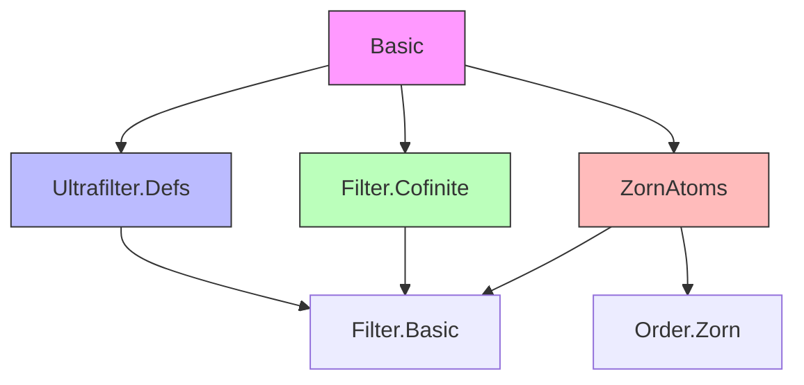
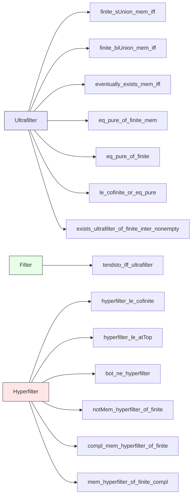

**Technical Brief: Basic.lean — Ultrafilters in Lean 4 (Mathlib)**  
*Based on `Mathlib.Order.Filter.Ultrafilter.Basic` (source: `Basic.lean`)*

---

### 1. KEY DEFINITIONS & THEOREMS

| Name | Type / Signature | Purpose |
|------|------------------|---------|
| `hyperfilter α` | `[Infinite α] → Ultrafilter α` | The unique ultrafilter extending the cofinite filter on an infinite type. |
| `eq_pure_of_finite_mem` | `s.Finite → s ∈ f → ∃ x ∈ s, f = pure x` | If a finite set is in an ultrafilter, the ultrafilter is principal at some point of the set. |
| `eq_pure_of_finite` | `[Finite α] → ∃ a, f = pure a` | Every ultrafilter on a finite type is principal. |
| `le_cofinite_or_eq_pure` | `f : Ultrafilter α → (f ≤ cofinite) ∨ ∃ a, f = pure a` | Dichotomy: an ultrafilter is either contained in the cofinite filter (hence non-principal) or is principal. |
| `eventually_exists_mem_iff` | `is.Finite → (∀ᶠ i in f, ∃ a ∈ is, P a i) ↔ ∃ a ∈ is, ∀ᶠ i in f, P a i` | Interchange of `∀ᶠ` and `∃` over finite index sets in ultrafilters. |
| `tendsto_iff_ultrafilter` | `Tendsto f l₁ l₂ ↔ ∀ g : Ultrafilter α, ↑g ≤ l₁ → Tendsto f g l₂` | Tendsto can be checked on ultrafilters extending the source filter. |
| `notMem_hyperfilter_of_finite` | `s.Finite → s ∉ hyperfilter α` | No finite set belongs to the hyperfilter. |
| `compl_mem_hyperfilter_of_finite` | `s.Finite → sᶜ ∈ hyperfilter α` | Complements of finite sets are in the hyperfilter (i.e., hyperfilter = cofinite filter as a filter). |
| `finite_sUnion_mem_iff` | `s.Finite → ⋃₀ s ∈ f ↔ ∃ t ∈ s, t ∈ f` | Membership in ultrafilter commutes with finite unions. |
| `finite_biUnion_mem_iff` | `is.Finite → (⋃ i ∈ is, s i) ∈ f ↔ ∃ i ∈ is, s i ∈ f` | Generalization of above to indexed unions. |

---

### 2. NAMING CONVENTIONS

- **Prefixes**:
  - `finite_`: properties involving finite sets or finite unions/intersections.
  - `hyperfilter_`: specific to the hyperfilter construction.
  - `eq_pure_of_`: characterizing when an ultrafilter is principal.
- **Suffixes**:
  - `_mem_iff`: equivalence involving membership in the filter.
  - `_iff`: logical equivalence (↔) statements.
  - `_le_cofinite`, `_eq_pure`: structural classification of ultrafilters.
- **Aliases**:
  - `_root_.Set.Finite.notMem_hyperfilter`, `_root_.Set.Finite.compl_mem_hyperfilter`: convenience aliases for set-theoretic arguments.

---

### 3. TACTIC STACK

- `simp` — heavily used for rewriting definitions (`mem_coe`, `biUnion`, `union_mem`, etc.).
- `aesop` — for automated reasoning in `eventually_exists_mem_iff`.
- `induction ... using ...` — structural induction on finite sets (`Set.Finite.induction_on`).
- `rcases` / `rintro` — destructuring existential/universal hypotheses.
- `convert ... with i` — equational reasoning with metavariable instantiation.
- `simpa using` — simplifying a goal using a lemma.
- `rw [← ...]` — rewriting using reverse equalities (e.g., singleton union).
- `exact`, `apply`, `intro`, `cases` — standard proof scripting.

---

### 4. PROOF LOGIC

- **Inductive structure** on finite sets/unions (via `Set.Finite.induction_on`).
- **Case analysis** on finiteness (`finite` vs `infinite`) and principality (`pure` vs `cofinite`).
- **Logical equivalences** (`↔`) proven via double implication:
  - `→`: use `finite_sUnion_mem_iff` or `finite_biUnion_mem_iff`.
  - `←`: construct witness and apply filter axioms.
- **Reduction to known filters**:
  - `hyperfilter α = of cofinite`, so properties of `cofinite` lift.
  - Use `le_iff_ultrafilter` to reduce `tendsto` to ultrafilter lifting.
- **Contrapositive reasoning**:
  - `le_cofinite_or_eq_pure` uses `or_iff_not_imp_left`.
  - `notMem_hyperfilter_of_finite` assumes membership and derives contradiction.

---

### 5. IMPORTS & DEPENDENCIES

| Module | Purpose |
|--------|---------|
| `Mathlib.Order.Filter.Ultrafilter.Defs` | Core definitions: `Ultrafilter`, `pure`, `of`, `le`, `sets`, `mem_coe`. |
| `Mathlib.Order.Filter.Cofinite` | Definition and basic lemmas about `cofinite` filter. |
| `Mathlib.Order.ZornAtoms` | Used for existence of ultrafilters extending a filter base (`of`, `generate_neBot_iff`). |

**Key dependencies**:
- `Filter`, `Set`, `Ultrafilter` namespaces.
- `NeBot`, `GenerateSets`, `generate`, `of_le`, `comap`, `tendsto`, `cofinite`, `pure`.

---

### 6. MERMAID DIAGRAMS

#### Dependency Graph (Module-Level)

#### Overview of `Basic.lean` Structure

---

### 7. THEORY CONTEXT

- **Ultrafilters** generalize limits and convergence beyond metric spaces.
- **Hyperfilter** is the canonical non-principal ultrafilter on any infinite set — used in nonstandard analysis, compactification (Stone–Čech), and model theory.
- This file provides foundational lemmas for:
  - Characterizing when ultrafilters are principal.
  - Interactions with cofinite filter.
  - Extending filters to ultrafilters (via Zorn’s Lemma).
  - Tendsto characterization via ultrafilters (useful for proving continuity, limits).

---

### 8. NOTES

- All proofs are constructive *except* for `hyperfilter` and `exists_ultrafilter_of_finite_inter_nonempty`, which rely on `of` (ultrafilter extension), nonconstructive in general.
- `hyperfilter` is *noncomputable* — consistent with its reliance on choice (via Zorn).
- The `alias` declarations enable set-theoretic usage (e.g., `s.Finite.compl_mem_hyperfilter`).

--- 

*End of Technical Brief.*
