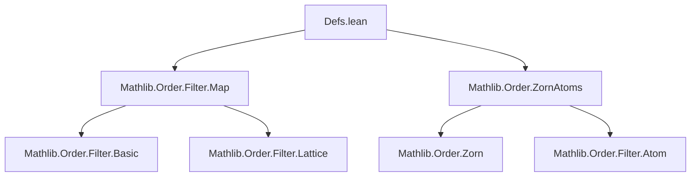
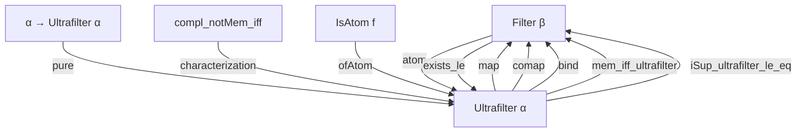
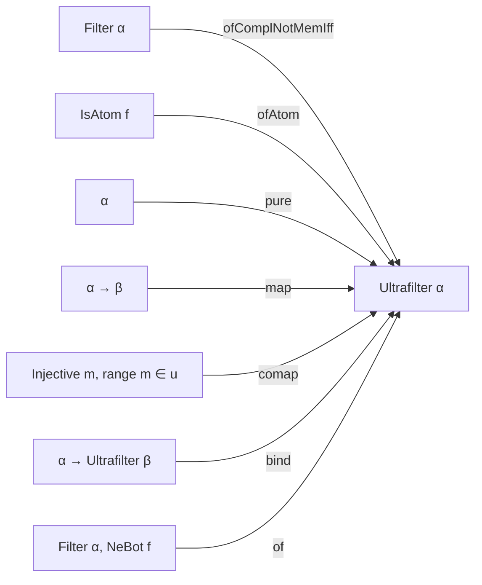

### Technical Brief: Ultrafilters in Lean 4 (Mathlib)

---

#### **1. Key Definitions & Theorems**

| Name | Type / Signature | Purpose |
|------|------------------|---------|
| `Ultrafilter α` | `Type u → Type u` | Subtype of `Filter α` consisting of *minimal proper filters* (i.e., atoms in the lattice of filters). |
| `neBot'` | `NeBot toFilter` | Ensures the underlying filter is nontrivial (≠ ⊥). |
| `le_of_le` | `∀ g, NeBot g → g ≤ f → f ≤ g` | Minimality condition: any nontrivial subfilter equals the ultrafilter. |
| `ofComplNotMemIff` | `(f : Filter α) → (∀ s, sᶜ ∉ f ↔ s ∈ f) → Ultrafilter α` | Constructs an ultrafilter from a filter satisfying the ultrafilter property (`sᶜ ∉ f ↔ s ∈ f`). |
| `ofAtom` | `(f : Filter α) → IsAtom f → Ultrafilter α` | Embeds an atomic filter (atom) into an ultrafilter. |
| `map` | `(α → β) → Ultrafilter α → Ultrafilter β` | Pushforward (image) of an ultrafilter along a function. |
| `comap` | `(α → β) → Ultrafilter β → Injective m → Set.range m ∈ u → Ultrafilter α` | Pullback (preimage) of an ultrafilter along an injective map with large range. |
| `pure` | `α → Ultrafilter α` | Principal ultrafilter at a point. |
| `bind` | `Ultrafilter α → (α → Ultrafilter β) → Ultrafilter β` | Monadic bind, defined via filter bind and `ofComplNotMemIff`. |
| `of` | `(f : Filter α) → NeBot f → Ultrafilter α` | Noncomputable choice of an ultrafilter extending a given nontrivial filter (Ultrafilter Lemma). |
| `exists_le` | `NeBot f → ∃ u, ↑u ≤ f` | Ultrafilter Lemma: every nontrivial filter is below some ultrafilter. |
| `mem_iff_ultrafilter` | `s ∈ f ↔ ∀ g : Ultrafilter α, ↑g ≤ f → s ∈ g` | Membership in a filter iff all ultrafilters below it contain the set. |
| `iSup_ultrafilter_le_eq` | `⨆ (g : Ultrafilter α) (_ : g ≤ f), ↑g = f` | A filter is the supremum of all ultrafilters below it. |
| `isAtom` | `f : Ultrafilter α → IsAtom (↑f : Filter α)` | Every ultrafilter is an atom in the filter lattice. |
| `compl_notMem_iff` | `sᶜ ∉ f ↔ s ∈ f` | Characterization of ultrafilters: a set or its complement is in the ultrafilter. |
| `frequently_iff_eventually` | `(∃ᶠ x in f, p x) ↔ (∀ᶠ x in f, p x)` | In ultrafilters, “frequently” and “eventually” coincide. |
| `union_mem_iff` | `s ∪ t ∈ f ↔ s ∈ f ∨ t ∈ f` | Union membership splits in ultrafilters. |
| `mem_or_compl_mem` | `s ∈ f ∨ sᶜ ∈ f` | Law of excluded middle for sets in ultrafilters. |
| `eq_of_le` | `(↑f ≤ g) → f = g` | Two ultrafilters are equal if one is below the other. |

---

#### **2. Naming Conventions**

- **Prefixes**:
  - `coe_`: coercion-related (e.g., `coe_map`, `coe_pure`, `coe_inj`).
  - `of_`: construction from a filter or property (e.g., `ofAtom`, `ofComplNotMemIff`, `of`, `ofComapInfPrincipal`).
  - `compl_`: complement-related (e.g., `compl_notMem_iff`, `compl_mem_iff_notMem`).
  - `mem_`: membership-related (e.g., `mem_pure`, `mem_map`, `mem_comap`).
  - `eventually_`: filter convergence (e.g., `eventually_or`, `eventually_not`, `eventually_imp`).
  - `le_`: order-related (e.g., `le_of_le`, `le_of_inf_neBot`, `le_sup_iff`).
  - `inf_`: meet-related (e.g., `inf_neBot_iff`, `diff_mem_iff`).
  - `disjoint_`: disjointness (e.g., `disjoint_iff_not_le`).

- **Suffixes**:
  - `_iff`: equivalence characterizations (e.g., `mem_coe`, `coe_le_coe`, `compl_notMem_iff`).
  - `_neBot`: nontriviality conditions (e.g., `inf_neBot_iff`, `comap_neBot_iff_compl_range`).
  - `_iff'`: variants of `_iff` (e.g., `le_pure_iff'`).

---

#### **3. Tactic Stack**

- **Core tactics**:
  - `simp` / `simp only`: heavily used for rewriting definitions and simplifying membership/coercion.
  - `rw`: rewriting using lemmas like `mem_map`, `coe_inj`, `compl_notMem_iff`.
  - `congr`: for proving equality of structures (e.g., `coe_injective`).
  - `ext`: extensionality for ultrafilters (via `coe_injective`).
  - `by_contra`: contradiction proofs (e.g., in `isAtom`).
  - `rwa`: rewrite + assumption (common in `mem_or_compl_mem`, `compl_mem_iff_notMem`).
  - `convert`: for equality up to definitional equality (e.g., `map_map`).
  - `apply`: applying lemmas like `le_antisymm`, `unique`, `eq_of_le`.
  - `aesop`: not used here — this file is mostly definitional and proof-structural.

- **Proof style**: Mostly *constructive* for definitions (`ofComplNotMemIff`, `ofAtom`, `map`, `comap`, `bind`), but uses *classical choice* in `of` and `exists_le`.

---

#### **4. Proof Logic**

- **Induction**: Not used — ultrafilters are defined extensionally, not inductively.
- **Cases**: Cases on `s ∈ f ∨ sᶜ ∈ f` (via `mem_or_compl_mem`) or `p x ∨ ¬p x` (via `em`).
- **Equality reasoning**: Heavy use of:
  - `coe_injective` to reduce equality of ultrafilters to equality of underlying filters.
  - `unique` / `eq_of_le` to show equality from mutual ≤.
- **Membership reasoning**: Often reduces to filter membership via `mem_coe`, then uses `simp` + lemmas like `compl_notMem_iff`, `union_mem_iff`.
- **Order-theoretic reasoning**: Leverages lattice properties of filters (inf, sup, principal filters), especially via `le_iff_ultrafilter`, `mem_iff_ultrafilter`, and `iSup_ultrafilter_le_eq`.
- **Axiomatic use**: Classical choice (`Classical.choose`) for `of`, `ofComapInfPrincipal`.

---

#### **5. Imports**

| Module | Purpose |
|--------|---------|
| `Mathlib.Order.Filter.Map` | Defines `Filter.map`, `Filter.comap`, and related lemmas (used in `map`, `comap`). |
| `Mathlib.Order.ZornAtoms` | Provides `IsAtomic`, `IsAtom`, and tools for atom-based constructions (e.g., `ofAtom`). |

---

#### **6. Mermaid Diagrams**

##### **Dependency Graph (Module-Level)**

##### **Overview of Theory Flow**

##### **Ultrafilter Structure (Data Flow)**

---

#### **7. Summary**

This file formalizes **ultrafilters** as *atomic nontrivial filters* in Lean 4, leveraging:
- **Order-theoretic minimality** (`le_of_le`),
- **Complement duality** (`compl_notMem_iff`),
- **Classical choice** for extension (`of`, `exists_le`),
- **Functor/monad structure** (`map`, `bind`, `pure`).

It serves as a foundational module for topology (e.g., Stone–Čech compactification), model theory (ultraproducts), and nonstandard analysis.

--- 

Let me know if you'd like a formalized dependency graph (e.g., for `leanproject`), or a summary of related files (e.g., `Basic.lean`, `StoneCech.lean`).
