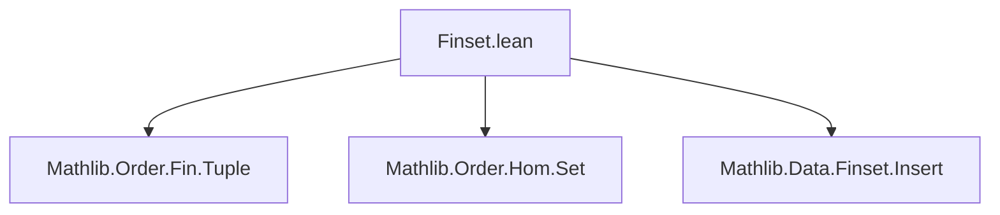

**Technical Brief: `Finset.lean` — Order Isomorphisms from `Fin n` to Small Finsets**

---

### 1. Key Definitions & Theorems

| Name | Type | Purpose |
|------|------|---------|
| `orderIsoSingleton` | `a : α → Fin 1 ≃o ({a} : Finset α)` | Constructs the unique order isomorphism from `Fin 1` to the singleton finset `{a}`. |
| `orderIsoPair` | `a < b → Fin 2 ≃o ({a, b} : Finset α)` | Constructs an order isomorphism from `Fin 2` to `{a, b}` when `a < b`. |
| `orderIsoTriple` | `a < b → b < c → Fin 3 ≃o ({a, b, c} : Finset α)` | Constructs an order isomorphism from `Fin 3` to `{a, b, c}` when `a < b < c`. |
| `orderIsoSingleton_apply` | `∀ i, orderIsoSingleton a i = a` | Describes the action of `orderIsoSingleton`. |
| `orderIsoPair_zero`, `orderIsoPair_one` | `orderIsoPair a b hab 0 = a`, `= b` | Evaluations of `orderIsoPair` at `0` and `1`. |
| `orderIsoTriple_zero`, `orderIsoTriple_one`, `orderIsoTriple_two` | Evaluations of `orderIsoTriple` at `0`, `1`, `2`. |

All definitions are **noncomputable**, relying on `OrderIso.ofUnique` (for singleton) or `StrictMono.orderIsoOfSurjective` (for pairs/triples), which constructs an order isomorphism from a strictly monotone surjection between finite linearly ordered types.

---

### 2. Naming Conventions

- **Prefixes**:
  - `orderIso_`: Indicates an order isomorphism (`≃o`) is being defined.
  - `vecCons`, `vecEmpty`: From `Mathlib.Data.Vec`, used to build vectors (tuples) for monotonicity proofs.
- **Suffixes**:
  - `_apply`: For lemmas about function application.
  - `_zero`, `_one`, `_two`: For evaluation lemmas at specific indices.

---

### 3. Tactic Stack

- `simp` (with `Finset.mem_insert`, `Finset.mem_singleton`)
- `obtain rfl | rfl | … := hx` (case analysis on equality from `Finset.mem_insert`/`mem_singleton`)
- `exact ⟨n, rfl⟩` (constructing preimage under the isomorphism)
- `by simp` (in proofs of membership for vector entries)
- `strictMono_vecEmpty.vecCons` (building strictly monotone vectors)

No heavy automation (e.g., `aesop`, `ring`, `linarith`) is used—proofs are mostly structural and rely on `simp`-based simplification.

---

### 4. Proof Logic

- **Singleton case**: Trivial via `OrderIso.ofUnique` (both `Fin 1` and `{a}` are unique up to unique isomorphism).
- **Pair/triple cases**:
  1. Construct a vector of elements (`![a, b]` or `![a, b, c]`) with proofs of membership.
  2. Prove strict monotonicity using `vecCons` and `hab`, `hbc`.
  3. Prove surjectivity onto the finset by case analysis on membership.
  4. Apply `StrictMono.orderIsoOfSurjective`, which guarantees an order isomorphism.

Induction is *not* used; instead, the pattern is **explicit construction + verification** for small `n`.

---

### 5. Imports

| Import | Role |
|--------|------|
| `Mathlib.Order.Fin.Tuple` | Provides `Fin n`-indexed tuples and monotonicity tools (`vecCons`, `vecEmpty`). |
| `Mathlib.Order.Hom.Set` | Supplies `StrictMono.orderIsoOfSurjective`. |
| `Mathlib.Data.Finset.Insert` | Provides `Finset.insert`, `mem_insert`, `mem_singleton`, needed for finset membership reasoning. |

---

### 6. Mermaid Diagrams

#### Dependency Graph (Module-Level)



#### Theoretical Overview (Conceptual Flow)

```mermaid
flowchart LR
  A[Preorder α] --> B[Fin 1]
  A --> C[{a}]
  B -- orderIsoSingleton --> C

  A --> D[Fin 2]
  A --> E[{a, b}]
  D -- orderIsoPair[hab] --> E

  A --> F[Fin 3]
  A --> G[{a, b, c}]
  F -- orderIsoTriple[hab, hbc] --> G

  style A fill:#f9f,stroke:#333
  style B,D,F fill:#bbf,stroke:#333
  style C,E,G fill:#bfb,stroke:#333
```

#### Future Work (TODO)

```mermaid
flowchart LR
  e[Fin (n+1) ≃o s] --> i[i < e 0]
  i --> extend[Fin (n+2) ≃o Finset.insert i s]
  style extend fill:#f96,stroke:#333,stroke-dasharray: 5 5
```

---

### 7. Summary

This module formalizes small-order isomorphisms between `Fin n` and finsets of size `n` in a preorder, leveraging strict monotonicity and surjectivity. It serves as a foundational stepping stone for more general constructions (e.g., extending isomorphisms via `Finset.insert`). The proofs are elementary but illustrative of how finite ordered types interact with finsets in Lean.
