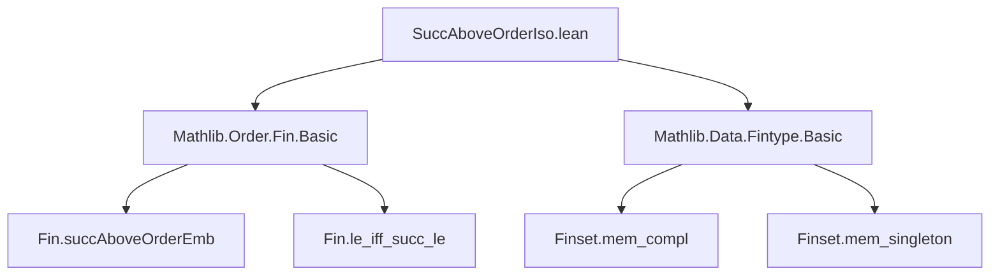

**Technical Brief: `SuccAboveOrderIso.lean`**

---

### 1. **Key Definitions & Theorems**

| Name | Type | Purpose |
|------|------|---------|
| `Fin.succAboveOrderIso` | `{n : ℕ} → (i : Fin (n + 2)) → Fin (n + 1) ≃o ({i}ᶜ : Finset (Fin (n + 2)))` | Constructs an order isomorphism between `Fin (n + 1)` and the complement of a singleton `{i}` in `Fin (n + 2)`. |
| `Fin.succAboveOrderEmb` *(implicit)* | `(i : Fin (n + 2)) → Fin (n + 1) ↪o Fin (n + 2)` | Order embedding used to define the underlying function of the isomorphism; maps `a` to `Fin.succAbove i a`. |
| `Equiv.ofBijective` *(used)* | `(f : α → β) → .Bijective f → α ≃ β` | Constructs an equivalence from a bijective function. |
| `Subtype.mk_le_mk` *(used)* | `∀ {p : α → Prop} (a b : {x // p x}), a.1 ≤ b.1 ↔ a ≤ b` | Relates order on subtype to order on ambient type. |

---

### 2. **Naming Conventions**

- **Prefixes**:
  - `succAbove` — indicates use of `Fin.succAbove`, a function that inserts a new element *above* a given index.
  - `orderIso`, `orderEmb` — standard Lean/Order theory suffixes for order isomorphisms/embeddings.
- **Suffixes**:
  - `mk` — used for subtype constructors (`Subtype.mk`).
  - `pred`, `predAbove` — inverse operations to `succ`, `succAbove`.

---

### 3. **Tactic Stack**

- `aesop` — used for automated reasoning in the surjectivity proof.
- `simp` / `simp only` — heavily used to simplify goals using definitional equalities and lemmas like `mem_compl`, `mem_singleton`.
- `constructor` — for splitting bijectivity into injectivity + surjectivity.
- `intro`, `rintro`, `obtain`, `rfl` — standard for case analysis and destructuring.
- `simpa using h` — simplifies using hypothesis `h`.

---

### 4. **Proof Logic**

The proof proceeds in two main parts:

1. **Constructing the equivalence**:
   - Define a function `f : Fin (n + 1) → {i}ᶜ` by `a ↦ ⟨Fin.succAboveOrderEmb i a, hj⟩`.
   - Prove `f` is **bijective**:
     - *Injective*: follows from injectivity of `Fin.succAboveOrderEmb`.
     - *Surjective*: case analysis on `i : Fin (n + 2)` (via `Fin.eq_zero_or_eq_succ`), then construct preimage using `pred` or `predAbove`.

2. **Preservation of order**:
   - Use `map_rel_iff'` to show `a ≤ b ↔ f a ≤ f b`.
   - Simplify using `Equiv.ofBijective_apply`, `Subtype.mk_le_mk`, and `OrderEmbedding.le_iff_le`.

The structure is typical for constructing order isomorphisms via bijective order embeddings.

---

### 5. **Imports**

| Module | Role |
|--------|------|
| `Mathlib.Order.Fin.Basic` | Provides `Fin`, `Fin.succAboveOrderEmb`, order-theoretic lemmas on `Fin`. |
| `Mathlib.Data.Fintype.Basic` | Provides `Finset`, `Finset.compl`, singleton sets, and basic finite set theory. |

---

### 6. **Mermaid Diagrams**

#### **Dependency Graph**



#### **Overview of File & Theory**

```mermaid
flowchart LR
  subgraph Theory["Order Theory on Fin"]
    E1[Fin types] --> E2[Order structure]
    E2 --> E3[Order embeddings]
    E3 --> E4[Order isomorphisms]
  end

  subgraph Construction["SuccAboveOrderIso"]
    I1[i : Fin (n + 2)] --> I2[Complement {i}ᶜ]
    I2 --> I3[Fin (n + 1) ≃o {i}ᶜ]
    I4[Fin.succAboveOrderEmb] --> I3
  end

  I1 --> Theory
  I3 --> Theory
```

---

### 7. **Summary**

This module formalizes a key combinatorial fact: removing one element from `Fin (n + 2)` yields a structure order-isomorphic to `Fin (n + 1)`. The construction leverages `Fin.succAbove`, a canonical embedding that “skips” a given index, and shows it induces a bijection onto the complement of that index. The proof is constructive and relies on elementary properties of `Fin`, `Finset`, and order theory.
