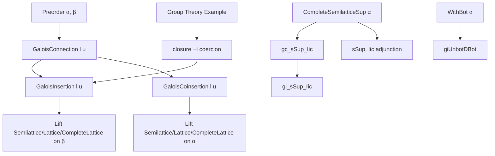
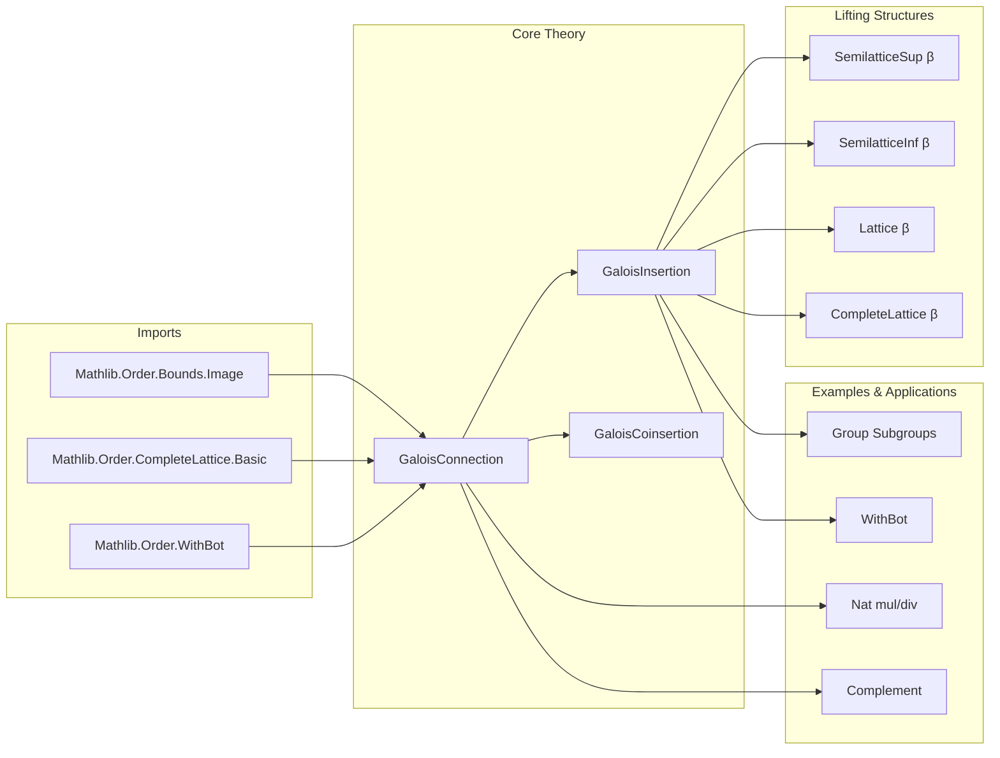

### Technical Brief: `Basic.lean` — Galois Connections, Insertions, and Coinsertions in Lean 4

---

#### **1. Key Definitions & Theorems**

| Name | Type / Signature | Purpose |
|------|------------------|---------|
| `GaloisConnection l u` | `l : α → β`, `u : β → α`, `[Preorder α]`, `[Preorder β]` | Binary relation `l a ≤ b ↔ a ≤ u b` expressing adjointness between preorders. |
| `GaloisInsertion l u` | `l : α → β`, `u : β → α`, `[PartialOrder β]`, plus `choice : Π S, l (u S) ≤ S → β` | A Galois connection where `u` is injective and `l ∘ u = id`. Includes a *choice* function to refine constructions (e.g., avoid unnecessary closure). |
| `GaloisCoinsertion l u` | Dual of `GaloisInsertion`: `l ∘ u = id`, `u` surjective, with dual choice. | Used to *co*-lift order structures (e.g., from `α` to `β` when `l` is embedding). |
| `gc_sSup_Iic` | `GaloisConnection sSup Iic` | Standard Galois connection between set supremum and down-sets. |
| `gc_Ici_sInf` | `GaloisConnection (toDual ∘ Ici) (sInf ∘ ofDual)` | Dual connection for infima and up-sets. |
| `gi_sSup_Iic` | `GaloisInsertion sSup Iic` | Galois insertion from complete semilattice of sets to its underlying type. |
| `gci_Ici_sInf` | `GaloisCoinsertion (toDual ∘ Ici) (sInf ∘ ofDual)` | Dual coinsertion. |
| `WithBot.giUnbotDBot` | `GaloisInsertion (unbotD ⊥) some` | Galois insertion for `WithBot`, enabling lifting of order structure across `some : α → WithBot α`. |
| `l_sup_u`, `l_iSup_u`, `l_inf_u`, `l_iInf_u` | `l (u a ⊔ u b) = a ⊔ b`, etc. | Key properties of Galois insertions: `l ∘ u` preserves suprema/infima. |
| `liftSemilatticeSup`, `liftLattice`, `liftCompleteLattice` | `GaloisInsertion → SemilatticeSup β`, etc. | Constructs order/lattice/complete lattice structures on `β` via `l, u`. |
| `isLUB_l_image`, `isGLB_u_image` | `IsLUB s a → IsLUB (l '' s) (l a)` | Image of LUB/GLB under adjoints. |
| `l_sSup`, `u_sInf` | `l (sSup s) = ⨆ a ∈ s, l a`, etc. | Preservation of arbitrary suprema/infima under `l`/`u`. |
| `compl`-based construction | `GaloisConnection l u ⇒ GaloisConnection (compl ∘ u ∘ compl) (compl ∘ l ∘ compl)` | Lifting Galois connections through Boolean complement. |
| `galoisConnection_mul_div` | `GaloisConnection (· * k) (· / k)` for `0 < k` | Arithmetic example: multiplication/division adjunction on `ℕ`. |

---

#### **2. Naming Conventions**

| Pattern | Meaning | Examples |
|--------|---------|----------|
| `l_` / `u_` | Lower / upper adjoint of a Galois connection | `l_sup`, `u_inf`, `l_iSup`, `u_iInf` |
| `gc_` | Galois connection | `gc_sSup_Iic`, `gc_Ici_sInf` |
| `gi_` | Galois insertion | `gi_sSup_Iic`, `giUnbotDBot` |
| `gci_` | Galois coinsertion | `gci_Ici_sInf` |
| `lift_` | Lifting order structure along `gi`/`gci` | `liftSemilatticeSup`, `liftCompleteLattice` |
| `isLUB_` / `isGLB_` | Characterization of least upper / greatest lower bounds | `isLUB_l_image`, `isGLB_u_image`, `isLUB_of_u_image` |
| `_image` | Behavior under image/preimage | `bddAbove_l_image`, `isLUB_l_image` |
| `_dual` | Dual statement (via `OrderDual`) | `gc.dual.upperBounds_l_image`, `gi.dual.l_iSup_u` |
| `choice_` | Choice function in `GaloisInsertion` | `choice_eq`, `choice` field in structure |

---

#### **3. Tactic Stack**

Frequent tactics used in proofs:

| Tactic | Role |
|--------|------|
| `simp` / `simp_rw` | Simplify using definitions (e.g., `upperBounds`, `l_u_eq`, `gc`) |
| `rw` / `rwa` | Rewrite using equalities or equivalences (e.g., `gc.le_iff_le`) |
| `exact` / `assumption` | Close goals directly from hypotheses |
| `calc` | Chain equalities (common in lattice structure proofs) |
| `congr_arg`, `funext` | Prove function equality |
| `ext` / `Set.ext` | Extensionality for sets |
| `dsimp`, `unfold` | Unfold definitions (e.g., `compl`) |
| `cases` | Case analysis on hypotheses (e.g., `h : IsLUB s a`) |
| `apply` / `exact` | Apply lemmas or constructors (e.g., `apply isLUB.sSup_eq`) |
| `aesop` (implied) | Not explicitly used, but `simp` + `rw` + `linarith`-style reasoning dominates. |

---

#### **4. Proof Logic**

- **Structure**: Most proofs follow a *two-step* pattern:
  1. **Show equivalence or inclusion** using the Galois connection property (`l a ≤ b ↔ a ≤ u b`).
  2. **Leverage lattice properties** (e.g., `isLUB_sSup`, `sup_le`, `le_inf`) to lift or reflect bounds.

- **Common proof patterns**:
  - **Induction**: Not used here (no inductive types).
  - **Case analysis**: On `IsLUB`/`IsGLB` hypotheses.
  - **Duality**: Many theorems are proven via `gc.dual.*`, `gi.dual.*`, or `OrderDual` to avoid repetition.
  - **Choice refinement**: In `liftSemilatticeInf`, the `choice` function is used to avoid closure when the set is already a subgroup/sublattice.

- **Example flow** (e.g., `l_sup_u`):
  ```lean
  calc
    l (u a ⊔ u b) = l (u a) ⊔ l (u b) := gi.gc.l_sup
    _ = a ⊔ b := by simp only [gi.l_u_eq]
  ```

---

#### **5. Imports**

| Module | Purpose |
|--------|---------|
| `Mathlib.Order.Bounds.Image` | Bounds and images of sets under monotone maps. |
| `Mathlib.Order.CompleteLattice.Basic` | Complete lattices, `sSup`, `sInf`, `iSup`, `iInf`. |
| `Mathlib.Order.WithBot` | `WithBot α`, used for lifting with bottom element. |

---

#### **6. Mermaid Diagrams**

##### **Dependency Graph (Core Concepts)**



##### **File Overview**



---

#### **7. Domain-Specific Insights**

- **Group Theory Motivation**: The file motivates Galois insertions via subgroup closure:  
  `Subgroup.closure ⊣ (↑· : Subgroup G → Set G)`.  
  The `choice` function ensures infimum of subgroups is *intersection*, not `closure (S ∩ T)`.

- **Lifting Strategy**:  
  - `GaloisInsertion` lifts *from* `α` *to* `β` (via `l : α → β`, `u : β → α`).  
  - `GaloisCoinsertion` lifts *from* `β` *to* `α` (dual direction).  
  - `choice` enables *definitional* refinement (e.g., avoid `closure` when unnecessary).

- **Arithmetic Example**:  
  `n ↦ n * k` ⊣ `n ↦ n / k` for `k > 0` shows how Galois connections model division as right adjoint to multiplication.

- **WithBot Use Case**:  
  Enables lifting of order structures to extended types (e.g., `ℝ≥0 ∪ {∞}`), with `unbotD ⊥ ⊣ some`.

---

#### **8. Summary**

This file formalizes the foundational theory of **Galois connections**, **insertions**, and **coinsertions**, emphasizing their role in **lifting order structures**. It provides:
- General theorems on preservation of suprema/infima,
- Concrete constructions (`gi_sSup_Iic`, `WithBot.giUnbotDBot`),
- A mechanism (`choice`) to avoid unnecessary closure,
- A dual framework for coinsertions.

It serves as a *prerequisite* for more advanced applications (e.g., topology, measure theory, group theory) where order-theoretic lifting is needed.

--- 

Let me know if you'd like a formalized dependency graph (e.g., for `leanpkg`), or a summary of related files (e.g., `GaloisConnection.lean`, `GaloisInsertion.lean`).
