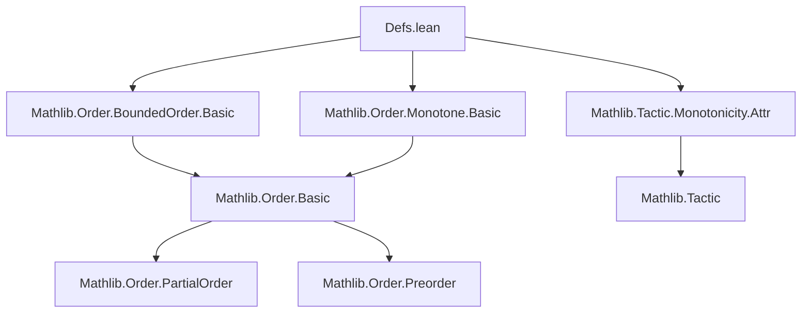
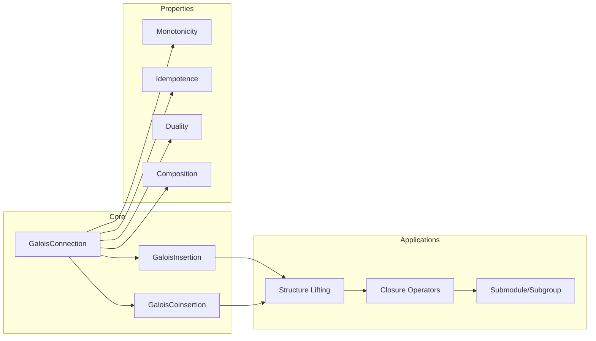

### Technical Brief: Galois Connections, Insertions, and Coinsertions in Lean 4

---

#### **1. Key Definitions & Theorems**

| Name | Type / Signature | Purpose |
|------|------------------|---------|
| `GaloisConnection` | `∀ {α β} [Preorder α] [Preorder β], (α → β) → (β → α) → Prop` | Defines a pair `(l, u)` satisfying $l(a) \le b \iff a \le u(b)$. Core order-theoretic adjunction. |
| `GaloisInsertion` | `structure` with fields `choice`, `gc`, `le_l_u`, `choice_eq` | A Galois connection where $l \circ u = \mathrm{id}$ (i.e., $l(u(b)) = b$), with a constructive choice function for lifting structures. |
| `GaloisCoinsertion` | `structure` with fields `choice`, `gc`, `u_l_le`, `choice_eq` | Dual to `GaloisInsertion`: $u \circ l = \mathrm{id}$ (i.e., $u(l(a)) = a$). |
| `GaloisConnection.monotone_intro` | `(Monotone u) → (Monotone l) → (∀ a, a ≤ u(l a)) → (∀ a, l(u a) ≤ a) → GaloisConnection l u` | Constructs a Galois connection from monotonicity and unit/counit inequalities. |
| `GaloisConnection.le_iff_le` | `l a ≤ b ↔ a ≤ u b` | The defining equivalence of a Galois connection. |
| `GaloisConnection.l_u_le` | `a ≤ u(l a)` | Unit inequality (always holds in a Galois connection). |
| `GaloisConnection.u_l_u_eq_u` | `u(l(u b)) = u b` | Idempotence of $u \circ l$ on the image of $u$. |
| `GaloisConnection.toGaloisInsertion` | `(GaloisConnection l u) → (∀ b, b ≤ l(u b)) → GaloisInsertion l u` | Upgrades a Galois connection to a Galois insertion if $b \le l(u(b))$. |
| `GaloisConnection.toGaloisCoinsertion` | `(GaloisConnection l u) → (∀ a, u(l a) ≤ a) → GaloisCoinsertion l u` | Dual upgrade to coinsertion. |
| `GaloisInsertion.l_u_eq` | `l(u b) = b` | Main property of Galois insertions (equality, not just inequality). |
| `GaloisInsertion.u_le_u_iff` | `u a ≤ u b ↔ a ≤ b` | $u$ reflects and preserves order; hence strictly monotone. |
| `GaloisCoinsertion.u_l_eq` | `u(l a) = a` | Dual to above; $u \circ l = \mathrm{id}$. |
| `GaloisConnection.compose` | `GaloisConnection l1 u1 → GaloisConnection l2 u2 → GaloisConnection (l2 ∘ l1) (u1 ∘ u2)` | Composition of Galois connections. |
| `GaloisConnection.dual` | `GaloisConnection l u → GaloisConnection (uᵒᵈ) (lᵒᵈ)` | Duality via order duals. |
| `GaloisInsertion.dual` / `GaloisCoinsertion.dual` | `GaloisInsertion l u → GaloisCoinsertion uᵒᵈ lᵒᵈ` and vice versa | Duality between insertions and coinsertions. |

---

#### **2. Naming Conventions**

- **Prefixes**:
  - `l_`, `u_`: Functions in the Galois connection (lower/upper adjoints).
  - `gc_`: Properties of a `GaloisConnection`.
  - `gi_`, `gci_`: Properties of `GaloisInsertion` / `GaloisCoinsertion`.
  - `monotone_`, `strictMono_`: Monotonicity/strict monotonicity lemmas.
  - `liftOrder_`: Lifting order-theoretic structures (e.g., `bot`, `top`).
- **Suffixes**:
  - `_eq`: Equality properties (e.g., `l_u_eq`, `u_l_eq`).
  - `_iff`: Biconditional characterizations (e.g., `u_le_u_iff`, `lt_iff_lt`).
  - `_intro`: Introduction rules (e.g., `monotone_intro`, `toGaloisInsertion`).
  - `_trans`, `_unique`: Transitivity/uniqueness lemmas.
- **Duals**:
  - `to_dual`, `of_dual`, `dual`: Mark dual versions (e.g., `@[to_dual]` attribute).
  - `ofDual`, `toDual`: Explicit use of `OrderDual`.

---

#### **3. Tactic Stack**

- **Core tactics**:
  - `rfl`, `refl`, `symm`, `trans`, `antisymm`: Basic equality reasoning.
  - `intro`, `introv`, `rintro`, `cases`, `exact`, `assumption`.
- **Order-specific**:
  - `le_of_eq`, `eq_of_le_of_le`, `le_antisymm`, `top_unique`, `bot_le`.
- **Simplification & rewriting**:
  - `simp`, `simp_rw`, `congr`, `ext`, `funext`.
- **Automated reasoning**:
  - `aesop`, `linarith`, `omega` (for linear orders).
- **Category/order-theoretic**:
  - `grind`, `to_dual_insert_cast`, `to_dual` (custom attributes for duality).

---

#### **4. Proof Logic**

- **Inductive/structural style**:
  - Most proofs are *direct* and *equational*, leveraging the defining equivalence $l a \le b \iff a \le u b$.
  - **Typical flow**:
    1. Unfold definitions (`GaloisConnection`, `le_iff_le`).
    2. Apply `⟨_, _⟩` to split biconditionals.
    3. Use monotonicity (`monotone_u`, `monotone_l`) and unit/counit inequalities (`l_u_le`, `u_l_le`).
    4. For equalities: prove two inequalities (`antisymm`), often via `le_of_eq` or `eq_of_le_of_le`.
- **Duality**:
  - Many theorems are paired via `@[to_dual]`, with proofs mirrored using `OrderDual`.
- **Constructive content**:
  - `choice` fields in `GaloisInsertion`/`GaloisCoinsertion` ensure definitional equality when lifting structures (e.g., `liftOrderBot`, `liftOrderTop`).

---

#### **5. Imports & Dependencies**

- **Core libraries**:
  ```lean
  Mathlib.Order.BoundedOrder.Basic
  Mathlib.Order.Monotone.Basic
  Mathlib.Tactic.Monotonicity.Attr
  ```
- **Key dependencies**:
  - `Preorder`, `PartialOrder`, `LinearOrder`, `OrderTop`, `OrderBot`.
  - `OrderDual`, `Function`, `Set`.
  - `Monotone`, `StrictMono`, `LeftInverse`, `Surjective`, `Injective`.

---

#### **6. Mermaid Diagrams**

##### **Dependency Graph (Module-Level)**



##### **Theory Overview (Conceptual Flow)**



##### **Galois Connection ↔ Insertion ↔ Coinsertion Relationships**

```mermaid
graph TD
  GC[GaloisConnection] -->|unit ≤ id & id ≤ counit| GC
  GC -->|if b ≤ l(u b)| GI[GaloisInsertion]
  GC -->|if u(l a) ≤ a| GCI[GaloisCoinsertion]
  GI -->|dual| GCI
  GCI -->|dual| GI
  GI -->|l ∘ u = id| EQ1[l(u(b)) = b]
  GCI -->|u ∘ l = id| EQ2[u(l(a)) = a]
```

---

#### **7. Summary**

This module formalizes *order-theoretic adjoints* — a foundational concept in domain theory, topology, and algebra — in Lean 4 without relying on category theory. It provides:

- A minimal, self-contained theory of Galois connections.
- Refined structures (`GaloisInsertion`, `GaloisCoinsertion`) with constructive choice functions for *definitional* lifting of order structures (e.g., `bot`, `top`).
- Extensive duality, composition, and monotonicity lemmas.
- Direct applicability to closure operators like `Submodule.span`, `Subgroup.closure`, and topology `interior`/`closure`.

The design reflects Lean’s emphasis on *definitional equality* and *constructive content*, making it suitable for formalizing algebraic and topological constructions where order-theoretic adjoints play a central role.
