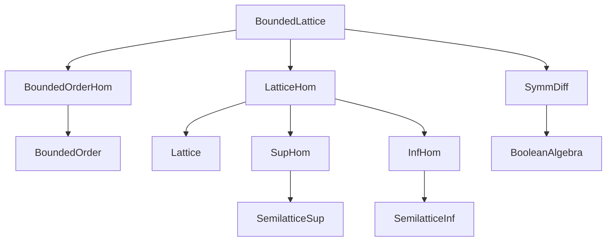
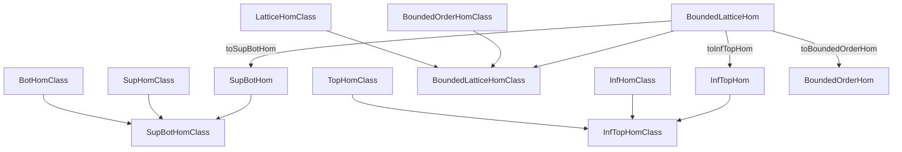
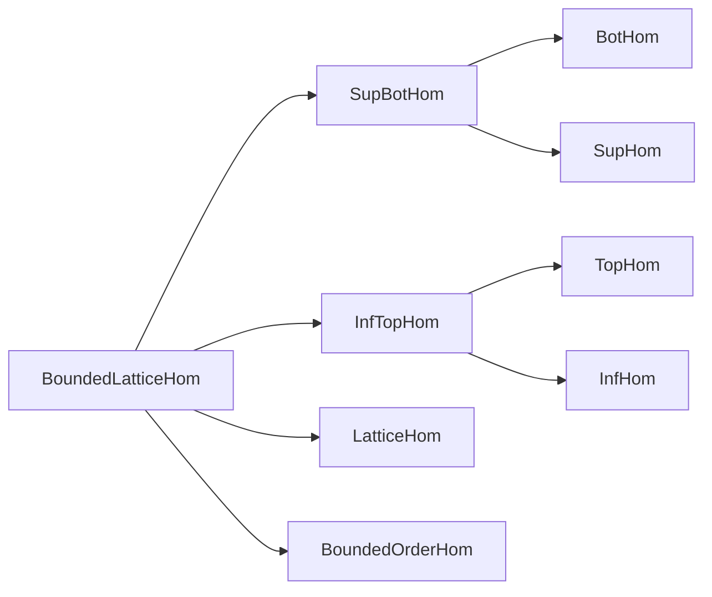

**Technical Brief: `BoundedLattice.lean` (Lean 4)**  
*Domain: Order Theory — Bounded Lattice Homomorphisms*

---

### 1. **Key Definitions & Theorems**

| Name | Type / Structure | Purpose |
|------|------------------|---------|
| `SupBotHom α β` | `Structure` | Finitary supremum-preserving maps (`⊔`, `⊥`) from `α` to `β`. Extends `SupHom` with `map_bot'`. |
| `InfTopHom α β` | `Structure` | Finitary infimum-preserving maps (`⊓`, `⊤`) from `α` to `β`. Extends `InfHom` with `map_top'`. |
| `BoundedLatticeHom α β` | `Structure` | Bounded lattice homomorphisms (`⊔`, `⊓`, `⊤`, `⊥`). Extends `LatticeHom` with `map_top'`, `map_bot'`. |
| `SupBotHomClass F α β` | `Class` | Typeclass stating `F` is a family of maps preserving `⊔` and `⊥`. Extends `SupHomClass`. |
| `InfTopHomClass F α β` | `Class` | Typeclass stating `F` preserves `⊓` and `⊤`. Extends `InfHomClass`. |
| `BoundedLatticeHomClass F α β` | `Class` | Typeclass stating `F` preserves `⊔`, `⊓`, `⊤`, `⊥`. Extends `LatticeHomClass`. |
| `Disjoint.map` | `Theorem` | If `f` preserves `⊥` and `⊓`, then `Disjoint a b → Disjoint (f a) (f b)`. |
| `Codisjoint.map` | `Theorem` | If `f` preserves `⊤` and `⊔`, then `Codisjoint a b → Codisjoint (f a) (f b)`. |
| `IsCompl.map` | `Theorem` | If `f` is a bounded lattice hom, then `IsCompl a b → IsCompl (f a) (f b)`. |
| `map_compl'` | `Theorem` | For Boolean algebras, `f aᶜ = (f a)ᶜ` under `BoundedLatticeHomClass`. |
| `map_sdiff'` | `Theorem` | For Boolean algebras, `f (a \ b) = f a \ f b`. |
| `map_symmDiff'` | `Theorem` | For Boolean algebras, `f (a ∆ b) = f a ∆ f b`. |
| `SupBotHom.dual` | `Equiv` | `SupBotHom α β ≃ InfTopHom αᵒᵈ βᵒᵈ`. Dualizes supremum homs to infimum homs on opposite orders. |
| `InfTopHom.dual` | `Equiv` | `InfTopHom α β ≃ SupBotHom αᵒᵈ βᵒᵈ`. |
| `BoundedLatticeHom.dual` | `Equiv` | `BoundedLatticeHom α β ≃ BoundedLatticeHom αᵒᵈ βᵒᵈ`. |

---

### 2. **Naming Conventions**

- **Prefixes**:
  - `map_`: property of preserving an operation/element (`map_sup`, `map_inf`, `map_top`, `map_bot`).
  - `coe_`: coercion-related lemmas (`coe_comp`, `coe_id`, `coe_sup`, `coe_bot`, etc.).
  - `subtypeVal_`: canonical embedding of a subtype into the ambient type.
- **Suffixes**:
  - `'` (prime): often used for simplified or definitional versions (`map_bot'`, `map_top'`, `map_compl'`).
  - `Class`: typeclass for abstract morphism families (`SupBotHomClass`, `InfTopHomClass`, `BoundedLatticeHomClass`).
- **Structure fields**:
  - `toFun`: underlying function.
  - `map_*'`: definitional preservation proofs (marked `private` in docs, used via `map_*` lemmas).
- **`mk`**: constructor for structures defined via `extends`.

---

### 3. **Tactic Stack**

- **Core tactics**: `rw`, `simp`, `congr`, `ext`, `obtain`, `cases`.
- **Order-specific**:
  - `dfunLike.ext` / `DFunLike.ext`: extensionality for function-like structures.
  - `bot_le`, `le_top`, `disjoint_iff`, `codisjoint_iff`, `isCompl_iff`.
- **Algebraic reasoning**:
  - `ring` (not used here — no additive/multiplicative structure).
  - `simp_rw` (via `simp` + `rw` in lemmas like `coe_comp_lattice_hom'`).
- **Class inference**:
  - `inferInstance`, `apply_instance`, `show ... from inferInstance`.
- **Equivalence reasoning**:
  - `ext`, `congr_arg`, `congr_arg₂`, ` rfl`, `symm`, `trans`.

---

### 4. **Proof Logic**

- **Structure definitions**: Use `extends` to inherit previous morphism types and add preservation of bounds.
- **Class instances**: Built via `{ ... with }` syntax to combine existing class instances (e.g., `SupBotHomClass.toBotHomClass`).
- **Main proof patterns**:
  - **Direct computation**: Many lemmas (`coe_*`, `apply_*`) are definitional (`rfl`).
  - **Reduction via definitions**: E.g., `Disjoint.map` rewrites `disjoint_iff`, uses `← map_inf`, and `map_bot`.
  - **Induction not needed**: All proofs are algebraic or rely on order-theoretic characterizations.
  - **Duality**: Proofs for `dual` use `SupHom.dual`, `InfHom.dual`, and `LatticeHom.dual`, with verification of bound preservation.

---

### 5. **Imports & Dependencies**

| Import | Purpose |
|--------|---------|
| `Mathlib.Order.Hom.Bounded` | `BotHom`, `TopHom`, `BoundedOrderHom`, and their classes. |
| `Mathlib.Order.Hom.Lattice` | `SupHom`, `InfHom`, `LatticeHom`, and their classes. |
| `Mathlib.Order.SymmDiff` | Symmetric difference (`∆`), set difference (`\`), Boolean algebra operations. |

**Core dependencies**:
- `Mathlib.Order.BoundedOrder`
- `Mathlib.Order.Lattice`
- `Mathlib.Order.SemilatticeSup`, `SemilatticeInf`
- `Mathlib.Order.BooleanAlgebra`
- `Mathlib.Data.Function.DFunLike`

---

### 6. **Mermaid Diagrams**

#### **Dependency Graph (Module-Level)**

#### **Overview of Morphism Hierarchy**

#### **Morphism Type Lattice (Inclusion Hierarchy)**

---

### 7. **Design Notes**

- **`DFunLike`-based design**: All morphism types are instances of `FunLike`, enabling uniform coercion and extensionality.
- **Class hierarchy mirrors structure hierarchy**: Each concrete type has a corresponding typeclass, and stricter types embed into looser ones (e.g., `BoundedLatticeHomClass → SupBotHomClass`).
- **Duality via `dual`**: Exploits `αᵒᵈ` to relate supremum and infimum homs uniformly.
- **Subtype embeddings**: `subtypeVal` constructs morphisms for sublattices closed under bounds and operations.

---

*End of Technical Brief*
