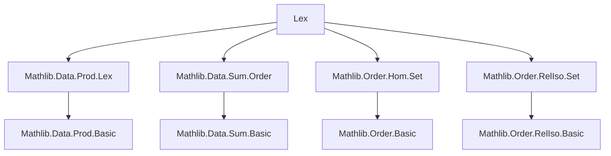
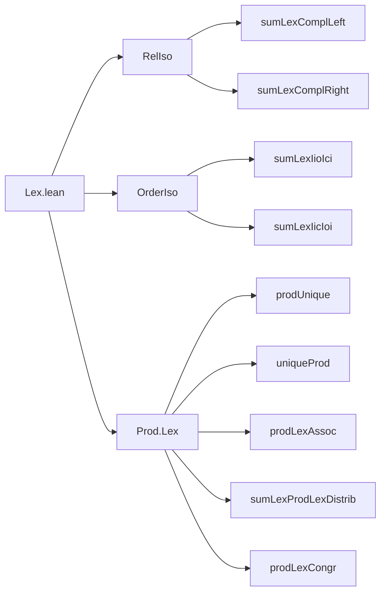

### Technical Brief: `Lex.lean` — Lexicographic Orders and Order Isomorphisms

---

#### **1. Key Definitions & Theorems**

| Name | Type / Signature | Purpose |
|------|------------------|---------|
| `RelIso.sumLexComplLeft` | `Sum.Lex (Subrel r (r · x)) (Subrel r (¬ r · x)) ≃r r` | Shows a relation `r` is *relation-isomorphic* to the lexicographic sum of elements `< x` and elements `≥ x`. |
| `RelIso.sumLexComplRight` | `Sum.Lex (Subrel r (¬ r x ·)) (Subrel r (r x)) ≃r r` | Shows `r` is *relation-isomorphic* to the lexicographic sum of elements `≤ x` and elements `> x`. |
| `OrderIso.sumLexIioIci` | `Iio x ⊕ₗ Ici x ≃o α` | For linear order `α`, `α ≅ (−∞, x) ⊕ₗ [x, ∞)`. |
| `OrderIso.sumLexIicIoi` | `Iic x ⊕ₗ Ioi x ≃o α` | For linear order `α`, `α ≅ (−∞, x] ⊕ₗ (x, ∞)`. |
| `Prod.Lex.prodUnique` | `α ×ₗ β ≃o α` (if `β` is `Unique`) | Lexicographic product with a unique right factor collapses to the left factor. |
| `Prod.Lex.uniqueProd` | `α ×ₗ β ≃o β` (if `α` is `Unique`) | Lexicographic product with a unique left factor collapses to the right factor. |
| `Prod.Lex.prodLexAssoc` | `(α ×ₗ β) ×ₗ γ ≃o α ×ₗ β ×ₗ γ` | Associativity of lexicographic product up to order isomorphism. |
| `Prod.Lex.sumLexProdLexDistrib` | `(α ⊕ₗ β) ×ₗ γ ≃o α ×ₗ γ ⊕ₗ β ×ₗ γ` | Left distributivity of `×ₗ` over `⊕ₗ`. |
| `Prod.Lex.prodLexCongr` | `(α ≃o β) → (γ ≃o δ) → α ×ₗ γ ≃o β ×ₗ δ` | Congruence of `×ₗ` w.r.t. order isomorphisms. |

---

#### **2. Naming Conventions**

- **Prefixes**:
  - `sumLex_`: lexicographic sum (`⊕ₗ`) constructions.
  - `prodLex_`: lexicographic product (`×ₗ`) constructions.
  - `prodUnique`, `uniqueProd`: degenerate product cases.
- **Suffixes**:
  - `Iio`, `Iic`, `Ici`, `Ioi`: standard interval notation (`Iio x = {a | a < x}`, etc.).
  - `ComplLeft`, `ComplRight`: partitioning via complement relative to `x`.
- **`ofRelIsoLT`**: lifts a *relation* isomorphism to an *order* isomorphism for strict order `<`.

---

#### **3. Tactic Stack**

- **Core tactics**:
  - `simp`, `simp_rw`, `ext`, `refl`, `rfl`
  - `intro`, `intro h`, `rintro (⟨a, ha⟩ | ⟨b, hb⟩)`
  - `rw [symm_apply_eq]`, `apply`, `exact`
- **Order-specific**:
  - `trans_trichotomous_left/right`, `trans`, `le_iff_lt_or_eq`
  - `ofRelIsoLT`, `sumLexCongr`, `setCongr`
- **Automation**:
  - `grind` (custom tactic for grinding through simplifications)
  - `aesop` not used here — proofs are mostly manual and rely on `simp` + `trans`.

---

#### **4. Proof Logic**

- **Structure**:
  - Most proofs follow a *constructive pattern*:
    1. Define an equivalence (via `Equiv.sumCompl`, `Equiv.prodAssoc`, etc.).
    2. Show it preserves and reflects the relation using `map_rel_iff'`.
    3. For order isomorphisms, lift via `ofRelIsoLT`.
  - **Induction/Recursion**: Used in `prodUnique`, `uniqueProd`, `prodLexAssoc`, `sumLexProdLexDistrib` via `x.rec` (recursor for `Lex`/`Prod`).
  - **Case analysis**: On `Sum.inl`/`Sum.inr` or membership in intervals (`h : y < x`, `h : x ≤ y`).
  - **Simplification**: Heavy use of `simp` with lemmas like `sumLexIioIci_apply_inl`, `Prod.Lex.le_iff`, etc.

- **Typical flow**:
  ```text
  intro (a | b) (c | d)
  · case inl-inl: simp
  · case inl-inr: use trans_trichotomous_right / left
  · case inr-inl: contradiction or use trans
  · case inr-inr: simp
  ```

---

#### **5. Imports & Dependencies**

- **Core libraries**:
  - `Mathlib.Data.Prod.Lex`: defines `Prod.Lex`, `toLex`, `ofLex`, `le_iff`, `lt_iff`.
  - `Mathlib.Data.Sum.Order`: defines `Sum.Lex`, order structures on sums.
  - `Mathlib.Order.Hom.Set`: interval sets (`Iio`, `Iic`, `Ici`, `Ioi`), order homs.
  - `Mathlib.Order.RelIso.Set`: relation isomorphisms, especially `ofRelIsoLT`.

- **Key typeclasses used**:
  - `[IsTrans α r]`, `[Std.Trichotomous r]`, `[DecidableRel r]` (for `RelIso`)
  - `[LinearOrder α]` (for `OrderIso`)
  - `[PartialOrder α]`, `[Preorder β]`, `[Unique β]` (for `prodUnique`)
  - `[LE β]`, `[Preorder α]`, `[Unique α]` (for `uniqueProd`)

---

#### **6. Mermaid Diagrams**

##### **Dependency Graph (Module-Level)**



##### **Overview of File Structure**



##### **Conceptual Flow of Main Theorems**

```mermaid
flowchart LR
  LinearOrder α -->|partition at x| Iio x ⊕ₗ Ici x
  LinearOrder α -->|partition at x| Iic x ⊕ₗ Ioi x

  Unique β --> α ×ₗ β ≃o α
  Unique α --> α ×ₗ β ≃o β

  (α ×ₗ β) ×ₗ γ --> α ×ₗ β ×ₗ γ
  (α ⊕ₗ β) ×ₗ γ --> α ×ₗ γ ⊕ₗ β ×ₗ γ
```

---

#### **7. Notes & Observations**

- **No `aesop`**: Proofs are highly structured and rely on manual `simp` + `trans` reasoning.
- **`[LinearOrder α]` is essential** for `OrderIso` lemmas — `RelIso` lemmas only need `IsTrans`, `Std.Trichotomous`, and `DecidableRel`.
- **Counterexample note**: Right distributivity `(α ×ₗ β) ⊕ₗ γ ≃o (α ⊕ₗ γ) ×ₗ (β ⊕ₗ γ)` fails — explicitly mentioned.
- **`[simps!]` attributes**: Used to auto-generate `simp` lemmas for `prodLexAssoc`, `sumLexProdLexDistrib`, `prodLexCongr`.

--- 

Let me know if you'd like a formalized dependency graph (e.g., for `leanproject`), or a tactic trace for a specific proof.
