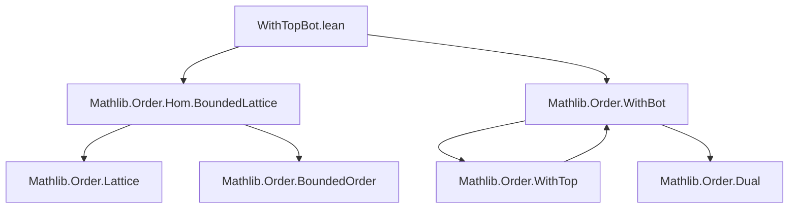

### Technical Brief: `WithTopBot.lean`

---

#### **1. Key Definitions & Theorems**

| Name | Type | Purpose |
|------|------|---------|
| `WithTop.toDualBotEquiv` | `WithTop αᵒᵈ ≃o (WithBot α)ᵒᵈ` | Order isomorphism showing duality between adjoining `⊤` and `⊥`. |
| `WithBot.toDualTopEquiv` | `WithBot αᵒᵈ ≃o (WithTop α)ᵒᵈ` | Dual of above: adjoining `⊥` then dual ≅ dual then adjoining `⊤`. |
| `Function.Embedding.coeWithTop` | `α ↪ WithTop α` | Canonical embedding of `α` into `WithTop α`. |
| `Function.Embedding.coeWithBot` | `α ↪ WithBot α` | Canonical embedding of `α` into `WithBot α`. |
| `coeOrderHom` | `α ↪o WithTop α` / `α ↪o WithBot α` | Monotone coercion embeddings (bundled). |
| `subtypeOrderIso` | `WithTop {a // a ≠ ⊤} ≃o α` (resp. `WithBot {a // a ≠ ⊥} ≃o α`) | Isomorphism between extended type and original when excluding top/bottom. |
| `OrderHom.withTopMap`, `OrderHom.withBotMap` | `α →o β ⇒ WithTop α →o WithTop β` / `WithBot α →o WithBot β` | Lifting order homs to extended types. |
| `OrderEmbedding.withTopMap`, `OrderEmbedding.withBotMap` | `α ↪o β ⇒ WithTop α ↪o WithTop β` / `WithBot α ↪o WithBot β` | Lifting order embeddings. |
| `OrderIso.withTopCongr`, `OrderIso.withBotCongr` | `α ≃o β ⇒ WithTop α ≃o WithTop β` / `WithBot α ≃o WithBot β` | Lifting order isomorphisms. |
| `SupHom.withTop`, `SupHom.withBot`, `SupHom.withTop'`, `SupHom.withBot'` | Various sup-hom liftings | Extend sup-homs to `WithTop`/`WithBot`, possibly changing codomain type (e.g., to `SupBotHom`). |
| `InfHom.withTop`, `InfHom.withBot`, `InfHom.withTop'`, `InfHom.withBot'` | Various inf-hom liftings | Extend inf-homs similarly. |
| `LatticeHom.withTop`, `LatticeHom.withBot`, `LatticeHom.withTopWithBot`, `LatticeHom.withTop'`, `LatticeHom.withBot'`, `LatticeHom.withTopWithBot'` | Lattice hom liftings | Extend lattice homs; `withTopWithBot` yields *bounded* lattice homs. |

**Key Theorems (Simp-normal forms):**
- `subtypeOrderIso_apply_coe`, `subtypeOrderIso_symm_apply`
- `withTop_id`, `withBot_id`, `withTop_comp`, `withBot_comp`, etc.
- `withTopCongr_refl`, `withTopCongr_symm`, `withTopCongr_trans`
- `coe_withTop`, `coe_withBot`, `coe_withTopWithBot`
- `withTopWithBot_id`, `withTopWithBot_comp`

---

#### **2. Naming Conventions**

| Pattern | Meaning |
|---------|---------|
| `withTop` / `withBot` | Extend homomorphism to `WithTop` / `WithBot` on both domain and codomain. |
| `withTop'` / `withBot'` | Extend only domain (or codomain) — often changes codomain type (e.g., `SupHom → SupBotHom`). |
| `withTopWithBot` | Extend to both `WithTop (WithBot α)` and `WithTop (WithBot β)` — yields *bounded* lattice homs. |
| `withTopWithBot'` | Extend codomain to include both `⊤` and `⊥` (i.e., `BoundedLatticeHom`). |
| `coeWithTop` / `coeWithBot` | Deprecated aliases for `coeOrderHom`. |
| `subtypeOrderIso` | Isomorphism between extended subtype and original type. |
| `toDualBotEquiv` / `toDualTopEquiv` | Duality equivalences between `WithTop` and `WithBot`. |

---

#### **3. Tactic Stack**

- **`simp` / `simp_rw`**: Used heavily for simplification of `map`, `elim`, `subtype`, and `dual`.
- **`rfl`**: For definitional equalities (e.g., `map`, `elim`, `coe`).
- **`split_ifs`**: In `subtypeOrderIso.right_inv`.
- **`congr_arg _`**: In `withTop.map_sup'`, `withBot.map_inf'`, etc., to lift equalities.
- **`ext` + `simp`**: For proving extensionality of homs (e.g., `withTopWithBot_comp`).
- **`RelIso.toEquiv_injective`**: To lift properties from underlying `Equiv` to `OrderIso`.
- **`dfunlike.coe_injective`**: To prove equality of bundled homs by extensionality.

---

#### **4. Proof Logic**

- **Induction/Case Analysis**: On elements of `WithTop α` / `WithBot α` (i.e., `⊤`, `a : α`) — especially in `map_*'` lemmas.
- **Duality**: Many results are proven via `OrderDual`, e.g., `WithBot` results derived from `WithTop` via `.dual`.
- **Definitional Reasoning**: Most proofs are short because constructions are designed to be definitionally coherent (`rfl`-provable).
- **Decidable Equality/Equality Predicates**: Required for `subtypeOrderIso` (e.g., `DecidablePred (· = ⊤)`).
- **Homomorphism Lifting**: Use `map_*` functions from `WithTop`/`WithBot` API, then verify homomorphism laws case-by-case.

---

#### **5. Imports**

- `Mathlib.Order.Hom.BoundedLattice`: For `BoundedLatticeHom`, `InfTopHom`, `SupBotHom`.
- `Mathlib.Order.WithBot`: Core definitions for `WithBot`, `map`, `coe`, etc.

> **Note**: No explicit imports for `WithTop` — it is part of `Mathlib.Order.WithBot` (or vice versa), but `WithTop` is implicitly available via `OrderDual`.

---

#### **6. Mermaid Diagrams**

##### **Dependency Graph (Module Scope)**



##### **Overview of Theory Flow**

```mermaid
flowchart LR
  subgraph Core Types
    A[α] --> B[WithTop α]
    A --> C[WithBot α]
    B --> D[(WithBot α)ᵒᵈ]
    C --> E[(WithTop α)ᵒᵈ]
  end

  subgraph Homomorphism Lifting
    B --> F[WithTop α →o WithTop β]
    C --> G[WithBot α →o WithBot β]
    A --> H[α →o β]
    H -.->|withTopMap| F
    H -.->|withBotMap| G
  end

  subgraph Bounded Extensions
    A --> I[LatticeHom α β]
    I --> J[BoundedLatticeHom (WithTop (WithBot α)) (WithTop (WithBot β))]
    I --> K[LatticeHom (WithTop α) β]
    I --> L[LatticeHom (WithBot α) β]
  end

  subgraph Duality
    B <-->|toDualBotEquiv| D
    C <-->|toDualTopEquiv| E
  end
```

---

#### **7. Summary**

This module formalizes the systematic extension of order and lattice homomorphisms by adjoining top/bottom elements. It provides:

- **Canonical embeddings** (`coeWithTop`, `coeWithBot`)
- **Lifting operators** (`withTopMap`, `withBotMap`, etc.) for homs, embeddings, and isos
- **Bounded extensions** (`withTopWithBot`, `withTopWithBot'`) that turn general lattice homs into *bounded* ones
- **Duality equivalences** (`toDualBotEquiv`, `toDualTopEquiv`) linking `WithTop` and `WithBot`
- **Subtype characterizations** (`subtypeOrderIso`) showing that `WithTop α` (resp. `WithBot`) is just `α` plus a new top/bottom

The design is highly uniform: definitions are bundled, `simps`-friendly, and proofs are mostly case analysis + `rfl`. This reflects Lean’s philosophy of making constructions *definitionally coherent* wherever possible.

--- 

Let me know if you'd like a formalized dependency graph (e.g., for `leanpkg`), or a summary of how this fits into the broader `Mathlib` hierarchy (e.g., relation to `WithBot`, `Option`, `BoundedOrder`).
