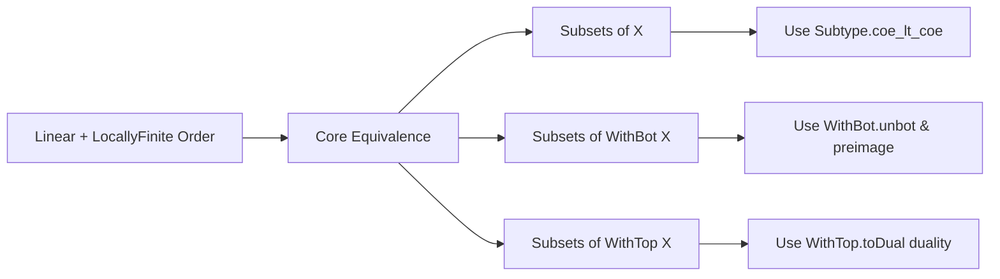

**Technical Brief: `DenselyOrdered.lean`**

---

### 1. **Key Definitions & Theorems**

| Name | Type / Signature | Purpose |
|------|------------------|---------|
| `LocallyFiniteOrder.denselyOrdered_iff_subsingleton` | `DenselyOrdered X ↔ Subsingleton X` | Core equivalence: in a linear *locally finite* order, density implies triviality (at most one element), and vice versa. |
| `denselyOrdered_set_iff_subsingleton` | `DenselyOrdered s ↔ s.Subsingleton` | Extension to subsets: a subset of a linear locally finite order is densely ordered iff it is a subsingleton. |
| `WithBot.denselyOrdered_set_iff_subsingleton` | `DenselyOrdered s ↔ s.Subsingleton` | Same for subsets of `WithBot X`, using coercion and `WithBot.unbot`. |
| `WithTop.denselyOrdered_set_iff_subsingleton` | `DenselyOrdered s ↔ s.Subsingleton` | Same for subsets of `WithTop X`, via duality (`WithTop.toDual`) and reduction to `WithBot` case. |

All theorems are *biconditionals*, with proofs leveraging:
- `denselyOrdered` definition: $ \forall a < b,\ \exists c,\ a < c < b $
- `Subsingleton`: $ \forall x y,\ x = y $
- `LocallyFiniteOrder`: every interval `[a, b]` is finite.
- `Nontrivial_iff_lt`: $ \exists a b,\ a < b $ iff not subsingleton.

---

### 2. **Naming Conventions**

- **Prefixes**:
  - `denselyOrdered_`: for properties about dense ordering.
  - `subsingleton`: for subsingleton-related equivalences.
  - `WithBot` / `WithTop`: for constructions over extended orders.
- **Suffixes**:
  - `_iff_subsingleton`: indicates equivalence with `Subsingleton`.
  - `_set`: indicates the statement applies to subsets (`Set X`).
- **Functional style**:
  - `image_strictAnti`, `toDual`, `unbot`, `coe_lt_coe`: standard order-theoretic utilities from `Mathlib`.

---

### 3. **Tactic Stack**

Frequent tactics used in proofs:

| Tactic | Role |
|--------|------|
| `refine` / `exact` | Structured proof construction, especially for biconditionals. |
| `rw` | Rewriting using equivalences, definitions (`denselyOrdered`, `Subsingleton`, etc.). |
| `simp` / `simp only` | Simplifying goals using definitional equalities and lemmas (e.g., `Set.subsingleton_coe`, `Subtype.coe_lt_coe`). |
| `intro` / `rintro` | Introducing hypotheses and existential witnesses. |
| `contrapose!` / `not_lt_of_denselyOrdered_of_locallyFinite` | Contrapositive reasoning, especially to derive contradiction from density + local finiteness. |
| `convert` / `rwa` | Rewriting after applying lemmas (e.g., `rwa` = `rw` + `assumption`). |
| `have` / `suffices` | Intermediate lemma introduction. |
| `simp` + `subst`-like reasoning via `replace`, `obtain` | Managing equality/inequality chains in extended orders (`WithBot`, `WithTop`). |

---

### 4. **Proof Logic**

The logical flow across the lemmas follows a consistent pattern:

1. **Biconditional decomposition**:
   - Prove both directions separately.
   - Left-to-right: assume density, derive subsingleton (often via contradiction: assume two distinct elements $a < b$, then use density + local finiteness to get an infinite ascending/descending chain — impossible in a locally finite order).
   - Right-to-left: if subsingleton, then vacuously densely ordered (no $a < b$ to check).

2. **Subsets**:
   - Reduce to the ambient order case using:
     - `Set.subsingleton_coe`
     - `Subtype.coe_lt_coe` for order on subsets
     - `Subtype.exists`, `Subtype.forall` for quantifier shifting.

3. **Extended orders (`WithBot`, `WithTop`)**:
   - For `WithBot`: lift subset to `X` via preimage under `WithBot.some`, apply `denselyOrdered_set_iff_subsingleton`, then translate back using `WithBot.unbot`.
   - For `WithTop`: use duality: `WithTop X ≃ᵒᵈ WithBot Xᵒᵈ`, and `StrictAnti` to transfer density.

4. **Key lemma used**:
   - `not_lt_of_denselyOrdered_of_locallyFinite`: if $a < b$ and the order is densely ordered and locally finite, then contradiction — i.e., no strict order can exist.

---

### 5. **Imports**

| Import | Purpose |
|--------|---------|
| `Mathlib.Order.Interval.Finset.Basic` | Provides `LocallyFiniteOrder`, interval finiteness, and related lemmas (e.g., `exists_between`, `locallyFinite_of_finite_interval`). |
| Implicit: `Mathlib.Order.LinearOrder` | For `LinearOrder`, `DenselyOrdered`, `Subsingleton`. |
| Implicit: `Mathlib.Order.WithBot.WithBot`, `Mathlib.Order.WithTop.WithTop` | For `WithBot`, `WithTop`, coercion, `unbot`, `toDual`, etc. |
| Implicit: `Mathlib.Set.Subsingleton`, `Mathlib.Set.Coe` | For subset-related reasoning. |

---

### 6. **Mermaid Diagrams**

#### **Dependency Graph (Theories & Lemmas)**

```mermaid
graph TD
  A[LinearOrder X] --> B[LocallyFiniteOrder X]
  B --> C[LocallyFiniteOrder.denselyOrdered_iff_subsingleton]
  A --> D[DenselyOrdered X]
  A --> E[Subsingleton X]
  C -->|↔| D
  C -->|↔| E

  subgraph Subsets
    F[Set X] --> G[ denselyOrdered_set_iff_subsingleton ]
    G -->|↔| D
    G -->|↔| E
  end

  subgraph WithBot
    H[WithBot X] --> I[ WithBot.denselyOrdered_set_iff_subsingleton ]
    I -->|↔| J[Set (WithBot X)]
    I -->|↔| K[Subsingleton (Set (WithBot X))]
    G -.->|preimage via WithBot.some| I
  end

  subgraph WithTop
    L[WithTop X] --> M[ WithTop.denselyOrdered_set_iff_subsingleton ]
    M -->|↔| N[Set (WithTop X)]
    M -->|↔| O[Subsingleton (Set (WithTop X))]
    M -->|dual| I
  end
```

#### **Overview of File Structure**



---

### 7. **Summary Insight**

This file formalizes a *rigidity* phenomenon: in a linearly ordered space where every interval is finite (e.g., `ℕ`, `ℤ`, finite chains), **density forces triviality**. The equivalence is nontrivial because density usually implies infinitude (e.g., `ℚ`), but local finiteness blocks that. The extension to `WithBot`/`WithTop` shows the result is stable under order completion, via duality and coercion tricks.

This is foundational for reasoning about discrete or finite ordered structures (e.g., in formalized combinatorics or verification of discrete systems).
