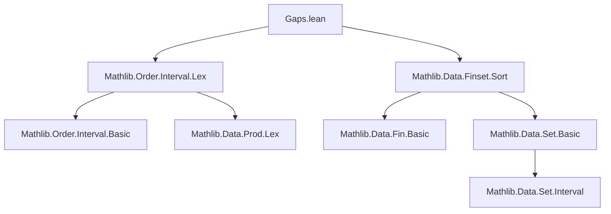

**Technical Brief: `Gaps.lean` — Formalization of Gaps Between Disjoint Closed Intervals**

---

### 1. **Key Definitions & Theorems**

| Name | Type / Signature | Purpose |
|------|------------------|---------|
| `intervalGapsWithin` | `F.intervalGapsWithin h a b i : α × α` | Computes the *i*-th gap interval between disjoint closed intervals in `F`, relative to bounds `a ≤ b`. Defined via `orderEmbOfFin` to order `F` lexicographically. |
| `intervalGapsWithin_zero_fst` | `(F.intervalGapsWithin h a b 0).1 = a` | Left endpoint of first gap is `a`. |
| `intervalGapsWithin_succ_fst_of_lt` | `j < k ⇒ (F.intervalGapsWithin h a b (j+1)).1 = y_j` | Left endpoint of gap after `j`-th interval is right endpoint of `j`-th interval. |
| `intervalGapsWithin_fst_of_lt_lt` | `0 < j ∧ j-1 < k ⇒ (F.intervalGapsWithin h a b j).1 = y_{j-1}` | Generalization of above for interior gaps. |
| `intervalGapsWithin_last_snd` | `(F.intervalGapsWithin h a b (last k)).2 = b` | Right endpoint of last gap is `b`. |
| `intervalGapsWithin_snd_of_lt` | `j < k ⇒ (F.intervalGapsWithin h a b j).2 = x_j` | Right endpoint of interior gap is left endpoint of `j`-th interval. |
| `intervalGapsWithin_mapsTo` | `(fun j ↦ ((F.intervalGapsWithin h a b j).2, (F.intervalGapsWithin h a b (j+1)).1)) : Iio k → F` | Maps each interior gap boundary pair to the original interval in `F`. |
| `intervalGapsWithin_injOn` | Injective on `Iio k` | Distinct gaps map to distinct intervals in `F`. |
| `intervalGapsWithin_surjOn` | Surjective onto `F` | Every interval in `F` arises as a boundary between two gaps. |
| `intervalGapsWithin_le_fst` | `a ≤ (gap j).1` | All gaps lie within `[a, b]` from the left. |
| `intervalGapsWithin_snd_le` | `(gap j).2 ≤ b` | All gaps lie within `[a, b]` from the right. |
| `intervalGapsWithin_fst_le_snd` | `(gap j).1 ≤ (gap j).2` | Each gap is a valid interval (nonempty or degenerate). |
| `intervalGapsWithin_pairwiseDisjoint_Ioc` | `PairwiseDisjoint (fun j ↦ Ioc (gap j).1 (gap j).2)` | Half-open gaps `(gap j).1, (gap j).2` are pairwise disjoint. |

---

### 2. **Naming Conventions**

- **Prefixes**:
  - `intervalGapsWithin_*`: All theorems/defs related to the main definition.
  - `orderEmbOfFin_*`: Used for embedding `Fin k` into `F` via lexicographic order.
- **Suffixes**:
  - `_fst`, `_snd`: Access first/second component of pair.
  - `_zero`, `_last`: Special cases for first/last gap.
  - `_of_lt`, `_of_lt_lt`: Conditions on indices.
  - `_mapsTo`, `_injOn`, `_surjOn`: Standard set-theoretic properties.
  - `_le_fst`, `_snd_le`, `_fst_le_snd`: Order-theoretic properties.
  - `_pairwiseDisjoint_Ioc`: Disjointness of half-open intervals.

---

### 3. **Tactic Stack**

- **Core tactics**: `simp`, `rw`, `convert`, `grind`, `omega`, `ext`, `congr`, `by_cases`, `wlog`, `have`, `obtain`, `set`.
- **Domain-specific automation**:
  - `grind`: Custom tactic (likely from the project’s infrastructure) for grinding through index arithmetic and equality reasoning.
  - `omega`: For linear arithmetic over natural numbers (e.g., `j < k + 1`, `j - 1 + 1 = j`).
  - `simp only [...]`: Fine-grained simplification using explicit lemmas.
  - `convert ... using n`: For controlled unification with minor adjustments.

---

### 4. **Proof Logic**

- **Induction-free reasoning**: Proofs rely on case analysis on indices (`j = 0`, `j = k`, `0 < j < k`) and monotonicity/injectivity of `orderEmbOfFin`.
- **Index arithmetic**: Heavy use of `omega` to manage `j < k`, `j - 1`, `castPred`, `castSucc`.
- **Order-theoretic reasoning**:
  - `orderEmbOfFin` is used as a monotone embedding of `Fin k` into `F` under lexicographic order (`α ×ₗ α`).
  - Disjointness of intervals in `F` is leveraged via `PairwiseDisjoint` to prove non-overlap of gaps.
- **Bijection construction**: The map `j ↦ ((gap j).2, (gap (j+1)).1)` is shown to be a bijection between `Iio k` and `F`, mirroring the intuitive “gaps ↔ intervals” correspondence.

---

### 5. **Imports & Dependencies**

- `Mathlib.Data.Finset.Sort`: For finite sets and sorting/ordering.
- `Mathlib.Order.Interval.Lex`: For lexicographic order on products (`α ×ₗ α`) and interval reasoning.
- Implicit reliance on:
  - `Mathlib.Data.Fin.Basic` (`Fin`, `castPred`, `castSucc`, `last`)
  - `Mathlib.Data.Set.Basic` (`Icc`, `Ioc`, `PairwiseDisjoint`, `MapsTo`, etc.)
  - `Mathlib.Order.LinearOrder` (for `LinearOrder α`)
  - `Mathlib.Data.Prod.Lex` (for `Prod.Lex.le_iff'`)

---

### 6. **Mermaid Diagrams**

#### **Dependency Graph (Module-Level)**



#### **Conceptual Overview of `intervalGapsWithin`**

```mermaid
flowchart LR
  F[Finite set F of intervals] -->|lex order| O[orderEmbOfFin : Fin k → F]
  a[a] -->|left bound| G1[Gap 0: (a, x₀)]
  O -->|x₀,y₀| G2[Gap 1: (y₀, x₁)]
  O -->|x₁,y₁| G3[Gap 2: (y₁, x₂)]
  O -->|...| Gn[Gap k: (y_{k-1}, b)]
  G1 -->|fst/snd| P1[(a, x₀)]
  G2 -->|fst/snd| P2[(y₀, x₁)]
  Gn -->|fst/snd| Pk[(y_{k-1}, b)]
  P1 & P2 & Pk -->|boundary map| F
```

#### **Bijection between Gaps and Intervals**

```mermaid
flowchart LR
  Iio k[Indices j < k] -->|j ↦ ((gap j).2, (gap (j+1)).1)| F[Interval set]
  subgraph gaps
    G0[(a, x₀)]
    G1[(y₀, x₁)]
    Gk[(y_{k-1}, b)]
  end
  G0 -->|right endpoint| x0[x₀]
  G1 -->|right endpoint| x1[x₁]
  Gk -->|right endpoint| xk[x_k]
  x0 & x1 & xk -->|as fst| intervals[F]
  y0 & y1 & yk -->|as snd| intervals
```

---

### 7. **Summary**

This file formalizes the *complement* of a finite union of disjoint closed intervals in a linearly ordered type, by defining and analyzing the `intervalGapsWithin` function. It establishes that:
- Gaps are well-defined intervals within `[a, b]`,
- Gaps and original intervals are in bijection via boundary pairs,
- Gaps are pairwise disjoint (as half-open intervals),
- All endpoints respect the global bounds `a ≤ b`.

The formalization is clean, index-heavy, and leverages Lean’s `orderEmbOfFin` to avoid explicit induction, relying instead on monotonicity and injectivity of the embedding.
