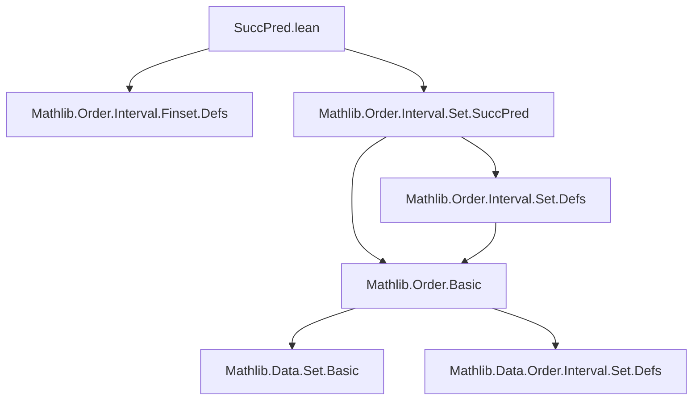
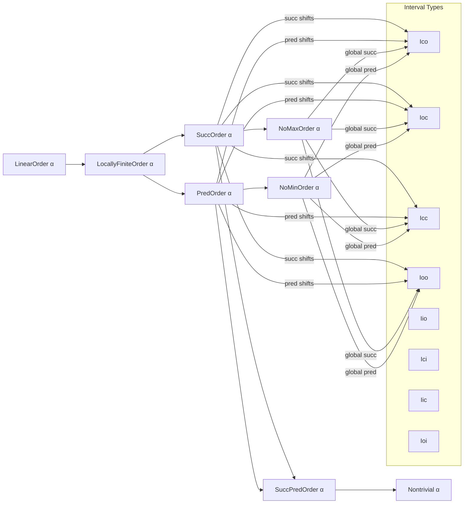

### Technical Brief: `SuccPred.lean` (Finset Intervals in Successor-Predecessor Orders)

---

#### **1. Key Definitions & Theorems**

| Name | Type / Signature | Purpose |
|------|------------------|---------|
| `Ico`, `Ioc`, `Icc`, `Ioo` | `α → α → Finset α` | Standard finset interval constructors: `[a, b)`, `(a, b]`, `[a, b]`, `(a, b)` |
| `succ`, `pred` | `α → α` | Successor and predecessor functions (partial or total depending on axioms) |
| `IsMax`, `IsMin` | `α → Prop` | Predicates for maximal/minimal elements |
| `LocallyFiniteOrder`, `LocallyFiniteOrderBot`, `LocallyFiniteOrderTop` | Typeclass | Ensures intervals are finite (resp. bounded below/above) |
| `SuccOrder`, `PredOrder`, `NoMaxOrder`, `NoMinOrder` | Typeclass | Structural assumptions on order (existence of succ/pred, no max/min) |

##### **Core Theorems (Selected)**

| Lemma | Statement | Notes |
|-------|-----------|-------|
| `Ico_succ_left_eq_Ioo` | `Ico (succ a) b = Ioo a b` | Removes left endpoint by shifting with `succ` |
| `Icc_succ_left_eq_Ioc_of_not_isMax` | `¬ IsMax a → Icc (succ a) b = Ioc a b` | Requires `a` not maximal to avoid `succ a = ⊤` issues |
| `insert_Icc_succ_left_eq_Icc` | `a ≤ b → insert a (Icc (succ a) b) = Icc a b` | Reconstructs closed interval by inserting left endpoint |
| `Iio_succ_eq_Iic_of_not_isMax` | `¬ IsMax b → Iio (succ b) = Iic b` | One-sided interval relation toward top |
| `Icc_succ_pred_eq_Ioo` | `Icc (succ a) (pred b) = Ioo a b` | In `SuccPredOrder`, shifts both endpoints to get open interval |

All proofs use `coe_injective` + `Set.*` lemmas (from `Mathlib.Order.Interval.Set.SuccPred`) to lift set equalities to finset equalities.

---

#### **2. Naming Conventions**

- **Prefixes**:
  - `Ico`, `Ioc`, `Icc`, `Iio`, `Ici`, `Iic`, `Ioi` — standard interval notation (closed/open, left/right).
  - `succ_`, `pred_` — indicate use of successor/predecessor.
  - `insert_` — insertion lemmas.
- **Suffixes**:
  - `_eq_*` — equality lemmas.
  - `_of_not_isMax`, `_of_not_isMin` — conditional lemmas requiring non-maximality/minimality.
  - `_of_not_isMax`, `_of_not_isMin` — often paired with `¬ IsMax a` or `¬ IsMin b`.
- **No suffix** for lemmas in `NoMaxOrder` / `NoMinOrder` contexts (assumptions are global in section).

---

#### **3. Tactic Stack**

| Tactic | Usage Frequency | Role |
|--------|-----------------|------|
| `simp` | High | Simplify using `Set.*` lemmas and `succ`/`pred` definitions |
| `simpa using` | Very High | Apply a `Set.*` lemma and discharge goal via `simpa` |
| `coe_injective` | Universal | Lift equality from `Set α` to `Finset α` (via coercion injectivity) |
| `aesop` | Not used | Not needed — proofs are highly structured |
| `ring` / `linarith` | Not used | Not applicable (order-theoretic, not arithmetic) |

**Typical proof pattern**:
```lean
coe_injective <| by simpa using Set.[name] _
```

---

#### **4. Proof Logic**

- **Structure**: Induction-free; relies on *set-theoretic* interval lemmas from `Mathlib.Order.Interval.Set.SuccPred`.
- **Flow**:
  1. Use `Set.*` lemma (e.g., `Set.Ico_succ_left_eq_Ioo`) to prove equality of *sets*.
  2. Apply `coe_injective` to lift to `Finset`.
  3. For conditional lemmas (`of_not_isMax`, `of_not_isMin`), pass hypothesis to `Set.*` lemma.
  4. In `NoMaxOrder`/`NoMinOrder`, `simp` suffices (since `succ`/`pred` behave globally).
- **Key Insight**: Finset intervals are defined as *finite* sets of elements satisfying interval conditions; finiteness is guaranteed by `LocallyFiniteOrder*`.

---

#### **5. Imports**

| Import | Purpose |
|--------|---------|
| `Mathlib.Order.Interval.Finset.Defs` | Defines `Ico`, `Ioc`, `Icc`, `Ioo`, etc., for `Finset` |
| `Mathlib.Order.Interval.Set.SuccPred` | Provides `Set.*` lemmas for intervals under `succ`/`pred` |

> **Note**: This file is a *finset-level* companion to the set-level `SuccPred.lean`. It mirrors its structure and lemmas.

---

#### **6. Dependency & Theory Overview**

##### **Mermaid Diagram: Module Dependencies**



##### **Mermaid Diagram: Theoretical Flow**



##### **Theory Scope**

- **Domain**: Ordered sets with successor/predecessor structure (e.g., `ℕ`, `ℤ`, discrete intervals).
- **Goal**: Relate intervals under `succ`/`pred` shifts and insertion operations.
- **Use Cases**:
  - Automating interval simplifications in discrete math (e.g., combinatorics on `ℕ`).
  - Bridging set- and finset-level reasoning (via `coe_injective`).
  - Supporting induction proofs by enabling interval rewriting.

---

#### **7. TODO & Future Work**

- Copy `insert` lemmas from `Mathlib.Order.Interval.Finset.Nat.lean` (e.g., `insert_Icc_succ_right_eq_Icc`).
- Extend to `WithBot`/`WithTop` compactifications (for handling `succ ⊤ = ⊤`, `pred ⊥ = ⊥`).
- Add `Finset.range`, `Finset.Ico_zero_succ`, etc., for concrete `ℕ`-based intervals.

--- 

✅ **Summary**: This file formalizes *interval arithmetic* in successor-predecessor orders at the `Finset` level, leveraging set-theoretic foundations and uniform proof patterns. It is a critical bridge between abstract order theory and concrete discrete reasoning.
