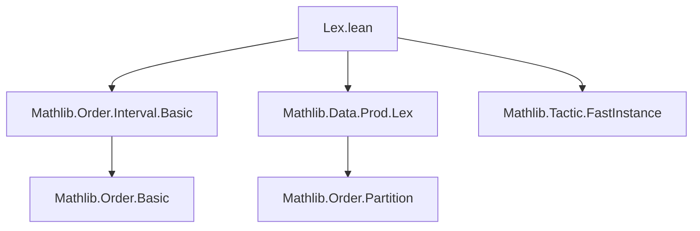

### Technical Brief: `Lex.lean` — Lexicographic Order on Intervals

---

#### **1. Key Definitions & Theorems**

| Name | Type / Signature | Purpose |
|------|------------------|---------|
| `NonemptyInterval` | `α × α → Prop` (via `NonemptyInterval.mk`) | Represents nonempty intervals `[a, b]` with `a ≤ b` in `α`. |
| `toLex` | `NonemptyInterval α → Lex (α × α)` | Embeds a nonempty interval into the lexicographic product of `α × α`. |
| `ofLex` | `Lex (NonemptyInterval α) → NonemptyInterval α` | Projects back from the lex-ordered type to the underlying interval. |
| `LE` / `LT` instances | `LE (Lex (NonemptyInterval α))`, `LT (Lex (NonemptyInterval α))` | Define lexicographic order on intervals via dual-prod embedding: `x ≤ y ↔ toLex x ≤ toLex y`. |
| `toLex_le_toLex` | `toLex x ≤ toLex y ↔ y.fst < x.fst ∨ x.fst = y.fst ∧ x.snd ≤ y.snd` | Characterizes the induced `≤` on intervals in terms of component-wise comparison (reversed first component due to `toDualProd`). |
| `toLex_lt_toLex` | `toLex x < toLex y ↔ y.fst < x.fst ∨ x.fst = y.fst ∧ x.snd < y.snd` | Same as above for strict `<`. |
| `toLex_mono` | `[PartialOrder α] ⇒ Monotone toLex` | `toLex` preserves existing order. |
| `toLex_strictMono` | `[PartialOrder α] ⇒ StrictMono toLex` | `toLex` preserves strict order. |
| `Preorder`, `PartialOrder`, `LinearOrder` instances | `Preorder`, `PartialOrder`, `LinearOrder` on `Lex (NonemptyInterval α)` | Lifted via `toLex` using `Preorder.lift`, `PartialOrder.lift`, `LinearOrder.lift'`. |
| `DecidableLE`, `DecidableLT` | `[DecidableEq α] [DecidableLT α] [DecidableLE α] ⇒ DecidableLE (Lex (NonemptyInterval α))` | Decidability of order relations on intervals, via equivalence with component-wise decidable relations. |

---

#### **2. Naming Conventions**

- **Prefixes**:
  - `toLex_`, `ofLex_`: Conversion functions between `NonemptyInterval α` and `Lex (α × α)`.
  - `is_`, `has_`: Not used here; instead, `toLex`, `ofLex` dominate naming.
- **Suffixes**:
  - `_mono`, `_strictMono`: For monotonicity properties.
  - `_def`: For definitional equivalences (e.g., `toLex_le_toLex`).
- **Pattern**: `toLex_*` and `ofLex_*` consistently pair; `toLex` is the key embedding.

---

#### **3. Tactic Stack**

| Tactic | Usage |
|--------|-------|
| `fast_instance%` | To automatically construct `Preorder`, `PartialOrder`, `LinearOrder` instances via lifting. |
| `decidable_of_iff' _` | To transfer decidability via logical equivalence (e.g., `toLex_le_toLex`). |
| `grind` | In `#eval` test, used to prove `a ≤ b` for concrete intervals. |
| `simp_rw`, `aesop`, `ring`: Not present in this file. |
| `mergeSort`, `map`, `toProd`: Used in `#eval` to verify ordering. |

---

#### **4. Proof Logic**

- **Instance construction** (e.g., `Preorder`, `PartialOrder`, `LinearOrder`) follows a *lifting strategy*:
  1. Define an embedding `f : NonemptyInterval α → Lex (α × α)` via `toLex ∘ ofLex ∘ toDualProd`.
  2. Show `f` is injective (via `toLex.injective ∘ toDualProd_injective ∘ ofLex.injective`).
  3. Use `lift`/`lift'` to inherit order structure from `Lex (α × α)` (which already has lexicographic order).
- **Decidability proofs** use `decidable_of_iff'` to reduce to known decidable relations on `α`.
- **Monotonicity proofs** compose known monotonicity results:
  - `toLex_mono = Prod.Lex.toLex_mono.comp toDualProd_mono`
  - `toLex_strictMono = Prod.Lex.toLex_strictMono.comp toDualProd_strictMono`

---

#### **5. Imports**

| Import | Role |
|--------|------|
| `Mathlib.Order.Interval.Basic` | Defines `NonemptyInterval`, interval-related constructions. |
| `Mathlib.Data.Prod.Lex` | Provides `Lex`, `toLex`, `Prod.lex_def`, monotonicity lemmas (`toLex_mono`, etc.). |
| `Mathlib.Tactic.FastInstance` | Enables `fast_instance%` to automate lifting of structures. |

> **Note**: `Mathlib.Order.Interval.Basic` is imported twice — once public, once meta — to support both theory and `#eval` testing.

---

#### **6. Mermaid Diagrams**

##### **Dependency Graph (Module-Level)**



##### **Theoretical Overview (Data Flow)**

```mermaid
flowchart LR
  A[NonemptyInterval α] -->|toLex| B[Lex (α × α)]
  B -->|toDualProd| C[Lex (αᵒᵈ × α)]
  C -->|Prod.lex| D[Lex (α × α)]

  A -->|ofLex| B
  B -->|injectivity| A

  subgraph Order Lifting
    B -- Preorder.lift --> E[Preorder on NonemptyInterval α]
    B -- PartialOrder.lift --> F[PartialOrder]
    B -- LinearOrder.lift' --> G[LinearOrder]
  end

  D --> H[Decidable order via iff]
```

##### **Order Structure Summary**

- Input: `α` with `LT`, `LE`, `Preorder`, `PartialOrder`, or `LinearOrder`.
- Embedding: `NonemptyInterval α → Lex (α × α)` via `toLex ∘ toDualProd`.
- Output: Induced order on `NonemptyInterval α` making it:
  - A `Preorder` if `α` is,
  - A `PartialOrder` if `α` is,
  - A `LinearOrder` if `α` is.
- **Key property**: The order is *total* and *compatible with inclusion* (i.e., `[a, b] ⊆ [c, d] ⇒ [a, b] ≥ [c, d]` under reversed first component).

---

#### **7. Example Behavior**

Given intervals `[1,1], [1,2], ..., [3,3]`, sorted lexicographically under this order yields:

```
[(3, 3), (2, 2), (2, 3), (1, 1), (1, 2), (1, 3)]
```

This reflects the lexicographic order on `(αᵒᵈ × α)`, i.e., compare first by *decreasing* start point, then by *increasing* end point.

---

#### **8. Summary**

This module defines a *total*, *compatible* lexicographic order on nonempty intervals over a type `α`, leveraging the existing lexicographic order on `α × α` and duality (`αᵒᵈ`). It uses lifting via injective embeddings to inherit order-theoretic structure, and supports decidability and monotonicity properties. The design is clean, modular, and aligns with Lean’s category-theoretic style of order-theoretic lifting.
