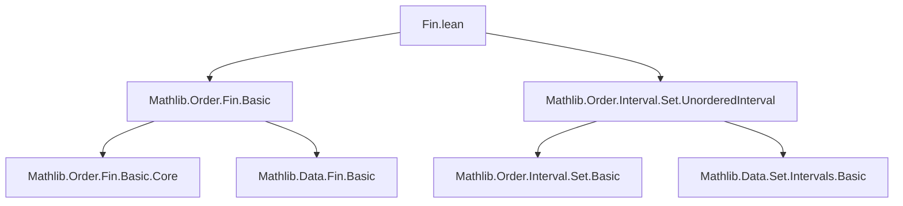
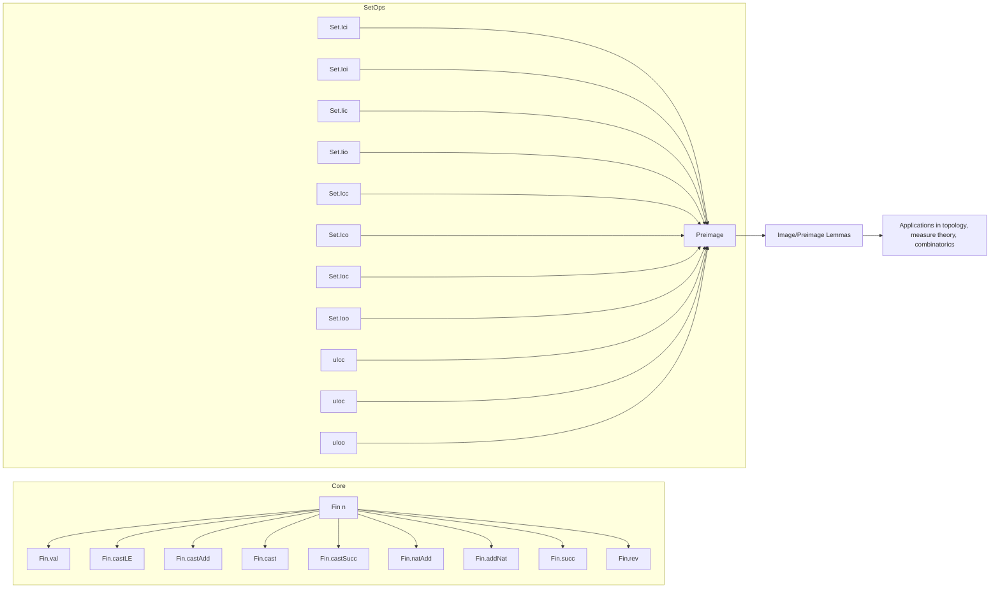

### Technical Brief: `Fin.lean` — (Pre)images of Set Intervals under `Fin` Operations

---

#### **1. Key Definitions & Theorems**

| Name | Type / Purpose |
|------|----------------|
| `Fin.val` | `Fin n → ℕ`, the coercion to natural numbers. |
| `Fin.castLE` | `m ≤ n → Fin m → Fin n`, embedding a smaller `Fin` into a larger one. |
| `Fin.castAdd` | `Fin n → Fin (n + m)`, embedding `Fin n` into the first `n` elements of `Fin (n + m)`. |
| `Fin.cast` | `m = n → Fin m ≃ Fin n`, equivalence induced by equality of indices. |
| `Fin.castSucc` | `Fin n → Fin (n + 1)`, special case of `castAdd 1`. |
| `Fin.natAdd` | `Fin n → Fin (m + n)`, shifts indices by `m`. |
| `Fin.addNat` | `Fin n → Fin (n + m)`, same as `natAdd m`, but with arguments flipped. |
| `Fin.succ` | `Fin n → Fin (n + 1)`, successor function; defined as `addNat 1`. |
| `Fin.rev` | `Fin n → Fin n`, reversal (anti-automorphism); `rev i = n - 1 - i`. |

**Key Theorems (selected highlights):**

| Theorem | Statement (simplified) |
|---------|------------------------|
| `range_val` | `range ((↑) : Fin n → ℕ) = Iio n` |
| `preimage_val_Ici_val` | `(↑) ⁻¹' Ici i = Ici i` for `i : Fin n` |
| `image_val_Ici` | `(↑) '' Ici i = Ico i n` |
| `preimage_castLE_Icc_castLE` | `castLE h ⁻¹' Icc (castLE h i) (castLE h j) = Icc i j` |
| `image_castAdd_Ici` | `castAdd m '' Ici i = Ico (castAdd m i) (natAdd n 0)` |
| `range_natAdd` | `range (natAdd m) = {i | m ≤ i.1}` |
| `preimage_rev_Icc` | `rev ⁻¹' Icc i j = Icc j.rev i.rev` |
| `image_rev` | `rev '' s = rev ⁻¹' s` (since `rev` is an involution) |

---

#### **2. Naming Conventions**

- **Prefixes:**
  - `preimage_…_…`: preimage under a function of a specific interval.
  - `image_…_…`: image under a function of a specific interval.
  - `range_…`: range of a function (special case of image of `univ`).
- **Suffixes:**
  - `_val`, `_castLE`, `_castAdd`, `_cast`, `_castSucc`, `_natAdd`, `_addNat`, `_succ`, `_rev`: indicate the function involved.
  - Interval types: `Ici`, `Ioi`, `Iic`, `Iio`, `Icc`, `Ico`, `Ioc`, `Ioo`, `uIcc`, `uIoc`, `uIoo`.
- **Pattern:**  
  `preimage_[func]_[interval]_[arg]` or `image_[func]_[interval]_[arg]`, where `[arg]` may be `val`, `castLE i`, `castAdd m i`, etc.

---

#### **3. Tactic Stack**

- **Core tactics used:**
  - `rfl`: for definitional equalities (especially preimages).
  - `simp`: heavily used, often with custom lemmas or interval definitions.
  - `ext`: extensionality for set equality.
  - `rw`: rewriting using previously proved lemmas.
  - `exact`, `refine`: for constructing proofs.
  - `image_preimage_eq_of_subset`, `image_preimage_eq_inter_range`: standard set-theoretic lemmas.
  - `Subset.antisymm`: for proving equality of sets via double inclusion.
  - `exists_succ_eq_of_ne_zero`: case analysis on successor structure.
  - `lia`, `linarith`: for arithmetic reasoning on natural numbers.
  - `strictMono_*`.monotone.*: monotonicity of `natAdd`, `addNat`, etc.

---

#### **4. Proof Logic**

- **Structure of proofs:**
  - **Preimage lemmas**: Usually immediate (`rfl`) or follow from `Fin.val` being injective and interval definitions.
  - **Image lemmas**: Typically follow the pattern:
    1. Rewrite `image s = f '' s` as `f '' s = f '' (f ⁻¹' (f '' s))`.
    2. Use `image_preimage_eq_of_subset` or `image_preimage_eq_inter_range`.
    3. Simplify using `range_*` lemmas (e.g., `range_val = Iio n`).
    4. Show subset condition (e.g., `Icc i j ⊆ range f`) via `Fin`-specific bounds (`i.is_lt`, `j.is_lt`).
  - **Special cases**:
    - `rev`: uses `rev_anti` (anti-monotonicity) and `rev_perm`.
    - `natAdd`, `addNat`: rely on `strictMono_*` and arithmetic manipulations (`natAdd m i = m + i`).
    - `castAdd`, `castLE`: reduce to `natAdd` or `Fin.val` via definitional equalities.

- **Common proof pattern**:
  ```lean
  rw [← preimage_*_*, image_preimage_eq_of_subset]
  exact subset_of_mem_range ...
  ```

---

#### **5. Imports**

- `Mathlib.Order.Fin.Basic`: core definitions and properties of `Fin`.
- `Mathlib.Order.Interval.Set.UnorderedInterval`: definitions of `uIcc`, `uIoc`, `uIoo`.

---

#### **6. Mermaid Diagrams**

##### **Dependency Graph (Module-Level)**



##### **Overview of Theory Flow**



---

#### **7. Summary**

This file formalizes a comprehensive toolkit for manipulating **intervals** under standard `Fin` operations. It is foundational for reasoning about discrete intervals in finite types — especially useful in combinatorics, formalization of finite structures, and measure theory on finite spaces. The proofs are highly uniform and exploit:
- Injectivity/surjectivity of `Fin` maps,
- Monotonicity of `natAdd`, `addNat`,
- Anti-symmetry of `rev`,
- Simple arithmetic on natural numbers.

The naming and structure follow Lean’s `Mathlib` conventions, enabling predictable reuse and composition with other interval lemmas.

--- 

Let me know if you'd like a **dependency graph of theorems**, or a **proof automation strategy** for similar files.
