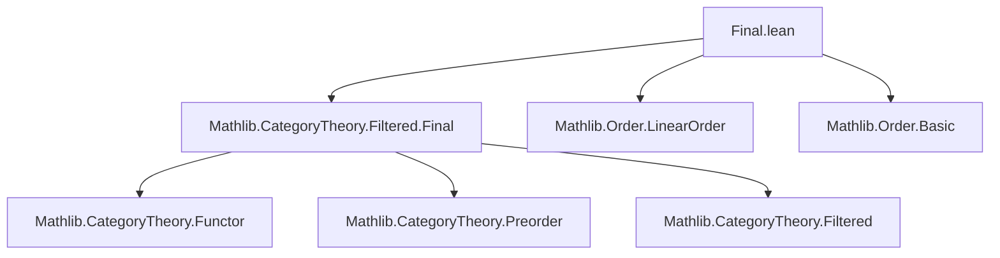
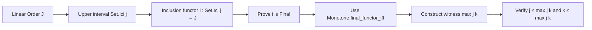

**Technical Brief: `Final.lean` (Mathlib Category Theory Filtered.Final Extension)**

---

### 1. **Key Definitions & Theorems**

| Name | Type / Statement | Purpose |
|------|------------------|---------|
| `Set.Ici.subtype_functor_final` | `instance {J : Type u} [LinearOrder J] (j : J) : (Subtype.mono_coe (Set.Ici j)).functor.Final` | Proves that the inclusion functor from the upper interval `↑(Set.Ici j)` into `J` is a **final functor** in the sense of category theory (i.e., colimits over `Set.Ici j` compute colimits over `J` along this inclusion). |

- **`Subtype.mono_coe (Set.Ici j)`**: The monotone map (hence functor between discrete categories? No — here interpreted as a functor between *discrete* or *posetal* categories; in Lean, `Subtype.mono_coe` is a monotone function, and `functor` lifts it to a functor between the corresponding thin categories).
- **`Final`**: A functor `F : C → D` is *final* if for every `d ∈ D`, the comma category `d ↓ F` is nonempty and connected. In the posetal case (e.g., linear orders), this reduces to: for all `k ∈ J`, there exists `l ≥ j` with `l ≤ k`? Wait — the proof shows existence of an object `max j k` in `Set.Ici j` mapping to something ≥ `k`, i.e., cofinality condition.

- **`Monotone.final_functor_iff`**: A characterization used in the proof: for a monotone map `f : J' → J` between linear orders, `f` is final iff for all `k ∈ J`, the set `{x ∈ J' | f(x) ≥ k}` is nonempty and directed (here just nonempty, since linear orders are directed in themselves).

---

### 2. **Naming Conventions**

- **Prefixes**:
  - `subtype_`: for constructions involving `Subtype`.
  - `mono_coe`: for the canonical monotone coercion from a subtype.
- **Suffixes**:
  - `_final`: indicates a `Final` instance (functor is final).
- **Structure**:
  - `Set.Ici` = `{x | j ≤ x}` (upper closure / interval).
  - `Subtype.mono_coe` → coerces to a monotone function → `.functor` lifts to a functor between thin categories.

---

### 3. **Tactic Stack**

- `rw [Monotone.final_functor_iff]`: Rewrites goal using a known equivalence for finality of monotone maps.
- `intro k`: Introduce arbitrary target object `k`.
- `exact ⟨⟨max j k, le_max_left _ _⟩, le_max_right _ _⟩`:
  - Constructs a witness in `Set.Ici j` (i.e., an element `x ≥ j`) such that its image under inclusion (`x`) satisfies `k ≤ x`.
  - `max j k` is ≥ `j` (`le_max_left`) and ≥ `k` (`le_max_right`), so inclusion maps it to something ≥ `k`.

No heavy automation (`aesop`, `ring`, `simp`), only basic order reasoning.

---

### 4. **Proof Logic**

- **Goal**: Show inclusion `↑(Set.Ici j) ↪ J` is final.
- **Strategy**:
  1. Use `Monotone.final_functor_iff` to reduce to: for all `k ∈ J`, ∃ `x ∈ Set.Ici j` with `k ≤ x`.
  2. Choose `x := max j k`.
  3. Verify `x ∈ Set.Ici j` via `le_max_left` (i.e., `j ≤ max j k`).
  4. Verify `k ≤ x` via `le_max_right`.
- **Logic Flow**: Direct construction — no induction, no case analysis beyond implicit order properties.

---

### 5. **Imports**

- `Mathlib.CategoryTheory.Filtered.Final`: Core definitions of final functors and related lemmas (e.g., `Monotone.final_functor_iff`).
- Implicitly uses:
  - `Mathlib.Order.Defs.LinearOrder` (for `max`, `le_max_*` lemmas).
  - `Mathlib.CategoryTheory.Functor` (for `functor` coercion).
  - `Mathlib.CategoryTheory.Preorder` (since linear orders are preorders, and functors between thin categories are monotone maps).

---

### 8. **Mermaid Diagrams**

#### Dependency Graph (Module-Level)

#### Overview of File Content

#### Theoretical Context

- **Purpose**: This lemma is a building block for showing that filtering colimits can be computed over cofinal subdiagrams — specifically, truncating diagrams at a lower bound `j` does not change colimits in filtered categories.
- **Broader Theory**: Part of a suite of results about *final functors* in filtered category theory, used e.g. to simplify diagrams, prove commutation of filtered colimits with finite limits, or justify diagram truncations.

--- 

Let me know if you'd like the corresponding `category_theory/final.lean` entry or a generalization to filtered categories.
