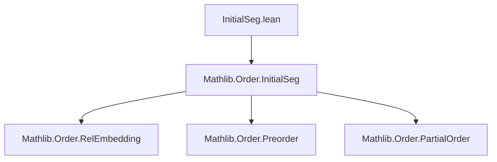
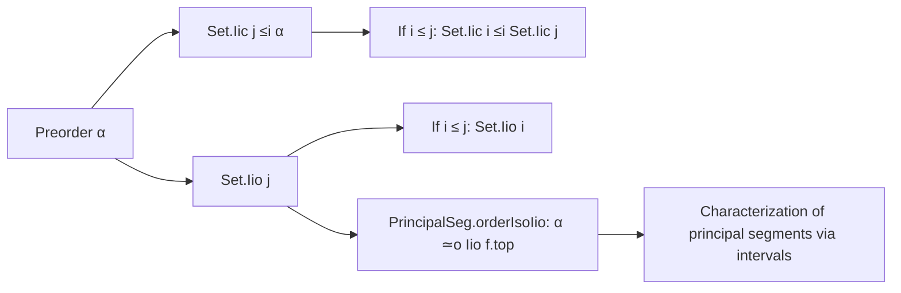

**Technical Brief: `InitialSeg.lean`**

---

### 1. **Key Definitions & Theorems**

| Name | Type | Purpose |
|------|------|---------|
| `initialSegIic` | `j : α → Set.Iic j ≤i α` | Shows that the downward-closed set `Iic j = {x | x ≤ j}` embeds as an *initial segment* of `α`. |
| `principalSegIio` | `j : α → Set.Iio j <i α` | Shows that the strict downward-closed set `Iio j = {x | x < j}` embeds as a *principal segment* (i.e., a proper initial segment with a top element `j`). |
| `principalSegIio_toRelEmbedding` | `k : Iio j → (principalSegIio j).toRelEmbedding k = k.1` | Confirms that the underlying relation embedding of `Iio j` is just projection. |
| `initialSegIicIicOfLE` | `i ≤ j → Set.Iic i ≤i Set.Iic j` | Embeds `Iic i` into `Iic j` when `i ≤ j`, preserving the initial segment structure. |
| `principalSegIioIicOfLE` | `i ≤ j → Set.Iio i <i Set.Iic j` | Embeds `Iio i` as a *principal* segment inside `Iic j`, with top `⟨i, h⟩`. |
| `principalSegIioIicOfLE_toRelEmbedding` | `k : Iio i → (principalSegIioIicOfLE h).toRelEmbedding k = ⟨k, k.2.le.trans h⟩` | Describes the action of the relation embedding in the previous lemma. |
| `PrincipalSeg.orderIsoIio` | `f : α <i β → α ≃o Set.Iio f.top` | For any principal segment `f`, induces an order isomorphism between `α` and `Iio f.top`. |

---

### 2. **Naming Conventions**

- **Prefixes**:
  - `initialSeg…`: for embeddings of *initial segments* (`≤i`)
  - `principalSeg…`: for embeddings of *principal segments* (`<i`)
  - `Iic`, `Iio`: standard notation for closed (`≤`) and open (`<`) intervals.
- **Suffixes**:
  - `OfLE`: indicates construction depends on a proof of `i ≤ j`.
- **`simps` attributes**: used to automatically generate simplification lemmas for projections (e.g., `toFun`, `top`).
- **`simps!`**: stronger version used for `orderIsoIio`, ensuring `apply_coe` simplifies correctly.

---

### 3. **Tactic Stack**

- **Core tactics**:
  - `aesop`: used repeatedly for relational reasoning (injectivity, monotonicity, membership).
  - `simp` / `simpa`: for simplifying goals using definitions and lemmas.
  - `constructor`: for proving bijectivity in `Equiv.ofBijective`.
  - `rintro`, `obtain`: for destructuring existential or subtype hypotheses.
  - `exact`, `refl`, ` rfl`: for trivial equalities.

No heavy automation (e.g., `linarith`, `omega`) is needed—reasoning is mostly structural and subtype-based.

---

### 4. **Proof Logic**

- **Structure**:
  - All definitions are *subtype embeddings* with explicit `toFun`, `inj'`, `map_rel_iff'`, and membership conditions.
  - Proofs follow a uniform pattern:
    1. Define the underlying function on pairs `(x, hx)`.
    2. Prove injectivity (`inj'`) via `aesop`.
    3. Prove relation preservation (`map_rel_iff'`) via `aesop`.
    4. Prove surjectivity onto the image (`mem_range_of_rel'` / `mem_range_iff_rel'`) by constructing a preimage using subtype properties and `h.le.trans`.
- **Key logical flow**:
  - For `principalSegIio`, the top element `j` is explicit and used in `mem_range_iff_rel'`.
  - For `PrincipalSeg.orderIsoIio`, bijectivity is shown via:
    - Injectivity: pulls back to `f.injective`.
    - Surjectivity: uses `f.mem_range_of_rel_top` (a property of principal segments) to lift elements of `Iio f.top`.

---

### 5. **Imports**

- **Primary dependency**:
  ```lean
  Mathlib.Order.InitialSeg
  ```
  This module defines:
  - `≤i` (initial segment embedding),
  - `<i` (principal segment embedding),
  - `top`, `toRelEmbedding`, `mem_range_of_rel_top`, etc.

No other imports are present—this file is self-contained within the `Mathlib.Order` hierarchy.

---

### 6. **Mermaid Diagrams**

#### **Dependency Graph**


#### **Overview of Theory Flow**


---

### 7. **Summary**

This file formalizes the elementary theory of intervals as (principal) initial segments in preordered/partially ordered types. It shows:
- `Iic j` and `Iio j` are canonical examples of initial/principal segments.
- Inclusions between such intervals correspond to order embeddings.
- Any principal segment is *order-isomorphic* to a strict lower interval `Iio top`.

The formalization is clean, uniform, and leverages Lean’s subtype machinery and `simps`-generated lemmas for smooth reasoning.
