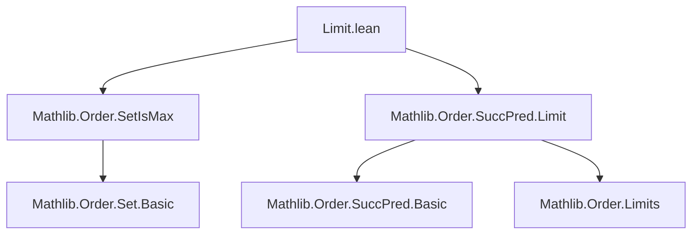
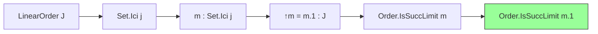
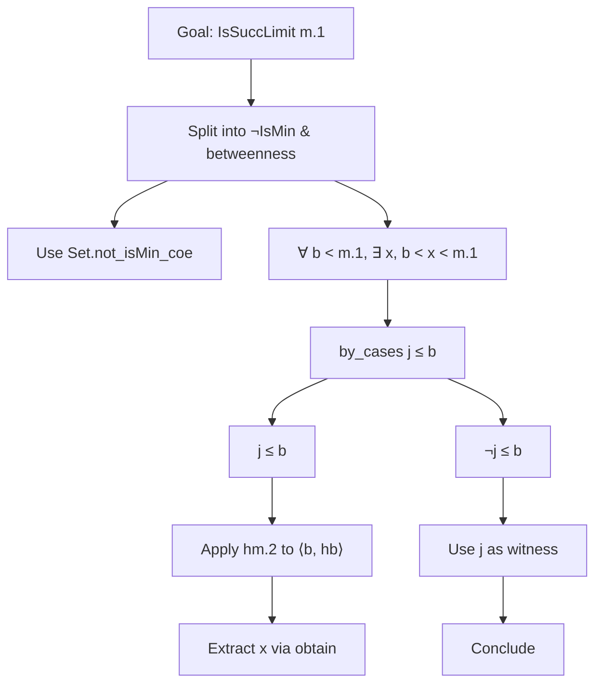

**Technical Brief: `Limit.lean` — Limit Elements in `Set.Ici`**

---

### 1. **Key Definitions & Theorems**

- **`Order.IsSuccLimit`**  
  *Type*: `∀ {α : Type u} [LinearOrder α], α → Prop`  
  *Purpose*: Predicate stating that an element is a *successor limit* — i.e., it is not a minimum and for every element strictly below it, there exists another element strictly between them and it. Formally:  
  $$
  \text{IsSuccLimit}(x) \equiv \neg \text{IsMin}(x) \land \forall b < x,\ \exists y,\ b < y < x
  $$

- **`Set.Ici`**  
  *Type*: `J → Set J` for `J : Type u` with `LinearOrder J`  
  *Purpose*: The *upper set* (interval) `Ici j = { x : J | j ≤ x }`.

- **`isSuccLimit_coe`**  
  *Type*:  
  ```lean
  ∀ {J : Type u} [LinearOrder J] {j : J} (m : Set.Ici j),
    Order.IsSuccLimit m → Order.IsSuccLimit m.1
  ```  
  *Purpose*: Shows that if a point `m` in the upper set `Ici j` is a successor limit *in the subtype*, then its coercion `m.1 : J` is a successor limit *in the ambient order*.

---

### 2. **Naming Conventions**

- **Prefixes**:
  - `is_`: Predicate definitions (`isSuccLimit`, `isMin`)
  - `coe`: Coercion-related (`isSuccLimit_coe`, `not_isMin_coe`)
- **Suffixes**:
  - `_coe`: When reasoning about coercion from subtype to ambient type.
- **Structure**:
  - Lemmas involving subtype properties often use `coe` to indicate the relationship between subtype and ambient element.

---

### 3. **Tactic Stack**

Frequent tactics used in the proof:
- `simp only [...]`: Simplification with explicit rewrite rules (e.g., `CovBy`, `not_lt`, `not_and`, etc.)
- `intro`: Introduce hypotheses and variables.
- `by_cases`: Split on decidability of `j ≤ b`.
- `rw [...] at ...`: Rewrite hypotheses using equivalences.
- `obtain ⟨...⟩`: Destruct existential/universal hypotheses.
- `refine ⟨...⟩`: Construct witnesses for existential goals.
- `by_contra!`: Prove by contradiction (with `not` introduction).
- `rintro`: Intro + destruct pattern matching (e.g., for `Σ`/`∃`).
- `trans`: Transitivity of relations (e.g., `≤`).
- `simpa using ...`: Simplify using a hypothesis.

---

### 4. **Proof Logic**

The proof proceeds as follows:

1. **Decompose goal**: Unfold `isSuccLimit` into two parts:
   - Show `¬ IsMin m.1` using `Set.not_isMin_coe`.
   - Show the “betweenness” property: for all `b < m.1`, find `b < x < m.1`.

2. **For the betweenness part**:
   - Let `b : J` with `b < m.1`.
   - Since `m : Ici j`, we have `j ≤ m.1`.
   - Consider two cases on whether `j ≤ b`:
     - **Case `j ≤ b`**: Then `⟨b, hb⟩ : Ici j`, so apply `hm.2` to get a point between `⟨b, hb⟩` and `m`, then project.
     - **Case `¬ j ≤ b` (i.e., `b < j`)**: Then `j` itself lies strictly between `b` and `m.1`, using the assumption that `m` is not a minimum to rule out equality.

3. **Key insight**: The subtype order on `Ici j` inherits the ambient order, so reasoning about `m` in `Ici j` reduces to reasoning about `m.1` in `J`, modulo the lower bound `j`.

---

### 5. **Imports**

- `Mathlib.Order.SetIsMax`: For `SetIsMax`-related lemmas (not directly used here, but part of the order theory ecosystem).
- `Mathlib.Order.SuccPred.Limit`: Defines `Order.IsSuccLimit`, `Order.IsMin`, and related notions.

These imports indicate the module belongs to the *order theory* and *limit/successor* hierarchy in Mathlib.

---

### 6. **Mermaid Diagrams**

#### **Dependency Graph (Module-Level)**



#### **Overview of File Content**



#### **Proof Strategy Flow**



---

### 7. **Summary**

This file formalizes a basic but crucial transfer principle: *successor-limithood is preserved under coercion from a upper set `Ici j` to the ambient linear order*. It demonstrates how Lean’s subtype machinery interacts with order-theoretic properties, and relies heavily on `simp`-based simplification of logical negations and quantifiers. The proof is constructive in structure, with case analysis and explicit witness construction.

--- 

Let me know if you'd like a formalization of the dual statement for `Set.Iic`, or a generalization to `Order.PartialCompactOrder`.
