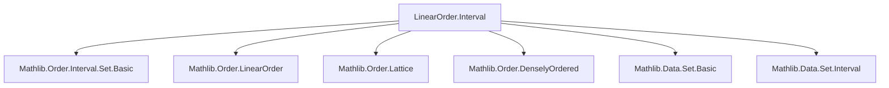
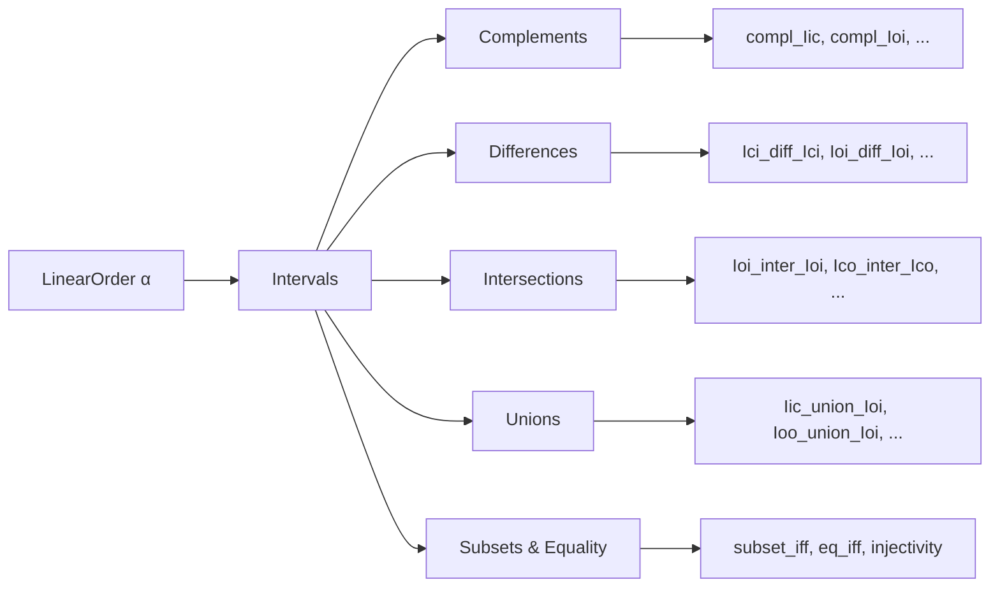
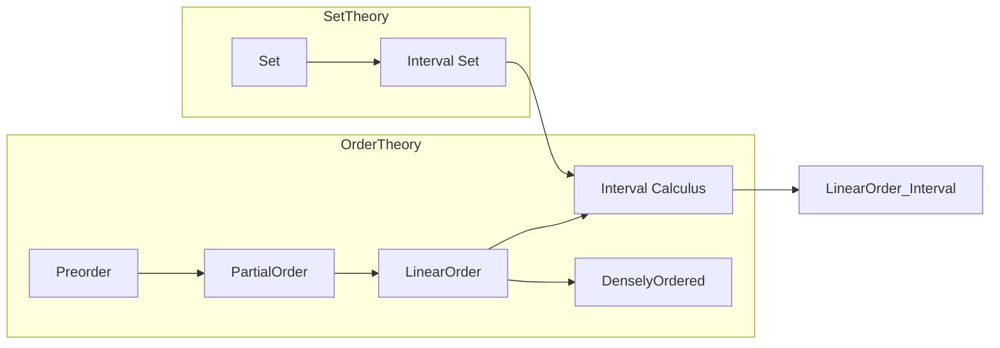

### Technical Brief: `LinearOrder.Interval` (from `LinearOrder.lean`)

---

#### **1. Key Definitions & Theorems**

| Name | Type / Signature | Purpose |
|------|------------------|---------|
| `Ici`, `Iic`, `Ioi`, `Iio`, `Ico`, `Ioc`, `Icc`, `Ioo` | `α → α → Set α` | Standard interval notation: `[a,∞)`, `(-∞,b]`, `(a,∞)`, `(-∞,b)`, `[a,b)`, `(a,b]`, `[a,b]`, `(a,b)` |
| `notMem_Ici`, `notMem_Iic`, `notMem_Ioi`, `notMem_Iio` | `c ∉ Ici a ↔ c < a`, etc. | Characterize membership negation using comparability |
| `compl_Iic`, `compl_Ici`, `compl_Iio`, `compl_Ioi` | `(Iic a)ᶜ = Ioi a`, etc. | Complement of intervals in linear orders |
| `Ici_diff_Ici`, `Ioi_diff_Ioi`, `Iic_diff_Iic`, etc. | e.g., `Ici a \ Ici b = Ico a b` | Set difference of intervals simplifies to another interval |
| `Ioi_injective`, `Iio_injective` | `Injective (Ioi : α → Set α)` | Injectivity of interval maps (via comparability) |
| `Ioi_inj`, `Iio_inj` | `Ioi a = Ioi b ↔ a = b` | Equality of infinite intervals ↔ equality of endpoints |
| `Ico_subset_Ico_iff`, `Ioc_subset_Ioc_iff`, `Ioo_subset_Ioo_iff` | Subset characterizations | Subset relations between intervals ↔ inequalities on endpoints |
| `Ico_eq_Ico_iff`, `Ioc_eq_Ioc_iff`, `Ioo_eq_Ioo_iff` | Equality characterizations | Equality of intervals ↔ equality of endpoints (under non-emptiness) |
| `Ici_eq_singleton_iff_isTop` | `(Ici x = {x}) ↔ IsTop x` | Singleton upper-closed interval ↔ top element |
| `Ioi_subset_Ioi_iff`, `Iio_subset_Iio_iff` | Subset ↔ endpoint order |
| `Ioi_ssubset_Ioi_iff`, `Iio_ssubset_Iio_iff` | Proper subset ↔ strict endpoint order |
| `Iic_union_Ioi_of_le`, `Iio_union_Ici_of_le`, etc. | Union of intervals = `univ` or complement of singleton | Covers of the line by overlapping intervals |
| `Ioo_union_Ioi`, `Ico_union_Ici`, `Ioc_union_Ioi`, etc. | Union of finite/infinite intervals = single interval | Simplify unions of intervals using `min`/`max` |
| `Ioo_subset_Ioo_union_Ico`, `Ico_subset_Ico_union_Ico`, etc. | Subset decomposition | Decompose intervals into union of adjacent subintervals |
| `Ioi_inter_Ioi`, `Iio_inter_Iio` | `Ioi a ∩ Ioi b = Ioi (a ⊔ b)` | Intersections of infinite intervals use sup/inf |
| `Ico_inter_Ico`, `Ioc_inter_Ioc`, `Ioo_inter_Ioo` | `Ico a₁ b₁ ∩ Ico a₂ b₂ = Ico (a₁ ⊔ a₂) (b₁ ⊓ b₂)` | Intersections of finite intervals via endpoint lattice ops |
| `Ioc_diff_Iic`, `Ico_diff_Iio`, etc. | Set difference simplifications | Express differences as intervals using `min`/`max` |
| `compl_Ioc` | `(Ioc a b)ᶜ = Iic a ∪ Ioi b` | Complement of half-open interval as union of two rays |

---

#### **2. Naming Conventions**

- **Prefixes**:
  - `I?i`: *closed* on left (`Ici`, `Ico`, `Icc`, `Ioc`)
  - `I?o`: *open* on left (`Ioi`, `Ioo`, `Ioc`)
  - `Ii?`: *closed* on right (`Iic`, `Ioc`, `Icc`, `Ico`)
  - `Io?`: *open* on right (`Iio`, `Ioo`, `Ico`, `Ioc`)
- **Suffixes**:
  - `_iff`: equivalence (↔) characterizations (subset/equality)
  - `_iff_h`: variant with explicit hypothesis `h : ...`
  - `_subset_iff`, `_eq_iff`: subset/equality ↔ endpoint conditions
  - `_union_`, `_diff_`, `_inter_`: operations on intervals
  - `_self_of_le`: special case when endpoints satisfy inequality (e.g., `Ioc_diff_Ioc_self_of_le`)
- **Pattern**: `interval_op_interval₂` (e.g., `Ico_union_Ico`, `Ioc_inter_Ioi`)

---

#### **3. Tactic Stack**

- **Core tactics**:
  - `grind`: custom tactic (likely `aesop`-based) for automated reasoning in ordered structures
  - `ext`: extensionality for set equality
  - `simp_rw`, `simp`: simplification using `@[simp]` lemmas
  - `convert`: for adapting proofs across dual orders (e.g., `αᵒᵈ`)
  - `rcases`, `obtain`, `cases'`: case analysis on order properties (`lt_or_ge`, `le_or_lt`)
  - `exact`, `assumption`, `linarith`: for inequality reasoning
  - `gt_or_le`, `ge_or_lt`, `lt_or_lt_iff_ne`, `lt_or_ge`: order decidability lemmas
  - `lt_irrefl`, `le_trans`, `le_of_not_gt`: basic order reasoning
  - `funext`, `ext`: extensionality for functions/sets
  - `subset_antisymm`: prove set equality via mutual inclusion

---

#### **4. Proof Logic**

- **Induction**: Not used directly (no inductive types in file).
- **Case analysis**: Heavy use of *totality* of `≤`/`<`:
  - `lt_or_ge x a`, `le_or_lt x a`, `gt_or_lt x a`, etc.
- **Duality**: Many theorems are dualized via `αᵒᵈ` (e.g., `Ioc_subset_Ioc_iff` via `Ico_subset_Ico_iff` on dual order).
- **Subset antisymmetry**: Standard pattern: prove `A ⊆ B` and `B ⊆ A` separately.
- **Endpoint comparison**: Most proofs reduce to comparing endpoints via `min`/`max` and lattice properties.
- **Non-emptiness assumptions**: For equality (`Ico_eq_Ico_iff`), require `a < b ∨ c < d` to avoid degenerate intervals.
- **Densely ordered extensions**: Some lemmas (e.g., `Ioo_subset_Ioo_iff`) require `[DenselyOrdered α]` to construct witnesses like `exists_between`.

---

#### **5. Imports**

- `Mathlib.Order.Interval.Set.Basic`: foundational interval definitions and basic properties
- `Function`: for `Injective`, `eq_of_forall_gt_iff`, etc.
- Implicit: `Mathlib.Order.LinearOrder`, `Mathlib.Order.Interval.Set.Defs`, `Mathlib.Order.Lattice`, `Mathlib.Order.DenselyOrdered`

---

#### **6. Mermaid Diagrams**

##### **Dependency Graph (Module-Level)**

##### **Overview of File Structure**

##### **Theory Context**

---

#### **7. Notes**

- **No `RelIso`**: Explicitly asserts no order isomorphisms are defined here (avoids naming conflicts).
- **Duality**: Many theorems are dualized via `αᵒᵈ`, e.g., `Ioc` lemmas via `Ico` on dual order.
- **Non-degeneracy**: Equality theorems require non-emptiness (`a < b ∨ c < d`) to avoid pathological cases like `Ico a a = ∅`.
- **`grind` tactic**: Used pervasively — likely a custom automation tactic for ordered structures (possibly `aesop` + `linarith` + `simp`).

--- 

Let me know if you'd like a formal dependency graph (e.g., `.lean` imports), or a tactic trace for a specific proof.
