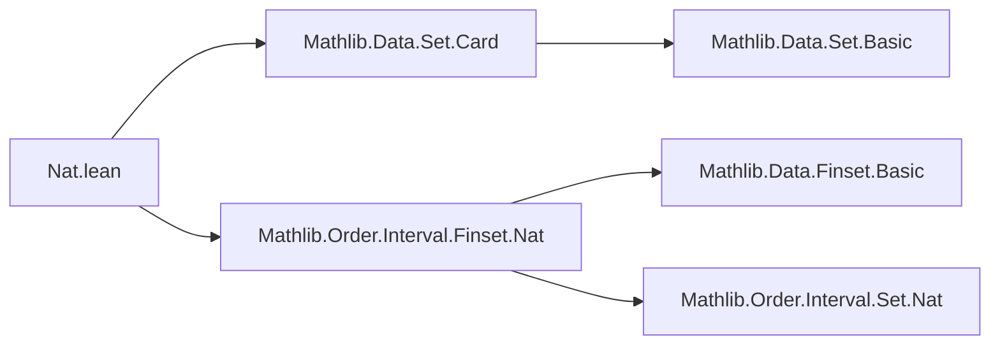
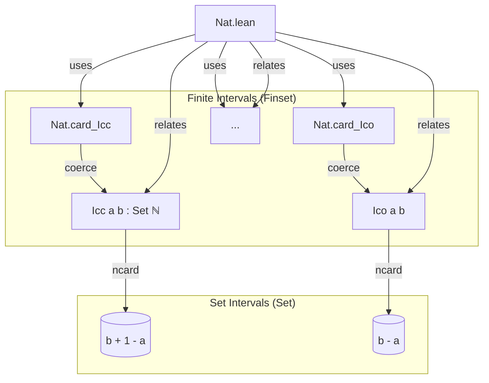
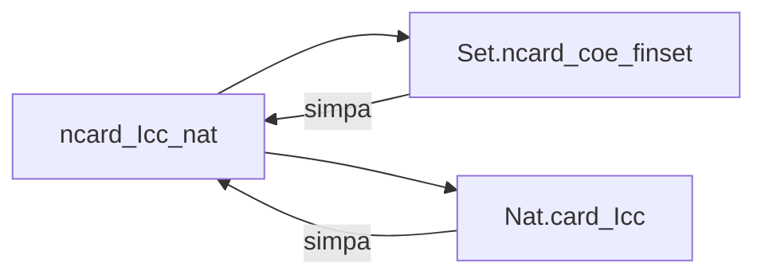

**Technical Brief: `Nat.lean` — Finite Intervals of Naturals**

---

### 1. **Key Definitions & Theorems**

| Name | Type | Purpose |
|------|------|---------|
| `ncard_Icc_nat` | `(a b : ℕ) → (Icc a b).ncard = b + 1 - a` | Cardinality of closed interval $[a, b]$ in ℕ is $b + 1 - a$ |
| `ncard_Ico_nat` | `(a b : ℕ) → (Ico a b).ncard = b - a` | Cardinality of half-open interval $[a, b)$ is $b - a$ |
| `ncard_Ioc_nat` | `(a b : ℕ) → (Ioc a b).ncard = b - a` | Cardinality of half-open interval $(a, b]$ is $b - a$ |
| `ncard_Ioo_nat` | `(a b : ℕ) → (Ioo a b).ncard = b - a - 1` | Cardinality of open interval $(a, b)$ is $b - a - 1$ |
| `ncard_uIcc_nat` | `(a b : ℕ) → (uIcc a b).ncard = (b - a : ℤ).natAbs + 1` | Cardinality of unordered interval $[a, b]$ (i.e., $[\min(a,b), \max(a,b)]$) is $|b - a| + 1$ |
| `ncard_Iic_nat` | `(b : ℕ) → (Iic b).ncard = b + 1` | Cardinality of initial segment $(-\infty, b]$ is $b + 1$ |
| `ncard_Iio_nat` | `(b : ℕ) → (Iio b).ncard = b` | Cardinality of strict initial segment $(-\infty, b)$ is $b$ |

All lemmas are `@[simp]`, indicating they are used as simplification rules for cardinalities of intervals.

---

### 2. **Naming Conventions**

- **Prefix**: `ncard_` — indicates *normalized cardinality* (i.e., `ncard` is the cardinality function for sets, returning a natural number).
- **Interval notation suffixes**:
  - `_Icc_` → closed–closed $[a,b]$
  - `_Ico_` → closed–open $[a,b)$
  - `_Ioc_` → open–closed $(a,b]$
  - `_Ioo_` → open–open $(a,b)$
  - `_uIcc_` → unordered closed interval (symmetric in $a,b$)
  - `_Iic_` → initial closed interval $(-\infty,b]$
  - `_Iio_` → initial open interval $(-\infty,b)$
- **Domain suffix `_nat`**: indicates the theorem is specialized to natural numbers.

---

### 3. **Tactic Stack**

- `simpa` — primary tactic used; simplifies using target equality and rewrites using `← Set.ncard_coe_finset`.
- `using` — supplies a pre-proved lemma (from `Nat.card_*`) to `simpa`.
- Implicitly: `simp`, `rw`, `norm_num` may be used under the hood via `simpa`.

No explicit induction or case analysis is visible in the proofs — they are *derived* from existing `Nat.card_*` lemmas via coercion.

---

### 4. **Proof Logic**

- **Strategy**: *Reduction to finite sets via coercion*.
  - Each proof uses `simpa [← Set.ncard_coe_finset] using Nat.card_*`.
  - `Set.ncard_coe_finset` relates `Set.ncard` (for sets) to `Finset.card` (for finite sets).
  - `Nat.card_*` lemmas provide the cardinalities of the corresponding *finite* intervals as `Finset`s.
- Thus, the proofs are *one-liners* relying on:
  - The fact that intervals of naturals are finite sets.
  - The coercion `↑(Icc a b : Finset ℕ) = Icc a b` as sets.

No explicit induction or arithmetic manipulation is needed — arithmetic simplifications are handled by `simpa`.

---

### 5. **Imports**

- `Mathlib.Data.Set.Card` — provides `Set.ncard`, cardinality for sets.
- `Mathlib.Order.Interval.Finset.Nat` — provides:
  - Interval definitions (`Icc`, `Ico`, etc.) as `Finset`s.
  - Lemmas like `Nat.card_Icc`, `Nat.card_Ico`, etc.

These imports define the *finite* interval objects and their cardinalities, which are then lifted to the *set* level.

---

### 6. **Mermaid Diagrams**

#### Dependency Graph (Module-Level)

#### Overview of Theoretical Flow

#### Proof Dependency (per lemma)

---

### Summary

This module bridges finite combinatorial interval cardinalities (`Nat.card_*`) with set-theoretic intervals (`Set.Icc`, etc.) via the `Set.ncard` function. It leverages coercion and simplification to derive clean arithmetic formulas for interval sizes over ℕ — a foundational result for counting arguments in combinatorics and analysis over discrete domains.
