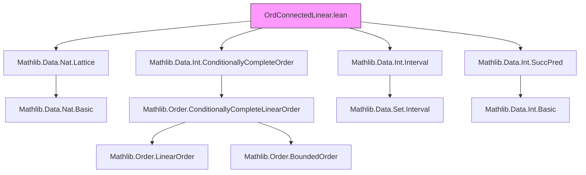

**Technical Brief: `OrdConnectedLinear.lean`**

---

### 1. KEY DEFINITIONS & THEOREMS

| Name | Type / Signature | Purpose |
|------|------------------|---------|
| `Set.OrdConnected` | `Prop` (implicit in context) | A set $ I \subseteq \alpha $ is *order-connected* if for all $ x, y \in I $ and $ z $ with $ x < z < y $, we have $ z \in I $. |
| `Set.Icc a b` | `Set α` | Closed interval $[a, b] = \{z \mid a \le z \land z \le b\}$. |
| `Set.Ioo x y` | `Set α` | Open interval $]x, y[ = \{z \mid x < z \land z < y\}$. |
| `Set.Nonempty.ordConnected_iff_of_bdd` | `I.OrdConnected ↔ I = Icc (sInf I) (sSup I)` | In a *conditionally complete*, *locally finite* linear order, a nonempty bounded set is order-connected iff it is a closed interval between its infimum and supremum. |
| `Set.Nonempty.ordConnected_iff_of_bdd'` | Same as above, but for *complete* linear orders with top/bottom (e.g., `Fin n`) — no explicit boundedness needed. |
| `Set.ordConnected_iff_disjoint_Ioo_empty` | `I.OrdConnected ↔ ∀ x y ∈ I, Disjoint (Ioo x y) I → Ioo x y = ∅` | In a *locally finite* linear order, $ I $ is order-connected iff no open interval between two points of $ I $ intersects $ I $ nontrivially. |
| `Set.Nonempty.eq_Icc_iff_nat` | Characterisation for $ I \subseteq \mathbb{N} $: $ I = [m, M] \iff \forall x, y \in I, \text{Disjoint}(]x,y[, I) \to y \le x+1 $ | Closed intervals in $ \mathbb{N} $ are exactly the nonempty, bounded-above, order-connected subsets where gaps are at most 1. |
| `Set.Nonempty.eq_Icc_iff_int` | Same as above for $ \mathbb{Z} $, with boundedness in both directions. | Analogous characterisation for integers. |

---

### 2. NAMING CONVENTIONS

- **Prefixes**:
  - `ordConnected_`: Relates to order-connectedness.
  - `Icc`, `Ioo`: Standard interval notation.
  - `bdd`: For boundedness assumptions (`BddBelow`, `BddAbove`).
  - `csInf`, `csSup`: Conditional supremum/infimum.
- **Suffixes**:
  - `_iff`: Indicates an equivalence (↔).
  - `_nat`, `_int`: Specialisations to concrete types.
  - `_of_bdd`, `_of_bdd'`: Variants depending on boundedness assumptions.

---

### 3. TACTIC STACK

- `simp_rw`: Rewriting with simplification rules (e.g., `← Set.subset_compl_iff_disjoint_right`).
- `refine`: To construct proofs by refinement, especially in ↔ proofs.
- `ext`: Extensionality for set equality.
- `simpa`: Simplify and discharge goal using assumptions.
- `intro`, `exact`, `apply`: Basic intro/apply steps.
- `by_contra`: Proof by contradiction.
- `obtain`: Destructive existential/universal quantifiers.
- `have`, `suffices`: Intermediate lemma introduction.
- `union_subset_iff`, `Ioc_union_Ico_eq_Ioo`: Rewriting set unions using known lemmas.
- `lt_of_le_of_ne`, `lt_of_le_of_ne'`: Strict inequality from non-strict + inequality.
- `mem_Icc_of_Ioo`: From open interval membership to closed.

---

### 4. PROOF LOGIC

- **Main proof strategy**:
  - For equivalences (`↔`), split into two directions (`→`, `←`).
  - Use `ordConnected` definition (via intervals) ↔ set-theoretic properties (e.g., disjointness with `Ioo`).
  - In `ordConnected_iff_disjoint_Ioo_empty`, the forward direction uses contrapositive reasoning: if $ Ioo(x,y) \cap I \neq \emptyset $, then $ I $ is not order-connected.
  - The reverse direction uses *local finiteness* to extract extremal points $ x', y' $ around a hypothetical missing point $ z $, then constructs disjoint open intervals contradicting the hypothesis.
  - For concrete types (`ℕ`, `ℤ`), reduce to general theorems via `simp` and known facts (e.g., `Int.succ`, `OrderBot.bddBelow`, `OrderTop.bddAbove`).

- **Inductive/constructive flavor**: Not induction-heavy; rather, relies on order-theoretic properties and extremal element extraction (enabled by `LocallyFiniteOrder`).

---

### 5. IMPORTS

| Module | Purpose |
|--------|---------|
| `Mathlib.Data.Nat.Lattice` | Lattice structure on `ℕ`, used for order reasoning. |
| `Mathlib.Data.Int.ConditionallyCompleteOrder` | Conditional completeness of `ℤ`. |
| `Mathlib.Data.Int.Interval` | Interval definitions and properties for `ℤ`. |
| `Mathlib.Data.Int.SuccPred` | Successor/predecessor structure on `ℤ`, used in `eq_Icc_iff_int`. |

Also implicitly uses:
- `Mathlib.Data.Set.Basic`, `Mathlib.Data.Set.Interval`
- `Mathlib.Order.ConditionallyCompleteLinearOrder`
- `Mathlib.Order.LocallyFiniteOrder`
- `Mathlib.Order.Interval.Set.Basic`

---

### 6. MERMAID DIAGRAMS

#### Dependency Graph (High-Level)



#### Overview of Theory Flow

```mermaid
flowchart LR
  subgraph CoreTheory
    L[LinearOrder α] --> LC[LocallyFiniteOrder α]
    LC --> CC[ConditionallyCompleteLinearOrder α]
    CC --> BDD[BddBelow I ∧ BddAbove I]
    BDD --> Icc[I = Icc (sInf I) (sSup I)]
    Icc --> OC[I.OrdConnected]
    OC <-->|↔| DIS[Disjoint Ioo I → Ioo = ∅]
  end

  subgraph Specialisations
    OC_nat[ℕ] -->|eq_Icc_iff_nat| DIS_nat
    OC_int[ℤ] -->|eq_Icc_iff_int| DIS_int
  end

  OC -->|ordConnected_iff_of_bdd| Icc
  OC -->|ordConnected_iff_of_bdd'| Icc'
  Icc' -->|Fin n| OC
```

---

### 7. REMARKS & TODO

- The `LocallyFiniteOrder` assumption in `ordConnected_iff_disjoint_Ioo_empty` is noted as possibly too strong — the result holds for `ℝ`, but the current proof requires local finiteness.
- The file bridges abstract order theory with concrete arithmetic structures (`ℕ`, `ℤ`, `Fin n`), enabling automated reasoning about intervals in discrete settings.

--- 

Let me know if you'd like a formal dependency graph (e.g., `.dot` format) or a proof sketch in natural deduction style.
