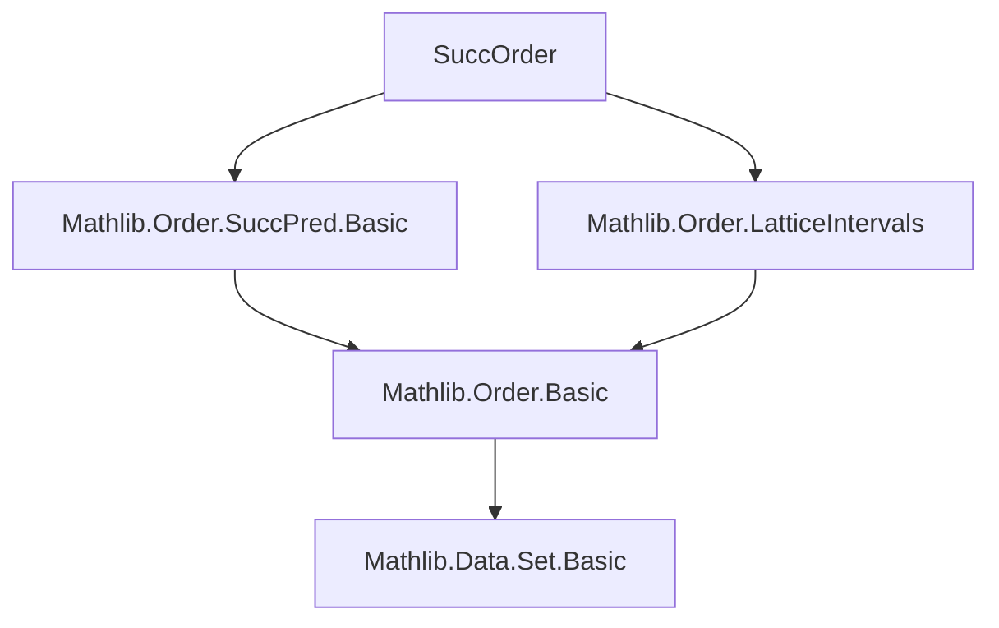
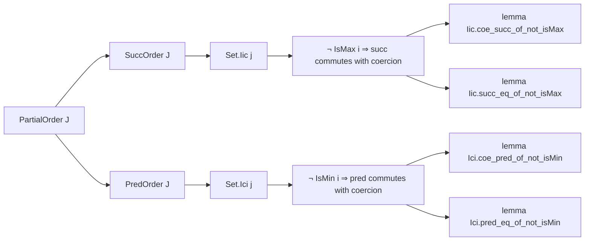

**Technical Brief: `SuccOrder.lean`**

---

### 1. **Key Definitions & Theorems**

| Name | Type / Signature | Purpose |
|------|------------------|---------|
| `Iic.coe_succ_of_not_isMax` | `[SuccOrder J] → {j : J} → {i : Set.Iic j} → ¬ IsMax i → (Order.succ i).1 = Order.succ i.1` | Shows that the coercion of the successor in the subtype `Set.Iic j` (i.e., the interval $(-\infty, j]$) coincides with the ambient successor, provided the element is not maximal. |
| `Iic.succ_eq_of_not_isMax` | `[SuccOrder J] → {j : J} → {i : Set.Iic j} → ¬ IsMax i → Order.succ i = ⟨Order.succ i.1, _⟩` | Refines the above to an equality of terms in `Set.Iic j`, constructing the successor as a subtype element. |
| `Ici.coe_pred_of_not_isMin` | `[PredOrder J] → {j : J} → {i : Set.Ici j} → ¬ IsMin i → (Order.pred i).1 = Order.pred i.1` | Dual statement for the interval $[j, \infty)$: coercion of the predecessor equals ambient predecessor, when not minimal. |
| `Ici.pred_eq_of_not_isMin` | `[PredOrder J] → {j : J} → {i : Set.Ici j} → ¬ IsMin i → Order.pred i = ⟨Order.pred i.1, _⟩` | Dual refinement of the above, expressing predecessor in the subtype. |

> **Note**: `SuccOrder` and `PredOrder` are typeclasses from `Mathlib.Order.SuccPred.Basic`, encoding existence of successor/predecessor functions with appropriate monotonicity and boundedness properties.

---

### 2. **Naming Conventions**

- **Prefixes**:
  - `Iic.` and `Ici.`: denote intervals — `Iic j` = `(-∞, j]`, `Ici j` = `[j, ∞)`.
- **Suffixes**:
  - `coe_...`: emphasizes that coercion (`.1`) commutes with the operation.
  - `..._eq_of_not_isMax` / `..._eq_of_not_isMin`: indicates equality in the subtype under a non-extremality condition.
- **Structure**: `Set.{interval}.{op}_{coerce?}_{cond}`.

---

### 3. **Tactic Stack**

- `rw [...]`: used to rewrite using lemmas like `coe_succ_of_mem`, `← coe_succ_of_not_isMax`, etc.
- `apply ...`: to apply lemmas such as `Order.succ_le_of_lt`, `Order.le_pred_of_lt`.
- `exact ...`: for immediate proof steps (e.g., `lt_of_le_of_ne`).
- `simpa using hi`: simplifies using hypothesis `hi`, often to derive inequalities or equalities.
- `ext`: extensionality for subtype equality (proving two subtype elements equal by proving their coercions equal).
- `simp only [...]`: simplifies goals using specific lemmas (e.g., `coe_succ_of_not_isMax hi`).

No heavy automation (e.g., `linarith`, `omega`) — proofs are mostly direct and structural.

---

### 4. **Proof Logic**

- **Core idea**: Use the universal property of subtypes (`Subtype.coe_prop`, `ext`) and the compatibility of `succ`/`pred` with coercion under non-extremality.
- **Typical flow**:
  1. Assume `i : Set.Iic j` and `¬ IsMax i`.
  2. Show `(Order.succ i).1 = Order.succ i.1` by:
     - Rewriting with `coe_succ_of_mem` (a lemma from `Mathlib.Order.SuccPred.Basic`).
     - Applying `Order.succ_le_of_lt` to reduce to showing `i < Order.succ i`, which follows from `¬ IsMax i` and `le_top`.
  3. Lift this equality to an equality in the subtype using `⟨..., Subtype.coe_prop⟩`.
  4. Conclude via `ext` (extensionality for subtypes).

- **Duality**: The `Ici` lemmas mirror the `Iic` ones, replacing `succ` with `pred`, `IsMax` with `IsMin`, and reversing inequalities (`bot_le` instead of `le_top`, `lt_of_ne_of_le` vs `lt_of_le_of_ne`, etc.).

---

### 5. **Imports**

| Module | Role |
|--------|------|
| `Mathlib.Order.LatticeIntervals` | Provides definitions and basic facts about intervals like `Set.Iic`, `Set.Ici`, including coercion lemmas (`coe_succ_of_mem`, `coe_pred_of_mem`). |
| `Mathlib.Order.SuccPred.Basic` | Defines `SuccOrder`, `PredOrder` typeclasses and basic lemmas (e.g., `coe_succ_of_mem`, `coe_pred_of_mem`, `succ_le_of_lt`, `le_pred_of_lt`). |

> These imports define the ambient order-theoretic context and the behavior of `succ`/`pred` with respect to coercion.

---

### 6. **Mermaid Diagrams**

#### **Dependency Graph (Module-Level)**

#### **Overview of File Content**

---

### 7. **Theoretical Significance**

This module formalizes a key technical fact used when working with inductive constructions over intervals in ordered types — especially in contexts like ordinal arithmetic, transfinite induction, or refinement of inductive definitions on bounded domains. It ensures that `succ`/`pred` behave well under restriction to initial/final segments, *as long as extremality is avoided* — a common condition in such arguments.

--- 

Let me know if you'd like a formalization of the dual `Ioi`/`Iic` cases or a generalization to `SuccOrder` on subtypes.
