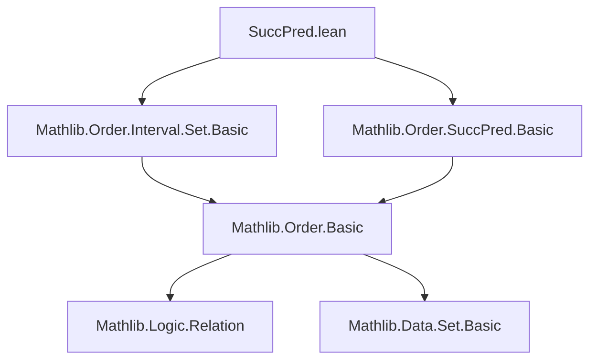
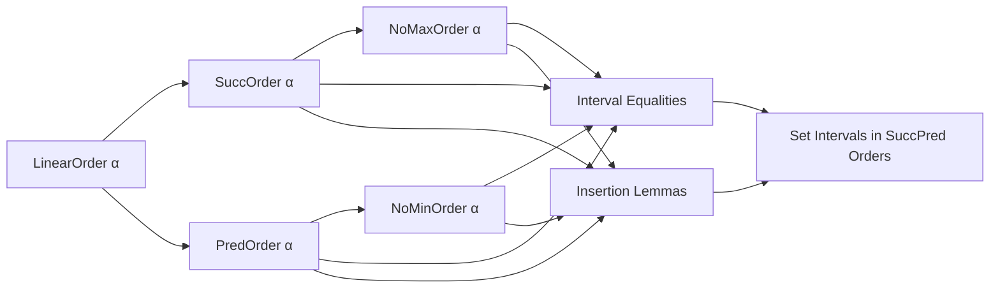
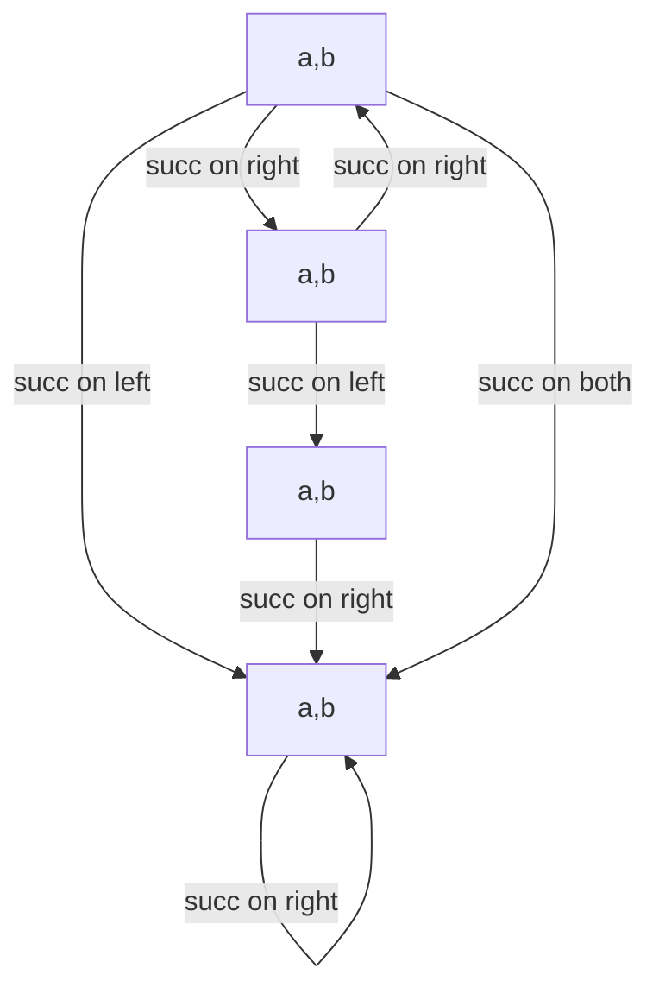

### Technical Brief: `SuccPred.lean`

---

#### **1. Key Definitions & Theorems**

| Name | Type / Signature | Purpose |
|------|------------------|---------|
| `Ico`, `Ioc`, `Icc`, `Ioo` | `Set α` (interval constructors) | Standard interval notation: `[a, b)`, `(a, b]`, `[a, b]`, `(a, b)` |
| `succ`, `pred` | `α → α` | Successor and predecessor functions (from `SuccOrder`, `PredOrder`) |
| `IsMax`, `IsMin` | `α → Prop` | Predicate for maximal/minimal elements |
| `SuccOrder`, `PredOrder`, `NoMaxOrder`, `NoMinOrder` | Typeclass | Structural assumptions on order (existence of succ/pred, or absence of max/min) |

##### **Core Equalities of Intervals**
| Lemma | Statement | Intuition |
|-------|-----------|-----------|
| `Ico_succ_left_eq_Ioo` | `Ico (succ a) b = Ioo a b` | Removing left endpoint via `succ` turns half-open `[a, b)` into open `(a, b)` |
| `Icc_succ_left_eq_Ioc_of_not_isMax` | `Icc (succ a) b = Ioc a b` (if `a` not max) | Shift left endpoint → open on left |
| `Ico_succ_right_eq_Icc_of_not_isMax` | `Ico a (succ b) = Icc a b` (if `b` not max) | Extend right endpoint by 1 → close right |
| `Ioo_succ_right_eq_Ioc_of_not_isMax` | `Ioo a (succ b) = Ioc a b` | Extend right endpoint → close right, keep left open |
| `Ico_succ_succ_eq_Ioc_of_not_isMax` | `Ico (succ a) (succ b) = Ioc a b` | Double shift → open-closed interval |
| `Ioc_pred_right_eq_Ioo` | `Ioc a (pred b) = Ioo a b` | Remove right endpoint via `pred` → open interval |
| `Icc_pred_right_eq_Ico_of_not_isMin` | `Icc a (pred b) = Ico a b` (if `b` not min) | Shift right endpoint down → open right |
| `Ioc_pred_left_eq_Icc_of_not_isMin` | `Ioc (pred a) b = Icc a b` (if `a` not min) | Shift left endpoint down → close left |
| `Ioo_pred_left_eq_Ioc_of_not_isMin` | `Ioo (pred a) b = Ico a b` | Shift left endpoint down → close left, keep right open |
| `Ioc_pred_pred_eq_Ico_of_not_isMin` | `Ioc (pred a) (pred b) = Ico a b` | Double shift → closed-open interval |
| `Icc_succ_pred_eq_Ioo` | `Icc (succ a) (pred b) = Ioo a b` | Shift both endpoints → open interval |

##### **Insertion Lemmas**
| Lemma | Statement | Intuition |
|-------|-----------|-----------|
| `insert_Icc_succ_left_eq_Icc` | `insert a (Icc (succ a) b) = Icc a b` (if `a ≤ b`) | Adding back left endpoint recovers closed interval |
| `insert_Icc_right_eq_Icc_succ` | `insert (succ b) (Icc a b) = Icc a (succ b)` (if `a ≤ succ b`) | Adding back right endpoint extends interval |
| `insert_Ico_right_eq_Ico_succ_of_not_isMax` | `insert b (Ico a b) = Ico a (succ b)` | Close right endpoint via `succ` |
| `insert_Ioc_right_eq_Ioc_succ_of_not_isMax` | `insert (succ b) (Ioc a b) = Ioc a (succ b)` | Extend right endpoint in open-closed interval |
| `insert_Icc_pred_right_eq_Icc` | `insert b (Icc a (pred b)) = Icc a b` | Recover original interval by adding right endpoint |
| `insert_Ioc_left_eq_Ioc_pred_of_not_isMin` | `insert a (Ioc a b) = Ioc (pred a) b` | Extend left endpoint via `pred` |
| `insert_Ico_left_eq_Ico_pred_of_not_isMin` | `insert (pred a) (Ico a b) = Ico (pred a) b` | Extend left endpoint in half-open interval |

##### **One-sided Intervals**
| Lemma | Statement | Intuition |
|-------|-----------|-----------|
| `Iio_succ_eq_Iic_of_not_isMax` | `Iio (succ b) = Iic b` (if `b` not max) | Predecessor of `succ b` is `b`, so `< succ b` = `≤ b` |
| `Ici_succ_eq_Ioi_of_not_isMax` | `Ici (succ a) = Ioi a` (if `a` not max) | `≥ succ a` = `> a` |
| `Iic_pred_eq_Iio_of_not_isMin` | `Iic (pred b) = Iio b` (if `b` not min) | `≤ pred b` = `< b` |
| `Ioi_pred_eq_Ici_of_not_isMin` | `Ioi (pred a) = Ici a` (if `a` not min) | `> pred a` = `≥ a` |

---

#### **2. Naming Conventions**

- **Prefixes**:
  - `Ico`, `Ioc`, `Icc`, `Ioo`: Interval notation (`I`nterval, `c`losed, `o`pen)
  - `succ_`, `pred_`: Operations involving successor/predecessor
  - `insert_`: Insertion lemmas
- **Suffixes**:
  - `_eq_`: Equality of intervals
  - `_of_not_isMax`, `_of_not_isMin`: Conditional lemmas requiring non-max/min
  - `_left`, `_right`: Position of operation (left/right endpoint)
- **Pattern**:
  - `insert_[interval]_[side]_[action]_[condition]`
    - e.g., `insert_Icc_succ_left_eq_Icc`
    - `Icc`: interval type
    - `succ_left`: apply `succ` to left endpoint
    - `eq_Icc`: result is `Icc`

---

#### **3. Tactic Stack**

- `ext x`: Extensionality for set equality
- `rw [...]`: Rewrite using interval membership lemmas (`mem_Ico`, `mem_Icc`, etc.)
- `simp` / `simp_all`: Simplify using `le_succ_iff`, `lt_succ_iff`, `pred_le_iff`, etc.
- `aesop`: Automated reasoning for order and set logic
- `by_cases ha : IsMax a` / `hb : IsMin b`: Case analysis on extremality
- `simp +contextual [...]`: Contextual simplification for conditional rewrites
- `exact fun h ↦ ...`: Direct proof of implication (e.g., emptiness)

---

#### **4. Proof Logic**

- **Structure**:
  1. **Case analysis** on `IsMax` / `IsMin` (especially for edge cases like empty intervals).
  2. **Extensionality**: Prove set equality by element-wise equivalence.
  3. **Rewrite membership** using interval definitions (`mem_Ico`, `mem_Icc`, etc.).
  4. **Apply order-theoretic lemmas** like `succ_le_iff_of_not_isMax`, `lt_succ_iff_of_not_isMax`, `pred_le_iff_of_not_isMin`, etc.
  5. **Simplify** using algebraic properties of `≤`, `<`, `succ`, `pred`.
  6. **Use `insert` lemmas** to relate interval constructions via set insertion.

- **Typical Flow**:
  ```text
  ext x
  rw [mem_..., mem_...]
  -- reduce to logical statement about x, a, b
  simp [le_succ_iff, lt_succ_iff, ...]
  -- simplify using order axioms
  aesop
  ```

- **Induction is not used** — proofs are purely equational and rely on order-theoretic properties.

---

#### **5. Imports**

| Import | Purpose |
|--------|---------|
| `Mathlib.Order.Interval.Set.Basic` | Definitions of intervals (`Ico`, `Ioc`, `Icc`, `Ioo`) and basic properties |
| `Mathlib.Order.SuccPred.Basic` | Definitions of `SuccOrder`, `PredOrder`, `succ`, `pred`, `IsMax`, `IsMin`, `NoMaxOrder`, `NoMinOrder` |

---

#### **6. Mermaid Diagrams**

##### **Dependency Graph (Module-Level)**



##### **Conceptual Overview of Theory**



##### **Interval Transformation Lattice (SuccOrder Case)**



---

#### **7. Related Files (Sync Targets)**

- `Mathlib/Algebra/Order/Interval/Finset/SuccPred.lean`
- `Mathlib/Algebra/Order/Interval/Set/SuccPred.lean`
- `Mathlib/Order/Interval/Finset/SuccPred.lean`

> **TODO**: Copy `insert` lemmas from `Mathlib/Order/Interval/Finset/Nat.lean`.

---

#### **8. Summary**

This file formalizes the **algebraic structure of intervals** under successor/predecessor operations in linearly ordered types. It provides a **comprehensive toolkit** for transforming intervals via `succ`/`pred`, especially in the presence or absence of extremal elements (`IsMax`, `IsMin`). The proofs are mostly **elementary and equational**, relying on foundational order theory and set extensionality. The naming and structure are highly systematic, enabling predictable generalization to related files (e.g., `Finset` versions).
