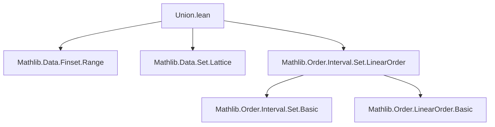

**Technical Brief: `Union.lean`**

---

### 1. **Key Definitions & Theorems**

| Name | Type | Purpose |
|------|------|---------|
| `Ioc_subset_biUnion_Ioc` | `{X : Type*} [LinearOrder X] → (N : ℕ) → (a : ℕ → X) → Ioc (a 0) (a N) ⊆ ⋃ i ∈ Finset.range N, Ioc (a i) (a (i + 1))` | Shows that the half-open interval $(a_0, a_N]$ is contained in the union of consecutive half-open intervals $(a_i, a_{i+1}]$ for $i < N$. |
| `Ico_subset_biUnion_Ico` | `{X : Type*} [LinearOrder X] → (N : ℕ) → (a : ℕ → X) → Ico (a 0) (a N) ⊆ ⋃ i ∈ Finset.range N, Ico (a i) (a (i + 1))` | Analogous to above, but for left-closed, right-open intervals $[a_0, a_N)$. |

Both theorems formalize the intuitive idea that a “chain” of adjacent intervals covers the full interval spanned by the endpoints.

---

### 2. **Naming Conventions**

- **Prefixes**: None beyond standard Lean/`Mathlib` conventions.
- **Suffixes**: None beyond standard.
- **Pattern**: Theorems use descriptive names: `Ioc`/`Ico` + `subset_biUnion` + `Ioc`/`Ico`, indicating interval type and inclusion direction.

---

### 3. **Tactic Stack**

- `induction` — used with `with` to handle base and inductive cases.
- `simp` — for simplification in base case (`N = 0`).
- `calc` — for chaining subset inclusions.
- `union_subset_union_right` — to lift an inclusion into a union.
- `simpa` — to simplify using a given lemma (`ih`) and rewrite rules (`Finset.range_add_one`).

No heavy automation (e.g., `aesop`, `linarith`, `ring`) is used — proofs are mostly structural and rely on interval lemmas from `Mathlib`.

---

### 4. **Proof Logic**

- **Inductive structure** on $N : \mathbb{N}$.
- **Base case** ($N = 0$): Both intervals degenerate to empty sets (`Ioc a 0 a 0` and `Ico a 0 a 0` are empty), so inclusion holds by `simp`.
- **Inductive step**:
  - Use known interval inclusion lemma (`Ioc_subset_Ioc_union_Ioc` or `Ico_subset_Ico_union_Ico`) to split the interval $[a_0, a_{N+1})$ (or $(a_0, a_{N+1}]$) into two parts: $[a_0, a_N)$ and $[a_N, a_{N+1})$.
  - Apply induction hypothesis to the first part.
  - Use `union_subset_union_right` to combine with the new interval $[a_N, a_{N+1})$ (or $(a_N, a_{N+1}]$).
  - Simplify using `Finset.range_add_one`, which rewrites $\text{range}(N+1) = \text{range}(N) \cup \{N\}$.

---

### 5. **Imports**

| Import | Purpose |
|--------|---------|
| `Mathlib.Data.Finset.Range` | Provides `Finset.range` and related lemmas (e.g., `Finset.range_add_one`). |
| `Mathlib.Data.Set.Lattice` | Provides set-theoretic operations and lattice structure (e.g., `⋃`, `∪`, subset relations). |
| `Mathlib.Order.Interval.Set.LinearOrder` | Defines intervals (`Ioc`, `Ico`, etc.) and basic properties in linear orders (e.g., `Ioc_subset_Ioc_union_Ioc`, `Ico_subset_Ico_union_Ico`). |

---

### 8. **Mermaid Diagrams**

#### **Dependency Graph (File-Level)**



#### **Overview of File Content**

```mermaid
flowchart LR
  A[Linear Order X] --> B[Interval Types]
  B --> C1[Ioc: (a,b]]
  B --> C2[Ico: [a,b))
  A --> D[Finset.range N]
  D --> E[Biunion over i < N]
  C1 & C2 --> F[Union of consecutive intervals]
  F --> G[Containment: full interval ⊆ union]
  G --> H[Theorems: Ioc_subset_biUnion_Ioc, Ico_subset_biUnion_Ico]
```

---

### Summary

This file formalizes a foundational covering property of intervals in linear orders: a finite chain of adjacent intervals covers the full interval between the first and last endpoints. The proofs are short, inductive, and rely on standard interval lemmas and `Finset.range` arithmetic. It serves as a complement to infinite union lemmas in `Mathlib.Order.Interval.Set.Disjoint`, which cannot use `Finset.range`.
