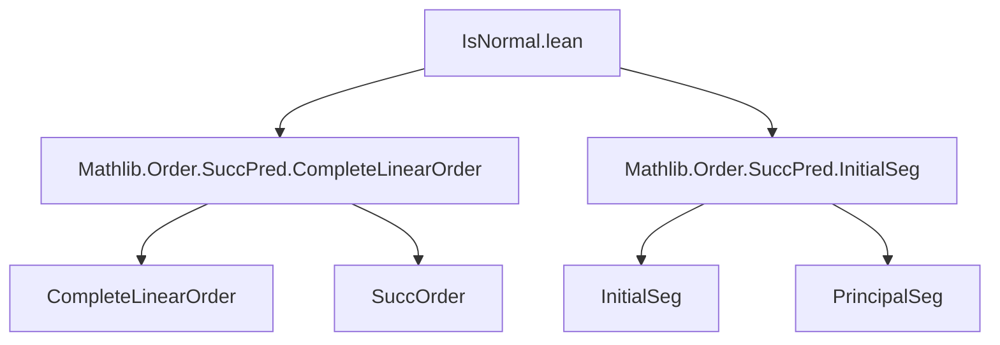
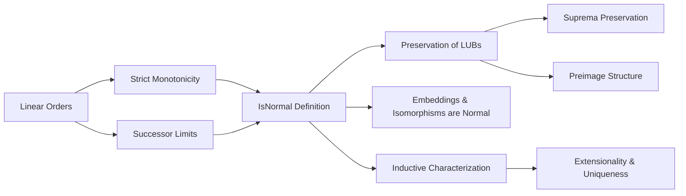
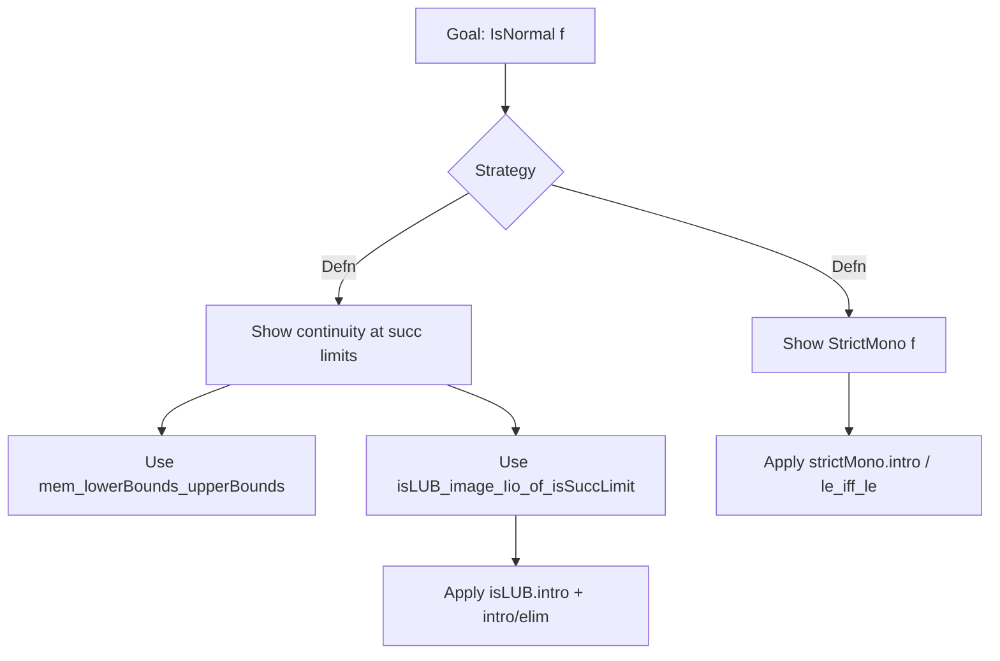

### Technical Brief: `IsNormal.lean`

---

#### **1. Key Definitions & Theorems**

| Name | Type / Signature | Purpose |
|------|------------------|---------|
| `IsNormal` | `structure (f : α → β) : Prop` | Defines a *normal function* between linearly ordered types as a strictly monotone function satisfying a continuity condition at successor limits. |
| `isNormal_iff'` | `IsNormal f ↔ StrictMono f ∧ ∀ a, IsSuccLimit a → f a ∈ lowerBounds (upperBounds (f '' Iio a))` | Equivalence definition: strict monotonicity + continuity at successor limits (via lower/upper bounds). |
| `isNormal_iff` | `IsNormal f ↔ StrictMono f ∧ ∀ o, IsSuccLimit o → (∀ a', a' < o → f a' ≤ a) → f o ≤ a` | Practical reformulation: continuity condition expressed via universal quantification over predecessors. |
| `isLUB_image_Iio_of_isSuccLimit` | `IsNormal f → IsSuccLimit a → IsLUB (f '' Iio a) (f a)` | Shows that `f` preserves least upper bounds of initial segments at successor limits. |
| `le_iff_forall_le` | `IsNormal f → IsSuccLimit a → (f a ≤ b ↔ ∀ a' < a, f a' ≤ b)` | Characterizes ≤ in terms of predecessors — key for reasoning about continuity. |
| `lt_iff_exists_lt` | `IsNormal f → IsSuccLimit a → (b < f a ↔ ∃ a' < a, b < f a')` | Dual to above: characterizes strict inequality via existence of a predecessor exceeding `b`. |
| `map_isSuccLimit` | `IsNormal f → IsSuccLimit a → IsSuccLimit (f a)` | Normal functions map successor limits to successor limits. |
| `map_isLUB` | `IsNormal f → IsLUB s a → s.Nonempty → IsLUB (f '' s) (f a)` | Normal functions preserve arbitrary LUBs (under nonemptiness). |
| `InitialSeg.isNormal`, `PrincipalSeg.isNormal`, `OrderIso.isNormal` | `f : α ≤i β` / `α <i β` / `α ≃o β` → `IsNormal f` | Embeddings and isomorphisms are normal functions. |
| `id` | `IsNormal (@id α)` | Identity is normal. |
| `comp` | `IsNormal g → IsNormal f → IsNormal (g ∘ f)` | Composition of normal functions is normal. |
| `of_succ_lt` | `(∀ a, f a < f (succ a)) ∧ (∀ {a}, IsSuccLimit a → IsLUB (f '' Iio a) (f a)) → IsNormal f` | Sufficient condition for normality in well-founded successor orders. |
| `ext` | `[OrderBot α] → IsNormal f ∧ IsNormal g → f = g ↔ f ⊥ = g ⊥ ∧ ∀ a, f a = g a → f (succ a) = g (succ a)` | Extensionality of normal functions on well-founded successor orders. |
| `map_sSup`, `map_iSup` | `IsNormal f → f(sSup s) = sSup(f '' s)` / `f(⨆ i, g i) = ⨆ i, f(g i)` | Preservation of suprema in conditionally complete linear orders. |
| `preimage_Iic` | `IsNormal f → (f ⁻¹' Iic x).Nonempty ∧ BddAbove → f ⁻¹' Iic x = Iic(sSup(f ⁻¹' Iic x))` | Preimage of a closed interval under a normal function is a closed interval. |
| `apply_of_isSuccLimit` | `IsNormal f → IsSuccLimit a → f a = ⨆ b : Iio a, f b` | Expresses `f(a)` as a supremum over predecessors at successor limits. |

---

#### **2. Naming Conventions**

- **Prefixes**:
  - `isNormal_`: properties of `IsNormal` (e.g., `isNormal_iff`, `isLUB_image_Iio_of_isSuccLimit`)
  - `map_`: preservation properties (e.g., `map_isSuccLimit`, `map_isLUB`, `map_sSup`)
  - `preimage_`: preimage behavior (e.g., `preimage_Iic`)
  - `le_iff_forall_le`, `lt_iff_exists_lt`: logical characterizations of order relations.

- **Suffixes**:
  - `_of_isSuccLimit`: applies when argument is a successor limit.
  - `_iff_`: equivalence statements.
  - `_unique`: uniqueness of LUBs (used implicitly in `map_isLUB` proof via `unique`).

- **Structure fields**:
  - `strictMono`: strict monotonicity.
  - `mem_lowerBounds_upperBounds_of_isSuccLimit`: continuity condition at successor limits.

---

#### **3. Tactic Stack**

Frequently used tactics in proofs:
- `simp` / `simp_rw`: simplification with definitional equivalences and rewrite rules.
- `refine`: constructing proofs stepwise with holes (`?_`).
- `intro` / `intro h`: introduction of hypotheses.
- `exact`, `assumption`: closing goals with existing hypotheses.
- `induction ... using SuccOrder.limitRecOn`: induction on well-founded successor orders.
- `aesop`: automated reasoning for order-theoretic goals (e.g., `ext` proof).
- `convert`: equational reasoning with unification.
- `rw`, `apply`, `exact`: standard proof scripting.
- `csSup_*` lemmas: for conditionally complete suprema.

---

#### **4. Proof Logic**

- **Inductive structure**: Proofs often proceed by:
  - **Case analysis** on whether `a` is a minimum, successor, or limit.
  - **Induction** on `a` using `SuccOrder.limitRecOn` (for well-founded successor orders).
  - **Equational reasoning** using `map_isLUB`, `le_iff_forall_le`, `lt_iff_exists_lt`.
- **Continuity at limits** is central: many proofs reduce to showing `f a` is the LUB of `f '' Iio a`.
- **Monotonicity + strictness** used to lift inequalities and preserve order structure.
- **Extensionality** proofs (`ext`) rely on base case (`⊥`) and successor step; limits follow from LUB preservation.

---

#### **5. Imports**

- `Mathlib.Order.SuccPred.CompleteLinearOrder`: provides `IsSuccLimit`, `SuccOrder`, completeness properties.
- `Mathlib.Order.SuccPred.InitialSeg`: provides `InitialSeg`, `PrincipalSeg`, embeddings.

These imports define the foundational order-theoretic context (successor/predecessor calculus, initial segments, completeness).

---

#### **6. Mermaid Diagrams**

##### **Dependency Graph (Module-Level)**

##### **Conceptual Overview (Theory Flow)**

##### **Proof Strategy Skeleton**

---

#### **7. Theory Scope**

This module formalizes the theory of **normal functions** between well-orders (or more generally, linear orders with successor calculus). It serves as a foundational building block for:
- Transfinite recursion/induction,
- Fixed-point theorems (e.g., Veblen hierarchy),
- Cardinal/ordinal arithmetic (e.g., normal functions like $ \alpha \mapsto \omega^\alpha $).

The equivalence between the standard definition (strictly monotone + continuous at limits) and the simplified continuity condition (`f a ∈ lowerBounds(upperBounds(f '' Iio a))`) is a key technical contribution.

--- 

Let me know if you'd like a formalized dependency graph (e.g., `.lean` file graph), or a proof outline for a specific theorem.
