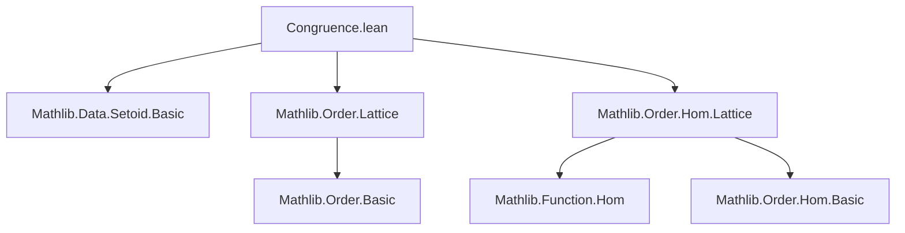

### Technical Brief: `Congruence.lean`

---

#### **1. Key Definitions & Theorems**

| Name | Type / Signature | Purpose |
|------|------------------|---------|
| `LatticeCon α` | `Type u` (structure) | Represents a **lattice congruence** on a lattice `α`: an equivalence relation compatible with `inf` and `sup`. |
| `LatticeCon.r` | `α → α → Prop` | The underlying binary relation of a `LatticeCon`. |
| `LatticeCon.inf` | `∀ {w x y z}, r w x → r y z → r (w ⊓ y) (x ⊓ z)` | Compatibility with meet (`inf`). |
| `LatticeCon.sup` | `∀ {w x y z}, r w x → r y z → r (w ⊔ y) (x ⊔ z)` | Compatibility with join (`sup`). |
| `LatticeCon.ker f` | `LatticeCon α` | Kernel of a lattice homomorphism `f : F` (where `F` is a `LatticeHomClass`), viewed as a lattice congruence. |
| `LatticeCon.mk'` | `r → [Refl] → (∀ x y, r x y ↔ r (x ⊓ y) (x ⊔ y)) → ... → LatticeCon α` | Alternative characterization: gives a `LatticeCon` from a relation satisfying three key properties (↔ with interval condition, transitivity under bounds, and compatibility with `inf`/`sup` under monotonicity). |
| `LatticeCon.r_inf_sup_iff` | `c.r (x ⊓ y) (x ⊔ y) ↔ c.r x y` | A key equivalence: in a lattice congruence, `x ≡ y` iff `x ⊓ y ≡ x ⊔ y`. |

---

#### **2. Naming Conventions**

- **Prefixes**:
  - `r_`: Used for properties of the underlying relation (e.g., `r_inf_sup_iff`).
  - `closed_interval`: Describes a technical lemma used to derive transitivity.
  - `compatible_left_*`: Helper lemmas for proving `inf`/`sup` compatibility in `mk'`.
- **Suffixes**:
  - `_iff`: Biconditional characterizations (`r_inf_sup_iff`).
  - `_left_*`: Compatibility when fixing one argument (e.g., `compatible_left_inf`).
- **Structure fields**:
  - `inf`, `sup`: Explicitly named after the operations they preserve.

---

#### **3. Tactic Stack**

Frequent tactics used in proofs:

| Tactic | Usage |
|--------|-------|
| `simp` / `simpa` | Rewriting using definitions (`Setoid.ker`, `map_inf`, `map_sup`, lattice identities like `inf_comm`, `sup_assoc`, etc.). |
| `rw` | Rewriting using lattice identities (e.g., `inf_eq_right.mpr`, `sup_eq_left.mpr`). |
| `exact` / `apply` | Direct proof construction, especially in `transitive` and `mk'`. |
| `have` / `suffices` | Introducing intermediate claims (e.g., `have compatible_left_inf`). |
| `convert` / `congr'` | Not used here, but `simp_all` is used in `ker`. |
| `aesop` | Not present — proofs are highly manual and lattice-specific. |
| `ring` | Not used — no arithmetic simplification needed. |

---

#### **4. Proof Logic**

The core logical flow is **constructive and structural**, with heavy use of:

- **Lattice identities** (e.g., absorption, associativity, distributivity of `inf`/`sup` over themselves).
- **Monotonicity under bounds**: Lemmas like `inf_le_of_left_le`, `sup_le_sup_right`, etc., are used to justify preconditions for `h₄`.
- **Reduction to interval condition**: The equivalence `r x y ↔ r (x ⊓ y) (x ⊔ y)` is central — used to reduce general congruence checks to comparisons between meet and join.
- **Transitivity via `closed_interval`**: Proving transitivity is nontrivial; it uses a geometric argument in the interval `[a, d]` with intermediate bounds `b, c`, leveraging compatibility with `inf`/`sup` and monotonicity.

**Typical proof pattern**:
1. Use `h₂` to rewrite `r x y` as `r (x ⊓ y) (x ⊔ y)`.
2. Apply `h₄` to get compatibility under meet/join with a fixed term.
3. Use `h₃` (bounded transitivity) to chain relations.
4. Combine via `transitive` or `closed_interval` to conclude.

---

#### **5. Imports & Dependencies**

| Module | Purpose |
|--------|---------|
| `Mathlib.Data.Setoid.Basic` | Provides `Setoid`, `Setoid.ker`, equivalence relations. |
| `Mathlib.Order.Lattice` | Defines lattices (`inf`, `sup`, `le`, etc.), basic lattice theory. |
| `Mathlib.Order.Hom.Lattice` | Defines lattice homomorphisms and `LatticeHomClass`. |
| `Std.Refl` | Required for `mk'` to assume reflexivity of `r`. |

---

#### **6. Mermaid Diagrams**

##### **Dependency Graph (Module-Level)**



##### **Theoretical Overview (Conceptual Flow)**

```mermaid
flowchart LR
  Lattice[Type α with Lattice α] --> Hom[Lattice Hom f : α → β]
  Hom --> Ker[Ker f as Setoid]
  Ker --> LatticeCon[LatticeCon α]

  Rel[Relation r on α] --> Refl[Refl r]
  Rel --> Interval[r x y ↔ r(x⊓y, x⊔y)]
  Rel --> BoundedTrans[x≤y≤z ⇒ rxy ∧ ryz ⇒ rxz]
  Rel --> Comp[r preserves ⊓, ⊔ under bounds]

  Interval & BoundedTrans & Comp --> mk'[mk' r ⇒ LatticeCon α]
  mk' --> LatticeCon

  LatticeCon --> Inf[Preserves ⊓]
  LatticeCon --> Sup[Preserves ⊔]
  Inf & Sup --> LatticeCon
```

---

#### **7. Summary**

This file formalizes **lattice congruences** — equivalence relations compatible with meet and join — and provides a powerful alternative characterization (`mk'`) that reduces verification to lattice-theoretic conditions. It connects lattice homomorphisms to congruences via kernels, laying groundwork for quotient lattices and the first isomorphism theorem. The proofs rely heavily on lattice identities and careful interval reasoning, avoiding automation in favor of explicit structural arguments.

--- 

Let me know if you'd like a formalized dependency graph (e.g., for Lean's `leanproject`), or a comparison with similar formalizations (e.g., group/ring congruences).
