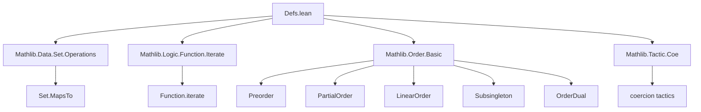

**Technical Brief: Monotonicity Definitions and Properties in Lean 4 (Mathlib)**  
*Based on `Defs.lean` from the Mathlib library*

---

### 1. **Key Definitions & Theorems**

| Name | Type | Purpose |
|------|------|---------|
| `Monotone f` | `∀ {α β} [Preorder α] [Preorder β], (α → β) → Prop` | `f` preserves order: `a ≤ b → f a ≤ f b` |
| `Antitone f` | `∀ {α β} [Preorder α] [Preorder β], (α → β) → Prop` | `f` reverses order: `a ≤ b → f b ≤ f a` |
| `MonotoneOn f s` | `Set α → Prop` | `f` is monotone on subset `s` |
| `AntitoneOn f s` | `Set α → Prop` | `f` is antitone on subset `s` |
| `StrictMono f` | `∀ {α β} [Preorder α] [Preorder β], (α → β) → Prop` | `f` strictly preserves order: `a < b → f a < f b` |
| `StrictAnti f` | `∀ {α β} [Preorder α] [Preorder β], (α → β) → Prop` | `f` strictly reverses order: `a < b → f b < f a` |
| `StrictMonoOn f s` | `Set α → Prop` | `f` is strictly monotone on `s` |
| `StrictAntiOn f s` | `Set α → Prop` | `f` is strictly antitone on `s` |

#### Key Theorems (selected)

| Name | Statement | Purpose |
|------|-----------|---------|
| `Monotone.comp` | `Monotone g → Monotone f → Monotone (g ∘ f)` | Composition of monotone functions is monotone |
| `StrictMono.comp` | `StrictMono g → StrictMono f → StrictMono (g ∘ f)` | Composition of strictly monotone functions is strictly monotone |
| `Monotone.iterate` | `Monotone f → Monotone f^[n]` | Iterates of monotone functions are monotone |
| `StrictMono.monotone` | `StrictMono f → Monotone f` | Strict monotonicity implies monotonicity (requires `PartialOrder`) |
| `Monotone.strictMono_of_injective` | `Monotone f → Injective f → StrictMono f` | Monotone + injective ⇒ strictly monotone (in `PartialOrder`) |
| `monotone_iff_forall_lt` | `Monotone f ↔ a < b → f a ≤ f b` | Alternative characterization of monotonicity |
| `StrictMono.reflect_lt` | `Monotone f → f a < f b → a < b` | Strict monotonicity reflects strict inequality (in `LinearOrder`) |
| `Subsingleton.monotone` | `[Subsingleton α] → Monotone f` | Any function from a subsingleton is monotone |
| `monotone_prodMk_iff` | `Monotone (λ x ↦ (f x, g x)) ↔ Monotone f ∧ Monotone g` | Product of monotone functions is monotone iff each component is |

---

### 2. **Naming Conventions**

- **Prefixes**:
  - `Monotone`, `Antitone`, `StrictMono`, `StrictAnti`: core definitions.
  - `On` suffix: localized version on a set (`MonotoneOn`, `AntitoneOn`, etc.).
- **Suffixes**:
  - `_comp`: composition lemmas (`Monotone.comp`, `StrictMono.comp`, etc.).
  - `_on_univ`: equivalence with global version (`monotoneOn_univ`, `strictMonoOn_univ`).
  - `_iff_forall_lt`: alternative characterizations using `<`.
- **`to_dual` annotations**: indicate duality via `OrderDual` (e.g., `Antitone` is dual to `Monotone`).
- **`imp` lemmas**: e.g., `Monotone.imp`, `StrictMono.imp` — strip implicit arguments for direct application.

---

### 3. **Tactic Stack**

Frequently used tactics in proofs:

| Tactic | Usage |
|--------|-------|
| `grind` | Automated simplification and proof search (custom to Mathlib) |
| `simp_rw` | Simplify using rewrite rules (e.g., `simp_rw [Monotone, Prod.mk_le_mk]`) |
| `exact`, `intro`, `cases`, `apply` | Basic proof construction |
| `lt_of_not_ge`, `lt_of_le_of_ne`, `antisymm` | Order reasoning |
| `forall₂_congr`, `forall_swap`, `and_congr` | Logical manipulations of quantifiers/conjunctions |
| `congr_arg`, `congr_fun` | Equality reasoning for functions |
| `elim`, `cases'` | Subsingleton and `Or`/`And` elimination |
| `by` + `grind`, `by simp`, `by aesop` | Short proofs via automation |

---

### 4. **Proof Logic**

- **Structure**: Most proofs follow a *direct implication* pattern:
  - Assume premises (e.g., `hf : Monotone f`, `h : a ≤ b`)
  - Apply definition (`hf h`) or use auxiliary lemmas (`hf.imp h`)
- **Induction**: Used in `iterate` lemmas (`Monotone.iterate`, `StrictMono.iterate`) via `Nat.recOn`.
- **Case analysis**: On `a < b` vs `a = b` using `eq_or_lt`, especially in `monotone_iff_forall_lt` proofs.
- **Duality**: Many theorems come in dual pairs (`to_dual self`), e.g., `Monotone` ↔ `Antitone` under order dual.
- **Subsingleton reasoning**: Uses `Subsingleton.elim _ _` to equate terms, then applies `le_of_eq`.
- **Product/Pi reasoning**: Leverages `Pi.le_def`, `Prod.mk_le_mk`, and `forall_swap` to reduce to component-wise reasoning.

---

### 5. **Imports & Dependencies**

| Import | Role |
|--------|------|
| `Mathlib.Data.Set.Operations` | Set operations, membership, maps-to |
| `Mathlib.Logic.Function.Iterate` | Function iteration (`f^[n]`) |
| `Mathlib.Order.Basic` | Preorders, partial orders, linear orders, order duals |
| `Mathlib.Tactic.Coe` | Coercion tactics (e.g., `↑(subtype t)`) |

---

### 6. **Mermaid Diagrams**

#### **Dependency Graph (Top-Level)**



#### **Overview of Monotonicity Theory Flow**

```mermaid
flowchart LR
  A[Preorder α × Preorder β] --> B[Monotone f]
  A --> C[Antitone f]
  A --> D[StrictMono f]
  A --> E[StrictAnti f]

  B --> F[MonotoneOn f s]
  C --> G[AntitoneOn f s]
  D --> H[StrictMonoOn f s]
  E --> I[StrictAntiOn f s]

  B --> J[Monotone.comp]
  D --> K[StrictMono.comp]
  J --> L[Monotone.iterate]
  K --> M[StrictMono.iterate]

  D --> N[Monotone]  %% StrictMono ⇒ Monotone (PartialOrder)
  I --> O[Antitone]  %% StrictAnti ⇒ Antitone

  A --> P[Subsingleton α/β]
  P --> Q[All functions monotone/antitone/strict]

  A --> R[LinearOrder α]
  R --> S[reflect_lt lemmas]
```

---

### 7. **Notes on Design Choices**

- **Preorder requirement**: All definitions require `Preorder`, not just `LE`/`LT`, to avoid elaboration issues (see Zulip discussion).
- **"Monotone" = increasing**: Contrary to some mathematical conventions, `Monotone` means *non-decreasing*; `Antitone` = *non-increasing*.
- **Strict ⇒ Non-strict**: In `PartialOrder`, strict monotonicity implies monotonicity (via `lt_iff_lt_of_le_iff_le'`).
- **Subsingleton behavior**: Any function from/to a subsingleton is monotone/antitone; strict versions are vacuously true (since `<` is irreflexive).
- **Dualities**: Many theorems are dual via `OrderDual`; `to_dual` annotations encode this.

--- 

Let me know if you'd like a formalized dependency graph (e.g., for `leanpkg`), or a proof sketch of a specific theorem (e.g., `Monotone.iterate`).
