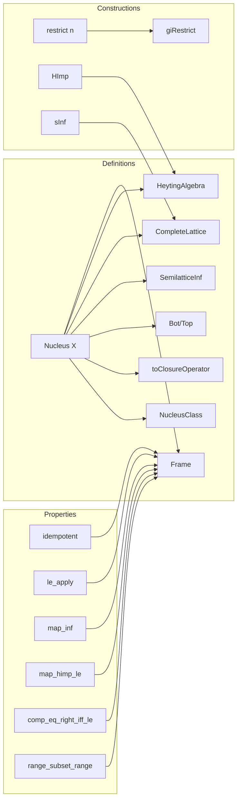

### Technical Brief: `Nucleus.lean`

---

#### **1. Key Definitions & Theorems**

| Name | Type / Signature | Purpose |
|------|------------------|---------|
| `Nucleus X` | `structure` | A nucleus on a semilattice `X` is an inflationary, idempotent, inf-preserving endomorphism (`InfHom X X`) — i.e., a closure operator that preserves finite meets. |
| `NucleusClass F X` | `class` | Abstract interface for a type `F` of nuclei acting on `X`, extending `InfHomClass`. |
| `toClosureOperator` | `n : Nucleus X → ClosureOperator X` | Forgets the `InfHom` structure, viewing a nucleus as a closure operator. |
| `idempotent` | `n (n x) = n x` | Follows from `toClosureOperator.idempotent`. |
| `le_apply` | `x ≤ n x` | Inflationarity (a.k.a. extensivity). |
| `map_inf` | `n (x ⊓ y) = n x ⊓ n y` | Preservation of binary meets. |
| `bot` / `top` | `⊥`, `⊤ : Nucleus X` | Smallest/largest nucleus: identity and constant-`⊤` maps. |
| `sInf` / `iInf` | `Set (Nucleus X) → Nucleus X`, `(ι → Nucleus X) → Nucleus X` | Arbitrary infima in the lattice of nuclei (defined pointwise via infima in `X`). |
| `himp` | `m ⇨ n : Nucleus X` | Internal hom in the Heyting algebra structure on nuclei (pointwise: $x \mapsto \bigwedge_{y \ge x} m(y) \Rightarrow n(y)$). |
| `restrict` | `n.restrict : FrameHom X (range n)` | Restriction of a nucleus to its range, yielding a frame homomorphism. |
| `giRestrict` | `GaloisInsertion n.restrict Subtype.val` | The restriction forms a Galois insertion. |
| `range.instFrameMinimalAxioms` | `Frame.MinimalAxioms (range n)` | The range of a nucleus inherits a frame structure. |
| `comp_eq_right_iff_le` | `n ∘ m = m ↔ n ≤ m` | Characterizes when a nucleus factors through another. |
| `range_subset_range` | `range m ⊆ range n ↔ n ≤ m` | Subset inclusion of ranges corresponds to pointwise order on nuclei. |

---

#### **2. Naming Conventions**

- **Prefixes**:
  - `is_` / `mem_`: Not used here; instead, properties are direct lemmas (`idempotent`, `le_apply`, `map_inf`).
  - `coe_`: For coercion lemmas (`coe_le_coe`, `coe_inf`, `coe_bot`, `coe_top`).
  - `map_`: For structure-preserving properties (`map_inf`, `map_top`, `map_himp_le`, `map_himp_apply`).
  - `inst_`: For typeclass instances (`instBot`, `instTop`, `instHeytingAlgebra`, `instCompleteLattice`).
  - `gi_`: For Galois insertion-related definitions (`giAux`, `giRestrict`).
- **Suffixes**:
  - `_apply`: For application lemmas (`inf_apply`, `himp_apply`, `bot_apply`, `top_apply`, `sInf_apply`, `iInf_apply`).
  - `_le_`, `_lt_`: For order-theoretic lemmas (`le_apply`, `coe_le_coe`, `mk_le_mk`).
  - `_iff_`: For equivalence lemmas (`comp_eq_right_iff_le`, `range_subset_range`).
- **Projection-style names**:
  - `Simps.apply`, `ext`, `mk`, `toFun`, `toClosureOperator`.

---

#### **3. Tactic Stack**

- **Core tactics**:
  - `simp`, `rw`, `ext`, `congr!`, `funext`, `exact`, `refine`, `gcongr`, `rfl`, `apply`, `intro`, `cases`.
- **Order-theoretic helpers**:
  - `le_antisymm`, `inf_le_inf`, `inf_le_of_left_le`, `inf_le_of_right_le`, `le_inf`, `le_iInf_iff`, `iInf_le_iff`, `iInf₂_le_of_le`, `iInf₂_mono`.
- **Closure operator & frame-specific**:
  - `ClosureOperator.IsClosed.closure_le_iff`, `le_himp_iff`, `himp_himp`, `himp_inf_self`, `sup_inf_right`, `inf_inf_distrib_left`.
- **Set-theoretic**:
  - `Set.range_subset_iff`, `mem_range`, `rangeFactorization`, `iSup_subtype'`, `sSup_image`.
- **Automation**:
  - `aesop` is *not* used; proofs are mostly manual but highly structured.
  - `simp +contextual` used for contextual simplification in lattice completeness proofs.

---

#### **4. Proof Logic**

- **Structure**:
  - Definitions are built incrementally: `Nucleus` → `NucleusClass` → `toClosureOperator` → `CompleteLattice` → `HeytingAlgebra` → `Frame`.
- **Common proof patterns**:
  - **Extensionality**: Prove equality of nuclei via `ext` (pointwise equality).
  - **Order-theoretic reasoning**: Use `le_antisymm` with `le_apply` and `idempotent` to bound expressions.
  - **Pointwise lifting**: Many constructions (e.g., `sInf`, `himp`) are defined pointwise and verified to satisfy nucleus axioms.
  - **Galois insertion machinery**: `giAux` constructs a Galois insertion from `rangeFactorization n` to `Subtype.val`, then lifts frame structure via `liftCompleteLattice`.
  - **Frame homomorphism checks**: `restrict` verifies `map_inf'`, `map_top'`, `map_sSup'` using properties of `n` and the GI.
- **Induction**: Not used directly; instead, rely on closure operator properties and completeness.

---

#### **5. Imports**

- `Mathlib.Order.Closure`: For `ClosureOperator`, `IsClosed`, and related lemmas.
- `Mathlib.Order.Hom.CompleteLattice`: For `InfHom`, `TopHomClass`, `CompleteLattice` morphisms, and lifting order structures.

---

#### **6. Theory Overview & Dependencies**

##### **Mermaid Diagram: Theory Dependencies**

```mermaid
graph TD
  A[SemilatticeInf X] --> B[Nucleus X]
  A --> C[InfHom X X]
  C --> D[NucleusClass F X]
  B --> E[toClosureOperator]
  E --> F[ClosureOperator X]
  B --> G[CompleteLattice (Nucleus X)]
  G --> H[HeytingAlgebra (Nucleus X)]
  H --> I[Order.Frame (Nucleus X)]
  B --> J[range n]
  J --> K[Frame (range n)]
  J --> L[FrameHom X (range n)]
  L --> M[GaloisInsertion]
```

##### **Mermaid Diagram: File Overview**



##### **Key Theoretical Insight**

- **Point-free topology**: Nuclei on a frame `X` classify **sublocales** of `X`. The lattice of nuclei `Nucleus X` itself carries a frame structure, and its Heyting structure encodes the internal logic of the sublocale lattice.
- **Galois insertion**: Every nucleus `n` induces a Galois insertion between `X` and its range `range n`, making `range n` a **subframe** of `X`. This mirrors how open/closed subspaces embed in topology.
- **Internal logic**: The `himp` operation on nuclei models implication in the Heyting algebra of sublocales — a key feature in constructive topology.

---

#### **7. Notable Design Choices**

- **No `is_nucleus` predicate**: Instead of a predicate on `X → X`, nuclei are bundled as structures — aligning with Lean’s preference for *bundled morphisms*.
- **`NucleusClass` abstraction**: Allows reasoning about *types of nuclei* (e.g., in future extensions like sheaf theory or topos theory).
- **`giAux` as private**: Public API is `giRestrict`; internal machinery is hidden to avoid misuse.
- **`set_option backward.privateInPublic true`**: Used to allow private definitions in public lemmas (e.g., `giRestrict` uses `giAux`), with warnings disabled for smoother compilation.

---

#### **8. Future Extensions (Implied)**

- `nucleusIsoSublocale`: A future theorem (referenced in docstring) linking nuclei ↔ sublocales.
- Sheaf theory: Sublocale lattices often serve as sites; nuclei may help define sheaves on frames.
- Constructive topology: The frame structure on `Nucleus X` supports internal logic of the sublocale lattice — relevant for synthetic topology.

--- 

Let me know if you'd like a formalized `nucleusIsoSublocale` sketch or a comparison with `ClosureOperator`.
