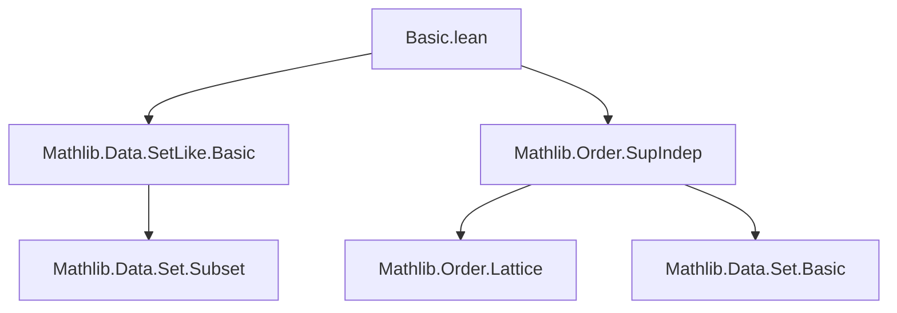
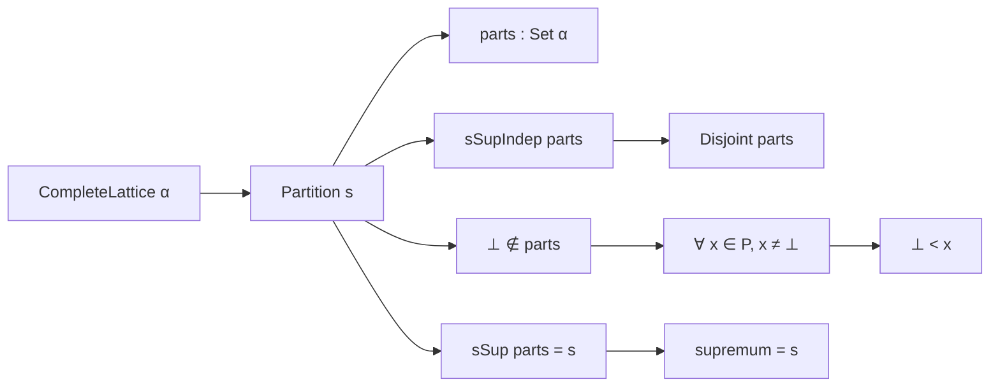
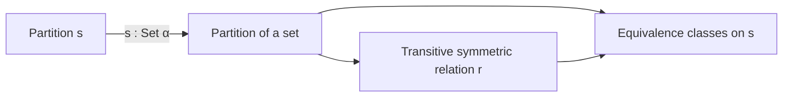

**Technical Brief: `Basic.lean` — Partition Definition in Lean 4**

---

### 1. KEY DEFINITIONS & THEOREMS

| Name | Type / Structure | Purpose |
|------|------------------|---------|
| `Partition` | `structure Partition [CompleteLattice α] (s : α)` | Represents a partition of an element `s` as a set of *independent*, *nontrivial* (i.e., ≠ ⊥), elements whose supremum is `s`. |
| `parts` | `P.parts : Set α` | The underlying set of parts of a partition `P`. |
| `sSupIndep'` | `sSupIndep parts` | Ensures the parts form an *independent family* under `sSup`. |
| `bot_notMem'` | `⊥ ∉ parts` | Excludes the bottom element from the partition (nontriviality). |
| `sSup_eq'` | `sSup parts = s` | Ensures the supremum of parts equals the target element `s`. |
| `disjoint` | `x ∈ P → y ∈ P → x ≠ y → Disjoint x y` | Consequence of independence: distinct parts are disjoint. |
| `pairwiseDisjoint` | `Set.PairwiseDisjoint (P : Set α) id` | Global disjointness of all parts. |
| `sSup_eq`, `iSup_eq` | `sSup P = s`, `⨆ x ∈ P, x = s` | Simplified forms of the supremum condition. |
| `le_of_mem` | `x ∈ P → x ≤ s` | Each part is bounded above by `s`. |
| `parts_nonempty` | `s ≠ ⊥ → (P : Set α).Nonempty` | If `s` is nonzero, the partition is nonempty. |
| `ne_bot_of_mem` | `x ∈ P → x ≠ ⊥` | Every part is nonzero. |
| `bot_lt_of_mem` | `x ∈ P → ⊥ < x` | Every part is strictly above ⊥. |
| `copy` | `Partition s → s = t → Partition t` | Transport a partition along an equality of targets. |
| `removeBot` | `Set α → sSupIndep P → sSup P = s → Partition s` | Constructs a partition by removing ⊥ from a candidate set. |

---

### 2. NAMING CONVENTIONS

- **Predicate suffixes**: `'` (e.g., `sSupIndep'`, `bot_notMem'`, `sSup_eq'`) — internal hypotheses stored in the structure.
- **Simplified projections**: `sSup_eq`, `bot_notMem`, `mem_copy_iff`, `partscopyEquiv` — derived or simplified versions.
- **`coe_` prefix**: `coe_parts`, `Simps.coe` — coercion-related lemmas/projections.
- **`ext` suffix**: `ext` — extensionality lemma.
- **`_iff` suffix**: `mem_copy_iff` — equivalence lemmas.
- **`_Equiv` suffix**: `partscopyEquiv` — equivalence of types.

---

### 3. TACTIC STACK

Frequently used tactics in proofs:
- `simp`, `simp_rw` — for simplification and rewriting using `@[simp]` lemmas.
- `cases` — to destructure `Partition` and equality proofs.
- `simpa` — simplification with discharge.
- `exact`, ` rfl`, `apply`, `intro`, `intro h` — basic intro/apply.
- `by_cases`, `by_contra` — for contradiction or case splits.
- `set_like.ext` / `SetLike.ext` — for extensionality of sets.
- `aesop` — not used here (lean4’s `aesop` not imported), but `simp` suffices.

---

### 4. PROOF LOGIC

- **Structure-based reasoning**: Proofs often proceed by destructuring `Partition` into its 4 fields, then applying properties of `sSupIndep`, `sSup`, and set operations.
- **Set-theoretic reasoning**: Leverages `SetLike`, `sSup`, `iSup`, and `Disjoint` from `Mathlib.Order.SupIndep`.
- **Transport via equality**: `copy` uses `congr_arg`-style reasoning (`hst ▸ ...`) to transport structure along equalities.
- **Removal of ⊥**: `removeBot` uses monotonicity of `sSupIndep` under subset inclusion and `sSup` continuity under removal of ⊥.

---

### 5. IMPORTS

| Import | Purpose |
|--------|---------|
| `Mathlib.Data.SetLike.Basic` | Provides `SetLike`, `ext`, `PartialOrder.ofSetLike`, coercion infrastructure. |
| `Mathlib.Order.SupIndep` | Defines `sSupIndep`, `Disjoint`, and related lattice-theoretic independence concepts. |

---

### 6. MERMAID DIAGRAMS

#### Dependency Graph (Module-Level)

#### Overview of `Partition` Theory

#### API Flow (Specialization to `Set α`)

> **Note**: The `TODO` indicates future work to connect to `Finpartition` and develop `Set`-specific API.

--- 

Let me know if you'd like the `Set`-specialized API lemmas formalized or the `Finpartition` bridge explored.
