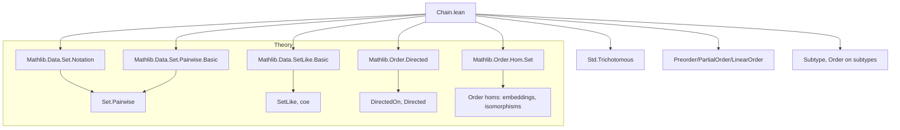
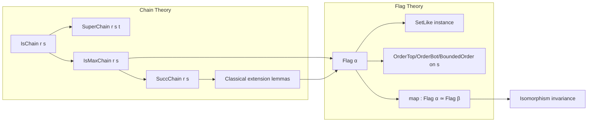

### Technical Brief: `Chain.lean`

---

#### **1. Key Definitions & Theorems**

| Name | Type | Purpose |
|------|------|---------|
| `IsChain r s` | `Prop` | States that set `s` is pairwise comparable under binary relation `r`. |
| `SuperChain r s t` | `Prop` | `t` is a chain strictly containing `s`. |
| `IsMaxChain r s` | `Prop` | `s` is a maximal chain: no strictly larger chain exists. |
| `Flag α` | `Type*` | Type of *flags* (i.e., maximal chains) in a preordered type `α`. |
| `ofIsMaxChain c hc` | `Flag α` | Reinterprets a maximal chain `c` as a flag. |
| `map e s` | `Flag α → Flag β` | Pushforward of a flag along an order isomorphism `e : α ≃o β`. |
| `SuccChain r s` | `Set α` | Choice function: if a strictly larger chain exists, picks one; otherwise returns `s`. |
| `isChain_univ_iff` | `IsChain r univ ↔ Std.Trichotomous r` | Characterizes total comparability of all elements. |
| `IsChain.directedOn` | `IsChain r s → DirectedOn r s` | Chains induce directed sets under reflexive relations. |
| `IsChain.exists3` | `∃ z ∈ s, r a z ∧ r b z ∧ r c z` | For transitive `r`, any three elements in a chain have a common upper bound in the chain. |

---

#### **2. Naming Conventions**

- **Prefixes**:
  - `isChain_`: lemmas about `IsChain` (e.g., `isChain_union`, `isChain_preimage_subtypeVal`).
  - `superChain_`: lemmas about `SuperChain`.
  - `maxChain_`: lemmas about `IsMaxChain` (e.g., `maxChain.top_mem`, `maxChain.bot_mem`).
  - `map_`, `image_`, `preimage_`: behavior under functions and embeddings.
- **Suffixes**:
  - `_iff`: characterizations (e.g., `image_relEmbedding_iff`, `le_or_ge_iff`).
  - `_rel`, `_embedding`, `_iso`: variants for relations, embeddings, and isomorphisms.
- **Notation**:
  - `≺` is local notation for `r`.
  - `↑s`, `s : Set α` for coercion of `Flag` carrier.

---

#### **3. Tactic Stack**

Frequently used tactics in proofs:
- `grind` — for automated reasoning with equalities and implications.
- `simp` / `simp_rw` — especially with `Set.Pairwise`, `image`, `preimage`, and `Subtype` lemmas.
- `intro`, `cases`, `rcases`, `obtain` — for destructuring hypotheses.
- `exact`, `refine`, `apply` — for constructing proofs.
- `rw`, `convert`, `congr` — for rewriting and congruence.
- `aesop` / `linarith` — for order reasoning (e.g., `lt_of_le_not_ge`, `le_of_not_gt`).
- `classical` — for `SuccChain` and maximal chain existence arguments.

---

#### **4. Proof Logic**

- **Inductive/constructive style** for `IsChain` properties (e.g., `insert`, `pair`, `diff`).
- **Case analysis** on `eq_or_ne x y` and `trichotomous` for total comparability.
- **Directedness arguments** via `directedOn_iff_directed` and `exists3`.
- **Classical choice** for `SuccChain` and maximal extensions.
- **Order-theoretic reasoning** using `lt_iff_le_not_ge`, `not_le`, `not_lt` equivalences.
- **Isomorphism invariance**: proofs often reduce to `RelEmbedding.map_rel_iff` or `Equiv.image_symm_eq_preimage`.

---

#### **5. Imports & Dependencies**

**Core imports**:
- `Mathlib.Data.Set.Notation`
- `Mathlib.Data.Set.Pairwise.Basic`
- `Mathlib.Data.SetLike.Basic`
- `Mathlib.Order.Directed`
- `Mathlib.Order.Hom.Set`

**Key dependencies**:
- `Std.Trichotomous`, `Preorder`, `PartialOrder`, `LinearOrder`, `BoundedOrder`
- `RelEmbedding`, `RelIso`, `Equiv`, `OrderIso`
- `Subtype`, `Set.image`, `Set.preimage`, `Set.Pairwise`

---

#### **6. Mermaid Diagrams**

##### **Dependency Graph (High-Level)**

##### **Overview of File Structure**

---

#### **7. Summary**

This module formalizes **chain theory** for arbitrary binary relations and introduces **flags** (maximal chains) in ordered types. It provides:
- A rich algebra of `IsChain` closure properties (under subsets, images, preimages, unions, etc.).
- A constructive approach to maximal chains via `SuccChain`.
- A type `Flag α` of maximal chains, equipped with induced order structure.
- Behavior under order embeddings and isomorphisms.

It serves as foundational material for applications in order theory (e.g., Zorn’s Lemma, Hausdorff maximal principle), and is closely tied to `Mathlib.Order.Zorn` and `Mathlib.OrderTheory.Filter.Ultrafilter`.

--- 

Let me know if you'd like a formal dependency graph (e.g., `leanpkg graph`) or a proof sketch of a key theorem like `IsChain.exists3`.
