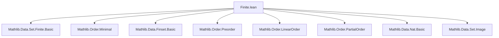
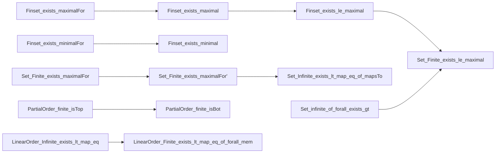

**Technical Brief: `Finite.lean` — Formalization of Minimal/Maximal Elements in Finite Sets in Preorders**

---

### **1. Key Definitions & Theorems**

| Name | Type / Signature | Purpose |
|------|------------------|---------|
| `MaximalFor (· ∈ s) f i` | `∀ j ∈ s, f i ≤ f j → f j ≤ f i` | $i$ is maximal w.r.t. $f$ on $s$: no $j \in s$ has strictly larger $f$-value. |
| `MinimalFor (· ∈ s) f i` | `∀ j ∈ s, f j ≤ f i → f j ≤ f i` | Dual of `MaximalFor`. |
| `Maximal (· ∈ s) i` | `MaximalFor (· ∈ s) id i` | $i$ is maximal in $s$ under the order. |
| `Minimal (· ∈ s) i` | `MinimalFor (· ∈ s) id i` | $i$ is minimal in $s$ under the order. |
| `exists_maximalFor` | `∀ s : Finset ι, s.Nonempty → ∃ i, MaximalFor (· ∈ s) f i` | In a transitive preorder, every nonempty finite set has a maximal element w.r.t. any function $f$. |
| `exists_minimalFor` | Dual of `exists_maximalFor` | Same for minimal elements. |
| `exists_maximal` | `s.Nonempty → ∃ i ∈ s, Maximal (· ∈ s) i` | Every nonempty finite set in a transitive preorder has a maximal element. |
| `exists_minimal` | Dual of `exists_maximal` | Every nonempty finite set has a minimal element. |
| `exists_le_maximal` | `a ∈ s → ∃ b ∈ s, a ≤ b ∧ Maximal (· ∈ s) b` | From any element $a \in s$, one can reach a maximal element $\ge a$. |
| `exists_le_minimal` | Dual of `exists_le_maximal` | From any $a \in s$, one can reach a minimal element $\le a$. |
| `Finite.exists_maximalFor'` | `(f '' s).Finite → s.Nonempty → ∃ i, MaximalFor (· ∈ s) f i` | Weaker version: only assume *image* of $s$ under $f$ is finite. |
| `infinite_of_forall_exists_gt` | `(∀ a, ∃ b ∈ s, a < b) → s.Infinite` | If every element has a strictly larger one in $s$, then $s$ is infinite. |
| `finite_isTop`, `finite_isBot` | `{a | IsTop a}.Finite`, `{a | IsBot a}.Finite` | In a partial order, the set of top/bottom elements is finite (in fact, subsingleton). |
| `Infinite.exists_lt_map_eq_of_mapsTo` | $s$ infinite, $f$ maps $s$ into finite $t$ ⇒ $\exists x < y \in s$ with $f(x) = f(y)$ | Pigeonhole principle for infinite sets in linear orders. |
| `Finite.exists_le_maximal` (under `Finite α`) | $p(a) → ∃ b, a ≤ b ∧ \text{Maximal } p\ b$ | In a finite preorder, any $p$-related element extends to a maximal $p$-element. |

---

### **2. Naming Conventions**

- **Prefixes**:
  - `exists_`: existence of extremal elements.
  - `is_`: predicates (e.g., `isTop`, `isBot`).
  - `finite_`: lemmas about finite sets (e.g., `finite_isTop`).
  - `infinite_`: lemmas about infinite sets (e.g., `infinite_of_forall_exists_gt`).
- **Suffixes**:
  - `_For`: relative extremality w.r.t. a function $f$.
  - `'` (prime): weaker hypotheses (e.g., `exists_maximalFor'`).
- **Duals**:
  - `minimal`/`minimalFor` are duals of `maximal`/`maximalFor`, often defined via `αᵒᵈ` (opposite preorder).

---

### **3. Tactic Stack**

| Tactic | Usage |
|--------|-------|
| `induction` | Structural induction on `Finset.Nonempty` (via `cons_induction`). |
| `simp`, `simp only`, `simp_rw` | Simplify membership, order, and `MaximalFor` definitions. |
| `by_cases` | Split on comparisons like $f(j) \le f(i)$. |
| `exact`, `refine`, `obtain` | Construct witnesses and decompose existential statements. |
| `lift s to Finset α using h` | Convert a finite set to a finset for reuse of `Finset` lemmas. |
| `rw`, `convert`, `symm` | Rewrite using order duals (`αᵒᵈ`) or equality symmetry. |
| `exact fun ... ↦ _` | Prove implications directly (e.g., transitivity arguments). |
| `inhabited` / `inhabitant` | Used implicitly via `inhabited α` in `infinite_of_injective_forall_mem`. |

---

### **4. Proof Logic**

- **Inductive structure on finite sets**:
  - Prove base case (`singleton`) and inductive step (`cons`) using `Finset.Nonempty.cons_induction`.
- **Order-theoretic reasoning**:
  - Use transitivity (`_root_.trans`) to propagate inequalities.
  - Use duality (`αᵒᵈ`) to avoid duplication: minimal results follow from maximal ones.
- **Contrapositive reasoning**:
  - Infinite sets are shown by constructing an injective sequence or using `infinite_of_injective_forall_mem`.
- **Filtering & lifting**:
  - For `exists_le_maximal`, restrict to $\{x \in s \mid a \le x\}$, apply `exists_maximal`, then unpack.
- **Pigeonhole principle**:
  - In linear orders, infinite domain + finite codomain ⇒ repeated values with order relation.

---

### **5. Imports & Dependencies**

| Module | Purpose |
|--------|---------|
| `Mathlib.Data.Set.Finite.Basic` | Core definitions: `Finite`, `Infinite`, `Finite.image`, `Finite.mem`, etc. |
| `Mathlib.Order.Minimal` | Definitions of `MaximalFor`, `MinimalFor`, `Maximal`, `Minimal`, and basic lemmas. |
| `Mathlib.Data.Finset.Basic` (via `Finset`) | `Finset`, `Nonempty`, `cons_induction`, `mem_cons`, `filter`, etc. |
| `Mathlib.Order.Preorder`, `Mathlib.Order.LinearOrder`, `Mathlib.Order.PartialOrder` | Typeclasses and basic order theory. |
| `Mathlib.Data.Set.Image` | Used implicitly for `f '' s`. |
| `Mathlib.Data.Nat.Basic` | For `Nat.recOn`, `strictMono_nat_of_lt_succ`. |

---

### **6. Theory Overview & Dependency Diagram**

#### **High-Level Theory Flow**

```
Finite Preorders & Sets in Preorders
│
├── Existence of extremal elements in finite sets (Finset)
│   ├── Transitive preorder ⇒ finite nonempty sets have maximal/minimal elements
│   └── From any element, can reach a maximal/minimal ≥/≤ it
│
├── Extension to arbitrary finite sets (Set.Finite)
│   ├── Lift to Finset via `lift`
│   ├── Weaker image-finiteness version (`exists_maximalFor'`)
│   └── Infinite sets with unbounded growth ⇒ contradiction
│
├── Applications in Partial/Linear Orders
│   ├── Top/bottom elements form finite (subsingleton) sets
│   ├── Infinite sets in linear orders with finite image ⇒ collisions with order
│   └── Pigeonhole principle for infinite domains
│
└── Contrapositive infinitude criteria
    ├── If every element has a strictly larger one ⇒ infinite
    └── Dually for strictly smaller ones
```

#### **Mermaid Diagrams**

##### **Dependency Graph (Module-Level)**



##### **Conceptual Flow (Theorem Dependencies)**



---

### **7. Summary**

This file formalizes foundational extremal principles for finite sets in preorders:  
- **Existence**: Nonempty finite sets in transitive preorders have maximal/minimal elements.  
- **Reachability**: From any element, one can extend to a maximal/minimal one.  
- **Infinitude criteria**: Unboundedness in either direction implies infinitude.  
- **Applications**: Pigeonhole principle in linear orders, finiteness of top/bottom elements.

The proofs rely heavily on induction over finite sets, order duality (`αᵒᵈ`), and lifting finite sets to finsets for reuse. The structure is clean and modular, with duals and weakenings clearly marked.

--- 

Let me know if you'd like a **proof sketch** of a specific lemma or a **dependency graph at the lemma level**.
