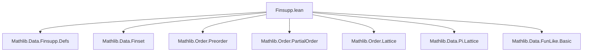
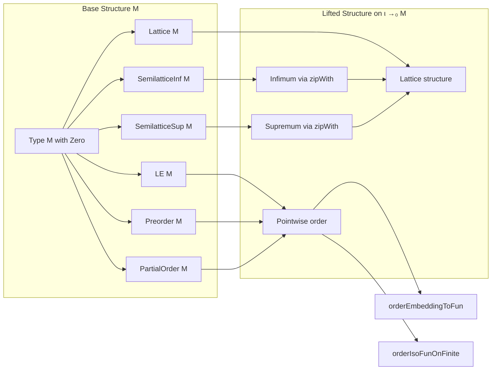

### Technical Brief: `Finsupp.lean` — Pointwise Order on Finitely Supported Functions

---

#### **1. Key Definitions & Theorems**

| Name | Type / Signature | Purpose |
|------|------------------|---------|
| `instLE` | `LE (ι →₀ M)` | Lifts the pointwise order from `M` to `ι →₀ M`: $ f \le g \iff \forall i,\, f(i) \le g(i) $. |
| `le_def` | `f ≤ g ↔ ∀ i, f i ≤ g i` | Definition equivalence of the lifted order. |
| `coe_le_coe` | `⇑f ≤ g ↔ f ≤ g` | Compatibility of coercion with the order. |
| `orderEmbeddingToFun` | `(ι →₀ M) ↪o (ι → M)` | Order embedding of finitely supported functions into all functions. |
| `orderIsoFunOnFinite` | `(ι →₀ M) ≃o (ι → M)` (when `Finite ι`) | Order isomorphism between finitely supported functions and all functions (finite domain case). |
| `preorder` | `Preorder (ι →₀ M)` | Lifts preorder structure pointwise. |
| `lt_def` | `f < g ↔ f ≤ g ∧ ∃ i, f i < g i` | Characterization of strict order. |
| `partialorder` | `PartialOrder (ι →₀ M)` | Lifts antisymmetry via extensionality. |
| `semilatticeInf` | `SemilatticeInf (ι →₀ M)` | Pointwise infimum via `zipWith (· ⊓ ·)`. |
| `inf_apply` | `(f ⊓ g) i = f i ⊓ g i` | Action of infimum on points. |
| `semilatticeSup` | `SemilatticeSup (ι →₀ M)` | Pointwise supremum via `zipWith (· ⊔ ·)`. |
| `sup_apply` | `(f ⊔ g) i = f i ⊔ g i` | Action of supremum on points. |
| `lattice` | `Lattice (ι →₀ M)` | Combines inf and sup into lattice structure. |
| `support_inf_union_support_sup` | `(f ⊓ g).support ∪ (f ⊔ g).support = f.support ∪ g.support` | Support identity for inf/sup in lattice case. |
| `support_sup_union_support_inf` | Symmetric version of above. | |

---

#### **2. Naming Conventions**

- **Prefixes**:
  - `inst*`: Instance definitions (`instLE`, `preorder`, `partialorder`, etc.)
  - `coe*`: Coercion-related lemmas (`coe_le_coe`, `coe_lt_coe`, `coe_mono`, `coe_strictMono`)
  - `*apply`: Application lemmas for operations on functions (`inf_apply`, `sup_apply`)
  - `support_*`: Support-related identities (`support_inf_union_support_sup`, etc.)

- **Suffixes**:
  - `_def`: Definition lemmas (`le_def`)
  - `_mono` / `_strictMono`: Monotonicity properties

---

#### **3. Tactic Stack**

- `simp` / `simp_rw`: Extensively used for simplification and rewriting (e.g., `simp [inf_eq_and_sup_eq_iff]`)
- `ext`: Extensionality for function equality
- `rfl`: Reflexivity for definitional equalities
- `exact`, `intro`, `apply`: Basic proof scripting
- `coe_injective`, `compl_injective`: Injectivity lemmas used in support reasoning
- `aesop`: Not explicitly used here, but `simp`-based automation suffices

---

#### **4. Proof Logic**

- **Structure**: Modular, section-based lifting of algebraic/order-theoretic structures.
- **Strategy**:
  - Define pointwise operations/orders.
  - Prove properties by pointwise reduction to `M`.
  - Use extensionality (`ext`) to lift properties from pointwise to global.
  - For support identities: reduce via coercion to function space, then simplify using set-theoretic lemmas and `simp`.
- **Induction**: Not needed — proofs rely on extensionality and pointwise reasoning.

---

#### **5. Imports**

- `Mathlib.Data.Finsupp.Defs`: Core definitions of `Finsupp`, support, coercion, etc.
- `Mathlib.Data.Finset`: Used for finite support reasoning (`open Finset`).
- Implicit dependencies:
  - `Mathlib.Order.Preorder`, `Mathlib.Order.PartialOrder`, `Mathlib.Order.Lattice`, etc.
  - `Mathlib.Data.Pi.Lattice`, `Mathlib.Data.FunLike.Basic` (for `DFunLike.coe_injective`, `coe_injective`)

---

#### **6. Mermaid Diagrams**

##### **Dependency Graph (Module-Level)**

##### **Overview of Theory Flow**

---

#### **7. Summary**

This file formalizes how order- and lattice-theoretic structures on a type `M` lift pointwise to the type of finitely supported functions `ι →₀ M`. It establishes:
- The pointwise order and its basic properties (preorder, partial order, lattice).
- Embeddings and isomorphisms with function spaces.
- Support identities for infimum and supremum in the lattice case.

It is foundational for later developments involving modules over semirings, group algebras, and tensor products where `Finsupp` serves as the underlying additive structure.

--- 

Let me know if you'd like a formalized dependency graph for the entire `Mathlib.Data.Finsupp` hierarchy.
