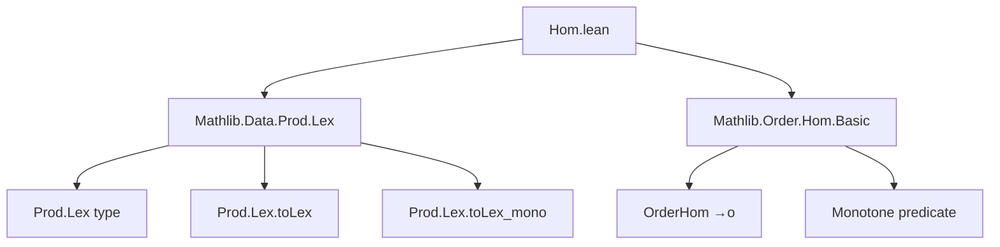

**Technical Brief: `Hom.lean` (Order Homomorphism for `Prod.Lex`)**

---

### 1. KEY DEFINITIONS & THEOREMS

| Name | Type | Purpose |
|------|------|---------|
| `Prod.Lex.toLexOrderHom` | `{α β : Type*} [PartialOrder α] [Preorder β] → (α × β) →o α ×ₗ β` | Constructs the *order homomorphism* version of `toLex`, mapping the product type with product order to the lexicographic product (`α ×ₗ β`) with its induced order. |
| `Prod.Lex.toLex_mono` | (used internally) | Proof that `toLex` is monotone, required to satisfy the `monotone'` field of `→o`. |

> **Note**: `→o` denotes the type of *monotone functions* (order homomorphisms) between preordered types.

---

### 2. NAMING CONVENTIONS

- **Prefix `toLex`**: Used for constructions that embed or map into the lexicographic product (`α ×ₗ β`).  
- **Suffix `OrderHom`**: Indicates the result is an *order homomorphism* (i.e., a monotone function), distinguishing it from a plain function (`→`) or equivalence (`≃o`).  
- **`[simps]` attribute**: Standard in Mathlib for automatically generating projection lemmas (e.g., `toLexOrderHom_toFun`, `toLexOrderHom_monotone'`).  
- **`[expose]` attribute**: Makes the definition visible in the `expose` namespace for easier discovery.

---

### 3. TACTIC STACK

- **`simp` / `simp_rw`**: Used implicitly via `@[simps]` to generate projection lemmas.
- **`exact` / `assumption`**: Likely used in the proof of monotonicity (via `Prod.Lex.toLex_mono`).
- **`constructor`**: Standard for defining structure elements (e.g., defining `→o` by supplying `toFun` and `monotone'`).
- **`rfl` / `refl`**: May appear in trivial monotonicity checks.

> The file itself is minimal — no heavy tactic usage beyond standard definitional machinery.

---

### 4. PROOF LOGIC

- **Definition-by-structure**: The definition `Prod.Lex.toLexOrderHom` is built by:
  1. Supplying the underlying function (`toLex`).
  2. Providing a proof that it is monotone (`Prod.Lex.toLex_mono`).
- **Monotonicity proof**: Relies on the existing lemma `Prod.Lex.toLex_mono`, which itself likely proceeds by:
  - Unfolding definitions of `≤` on `α ×ₗ β` (lexicographic order),
  - Using monotonicity of projections and case analysis on comparisons in `α` and `β`.

No induction or case-splitting is needed *in this file* — it delegates to prior lemmas.

---

### 5. IMPORTS & DEPENDENCIES

| Import | Role |
|--------|------|
| `Mathlib.Data.Prod.Lex` | Provides `Prod.Lex.toLex`, `Prod.Lex.toLex_mono`, and the lexicographic product type `α ×ₗ β`. |
| `Mathlib.Order.Hom.Basic` | Defines `→o` (order homomorphisms), `OrderHom`, and basic infrastructure (e.g., `monotone'`, `toFun`). |

> These imports sit at the core of order-theoretic constructions in Mathlib.

---

### 6. MERMAID DIAGRAMS

#### Dependency Graph (File-Level)



#### Overview of Theoretical Context

```mermaid
graph LR
  A[Type α, β] --> B[PartialOrder α]
  A --> C[Preorder β]
  B --> D[Product order on α × β]
  C --> D
  D --> E[OrderHom (α × β) →o (α ×ₗ β)]
  E --> F[Prod.Lex.toLexOrderHom]
  F --> G[toLex is monotone]
  G --> H[Prod.Lex.toLex_mono]
```

---

### Summary

This file formalizes the observation that the lexicographic embedding `toLex : α × β → α ×ₗ β` is not just a function, but an *order homomorphism* (i.e., monotone), under the assumptions that `α` is partially ordered and `β` is preordered. It leverages existing lemmas (`toLex_mono`) and standard Mathlib conventions (`→o`, `@[simps]`) to build a clean, reusable structure.
