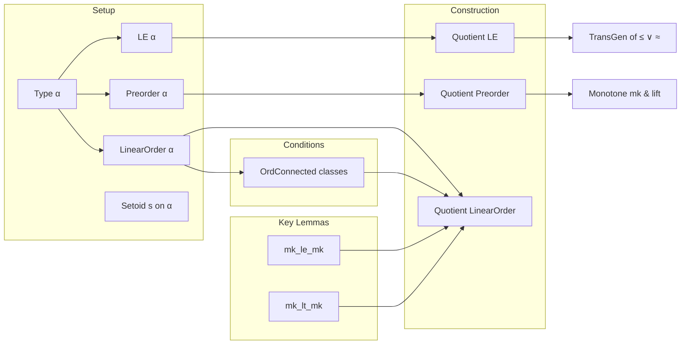

### Technical Brief: `Quotient.lean` — Order Structures on Quotients

---

#### **1. Key Definitions & Theorems**

| Name | Type / Signature | Purpose |
|------|------------------|---------|
| `instance LE (Quotient s)` | `[LE α] → LE (Quotient s)` | Defines a preorder-like order on the quotient via transitive closure of $x \le y \lor x \approx y$. |
| `le_def` | `Quotient.mk s x ≤ Quotient.mk s y ↔ Relation.TransGen (fun x y ↦ x ≤ y ∨ x ≈ y) x y` | Characterizes the quotient order in terms of the generating relation. |
| `instance Refl` | `Std.Refl (Quotient s) (· ≤ ·)` | Proves reflexivity of the quotient order. |
| `instance IsTrans` | `IsTrans (Quotient s) (· ≤ ·)` | Proves transitivity of the quotient order (via `TransGen.trans`). |
| `instance Total` | `[Std.Total α (· ≤ ·)] → Std.Total (Quotient s) (· ≤ ·)` | Shows totality lifts to the quotient. |
| `instance Preorder` | `[Preorder α] → Preorder (Quotient s)` | Constructs a `Preorder` instance on the quotient. |
| `mk_monotone` | `Monotone (Quotient.mk s)` | The quotient map is monotone. |
| `lift_monotone` | `Monotone f → (∀ x₁ x₂, x₁ ≈ x₂ → f x₁ = f x₂) → Monotone (Quotient.lift f H)` | Universal property: monotone maps constant on equivalence classes descend to monotone maps on the quotient. |
| `mk_le_mk` | `[LinearOrder α] → [∀ x, OrdConnected (Quotient.mk s ⁻¹' {x})] ⇒ (Quotient.mk s x ≤ Quotient.mk s y ↔ x ≤ y ∨ x ≈ y)` | In the *condensation* case (OrdConnected classes), transitive closure is unnecessary: the order is just $x \le y \lor x \approx y$. |
| `instance instLinearOrder` | `[LinearOrder α] → [DecidableRel (· ≈ ·)] → [∀ x, OrdConnected (Quotient.mk s ⁻¹' {x})] → LinearOrder (Quotient s)` | Constructs a `LinearOrder` on the quotient under OrdConnectedness. |
| `mk_lt_mk` | `[LinearOrder α] → [∀ x, OrdConnected (Quotient.mk s ⁻¹' {x})] ⇒ (Quotient.mk s x < Quotient.mk s y ↔ x < y ∧ ¬ x ≈ y)` | Strict order on the quotient corresponds to strict order modulo equivalence. |

---

#### **2. Naming Conventions**

- **Prefixes**:
  - `mk_`: refers to properties of the quotient map `Quotient.mk s`.
  - `lift_`: refers to universal properties of `Quotient.lift`.
  - `inst_`: for typeclass instances (e.g., `instLinearOrder`).
- **Suffixes**:
  - `_def`: definitional characterizations (`le_def`, `mk_le_mk`, `mk_lt_mk`).
  - `_trans`, `_refl`, `_total`: structural properties of the order.
- **Logical patterns**:
  - `propext` used to equate propositions via mutual implication.
  - `congrArg _` used to lift equality of representatives to equality in the quotient.

---

#### **3. Tactic Stack**

| Tactic | Usage Frequency | Role |
|--------|-----------------|------|
| `induction ... using Quotient.inductionOn` | Very High | Eliminate quotient elements via representatives. |
| `rw [mk_le_mk]` / `rw [← propext_iff]` | High | Rewrite using key lemmas or propositional extensions. |
| `cases h with | inl | inr` | High | Case analysis on disjunctions in the generating relation. |
| `exact .trans ...` / `.single ...` | High | Construct proofs in `Relation.TransGen`. |
| `simp_rw` / `aesop` | Medium | Simplify and automate propositional reasoning. |
| `contrapose!` | Medium | Used in `mk_lt_mk` to flip implications. |
| `decidable_of_iff'` | Low | Convert decidability via equivalence. |
| `intro`, `rename_i`, `on_goal` | Medium | Proof scripting control. |

---

#### **4. Proof Logic**

- **General structure**:
  - **Step 1**: Define the order on `Quotient s` as the *transitive closure* of $x \le y \lor x \approx y$.
  - **Step 2**: Prove basic properties (reflexivity, transitivity, totality) by lifting from `α` using induction on representatives.
  - **Step 3**: For monotonicity of `Quotient.mk` and `Quotient.lift`, use case analysis on the generating relation.
  - **Step 4 (Key innovation)**: Under the assumption that each equivalence class is *order-convex* (`OrdConnected`), show that the transitive closure collapses to the original relation:
    $$
    x \le y \lor x \approx y \quad \text{is already transitive}.
    $$
    This is proven via a congruence lemma `Relation.transGen_eq_self`, where convexity ensures no “jumps” across equivalence classes.
  - **Step 5**: Use this to lift linear order structure (antisymmetry, totality, decidability) to the quotient.

- **Induction pattern**:
  - Triple induction on `x, y, z : Quotient s` for transitivity/antisymmetry.
  - Use `Quotient.sound` and `Quotient.eq_iff_equiv` to relate equality in the quotient to the equivalence relation.

---

#### **5. Imports & Dependencies**

- **Core imports**:
  ```lean
  Mathlib.Order.Interval.Set.OrdConnected
  ```
- **Implicit dependencies**:
  - `Mathlib.Order.Preorder`
  - `Mathlib.Order.LinearOrder`
  - `Mathlib.Order.Quotient` (standard quotient theory)
  - `Mathlib.Relation.TransGen`
  - `Mathlib.SetTheory.Set.OrdConnected` (for `OrdConnected` definition)

---

#### **6. Mermaid Diagrams**

##### **Dependency Graph (Module-Level)**


##### **Theoretical Overview (Conceptual Flow)**



##### **Condensation Interpretation**

In the presence of `OrdConnected` equivalence classes, the quotient order is a **condensation**:
- Equivalence classes become *points*,
- Order between points is induced by order between representatives,
- No extra identifications from transitive closure are needed.

This matches the categorical notion of a **quotient object** in `Preorder` (or `LinearOrder` when classes are convex).

---

#### **7. Summary**

This file formalizes the standard construction of order structures on quotients, emphasizing the role of *convexity* (`OrdConnected`) in ensuring that the quotient inherits a linear order without needing to explicitly take transitive closure. It is foundational for constructing ordered structures on algebraic quotients (e.g., in ordered groups or rings), and serves as a template for universal properties in ordered categories.

Let me know if you'd like a formalization checklist or a comparison with similar constructions in other libraries (e.g., Coq, Isabelle).
