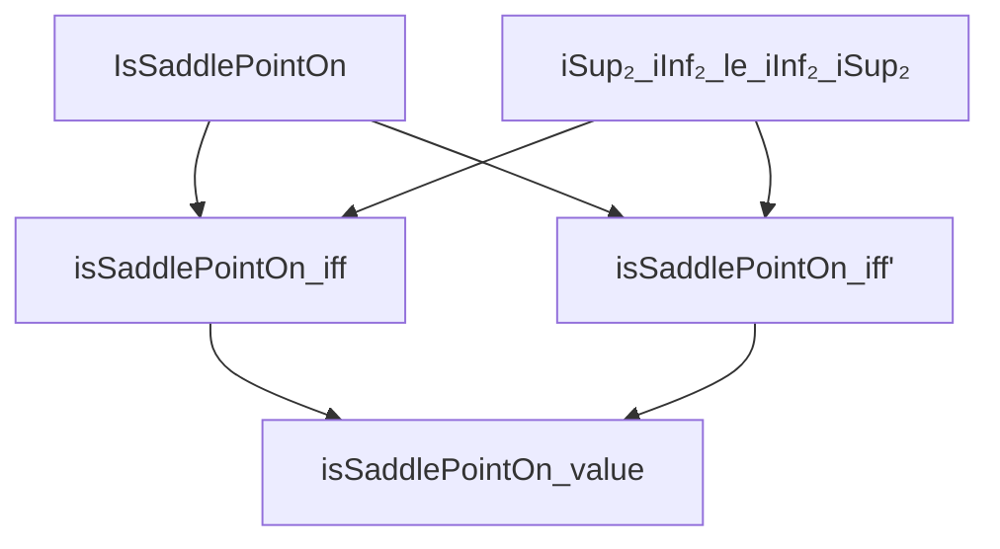
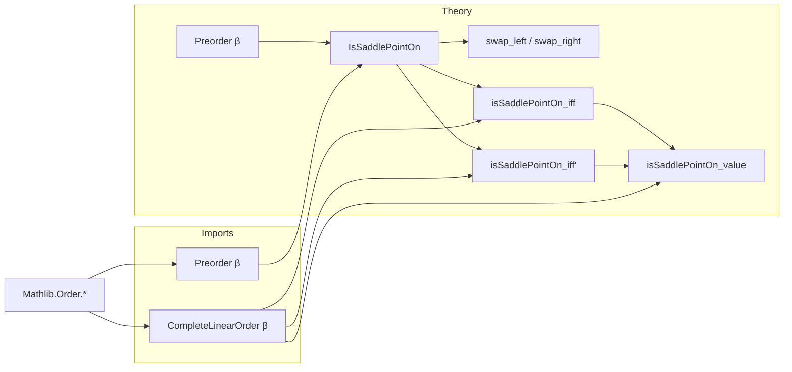

### Technical Brief: `SaddlePoint.lean`

---

#### **1. Key Definitions & Theorems**

| Name | Type / Signature | Purpose |
|------|------------------|---------|
| `IsSaddlePointOn` | `def IsSaddlePointOn [Preorder β] (a : E) (b : F) : Prop` | Defines a *saddle point* $(a,b)$ of $f$ on $X \times Y$: $\forall x \in X, y \in Y,\ f(a,y) \le f(x,b)$. Does **not** require $a \in X$, $b \in Y$. |
| `iSup₂_iInf₂_le_iInf₂_iSup₂` | `theorem` | Trivial minimax inequality: $\sup_{y \in Y} \inf_{x \in X} f(x,y) \le \inf_{x \in X} \sup_{y \in Y} f(x,y)$ in a complete linear order. |
| `isSaddlePointOn_iff` | `lemma` | Characterization: $(a,b) \in X \times Y$ is a saddle point iff $\sup_{y \in Y} f(a,y) = f(a,b) = \inf_{x \in X} f(x,b)$. |
| `isSaddlePointOn_iff'` | `lemma` | Equivalent formulation: $(a,b) \in X \times Y$ is a saddle point iff $\sup_{y \in Y} f(a,y) \le \inf_{x \in X} f(x,b)$. |
| `isSaddlePointOn_value` | `lemma` | If $(a,b)$ is a saddle point, then both $\inf_{x \in X} \sup_{y \in Y} f(x,y)$ and $\sup_{y \in Y} \inf_{x \in X} f(x,y)$ equal $f(a,b)$. |

---

#### **2. Naming Conventions**

- **Prefixes**:
  - `is_`: Predicate definitions (`isSaddlePointOn`, `isSaddlePointOn_iff`, `isSaddlePointOn_iff'`, `isSaddlePointOn_value`).
  - `iSup₂_`, `iInf₂_`: Indexed supremum/infimum over sets (`iSup₂_iInf₂_le_iInf₂_iSup₂`).
- **Suffixes**:
  - `_le_`: Inequality direction (`iSup₂_iInf₂_le_iInf₂_iSup₂`).
  - `_iff`: Logical equivalence characterizations (`isSaddlePointOn_iff`, `isSaddlePointOn_iff'`).
  - `_value`: Value extraction or equality result (`isSaddlePointOn_value`).
- **Variable naming**:
  - `E`, `F`: Type parameters for domain spaces.
  - `β`: Codomain (preordered / complete linear order).
  - `X`, `Y`: Subsets of `E`, `F`.
  - `f : E → F → β`: Bivariate function.

---

#### **3. Tactic Stack**

Frequent tactics used in proofs:

| Tactic | Usage |
|--------|-------|
| `rw` | Rewriting definitions and hypotheses (e.g., `rw [isSaddlePointOn_iff ha hb]`). |
| `apply` | Applying lemmas or implications. |
| `trans` | Chaining inequalities (e.g., `trans f a b`). |
| `le_antisymm` | Proving equality via double inequality. |
| `simp only [iSup_le_iff]`, `simp only [le_iInf_iff]` | Simplifying quantified sup/inf goals. |
| `exact`, `intro`, `refine` | Standard intro/proof construction. |
| `iSup₂_mono`, `iInf₂_mono` | Monotonicity of indexed sup/inf. |
| `le_trans` | Transitivity of order. |
| `le_rfl` | Reflexivity of ≤. |

No heavy automation (e.g., `aesop`, `linarith`) — proofs are mostly manual and order-theoretic.

---

#### **4. Proof Logic**

- **Structure**: Proofs rely heavily on:
  - **Order-theoretic properties** of complete linear orders (e.g., existence of sup/inf, antisymmetry).
  - **Indexed sup/inf calculus** (`iSup₂`, `iInf₂`).
  - **Case analysis** on membership (`ha : a ∈ X`, `hb : b ∈ Y`).
- **Typical flow**:
  1. Unfold `IsSaddlePointOn` definition.
  2. Use `le_antisymm` to prove equalities.
  3. Apply `iSup₂_le_iff`, `le_iInf₂_iff`, etc., to reduce to pointwise inequalities.
  4. Use `h a ha y hy` or `h' x hx b hb` to substitute saddle point condition.
  5. Combine with `le_trans`, `le_iSup₂`, `iInf₂_le`, etc.

Example: In `isSaddlePointOn_iff`, the proof splits into two directions:
- **→**: Show both equalities using `le_antisymm` and saddle point condition.
- **←**: Use the equalities to bound $f(a,y) \le f(a,b) \le f(x,b)$.

---

#### **5. Imports & Dependencies**

| Import | Purpose |
|--------|---------|
| `Mathlib.Order.ConditionallyCompleteLattice.Basic` | Provides basic order theory (inf/sup, completeness assumptions). |
| `Mathlib.Order.OmegaCompletePartialOrder` | For $\omega$-complete partial orders (though not directly used here, may support future extensions). |

**Note**: The file assumes `CompleteLinearOrder β` for most key results — stronger than just `Preorder`.

---

#### **6. Mermaid Diagrams**

##### **Dependency Graph (Theorems & Definitions)**

##### **Overview of File Structure**

---

#### **7. Theory Context**

- **Mathematical domain**: Order theory, convex analysis, game theory (saddle points as equilibria).
- **Reference**: Based on Hiriart-Urruty’s *Fundamentals of Convex Analysis* (cited as `[Hiriart-Urruty, ...]`).
- **Goal**: Formalize minimax principles and saddle point characterizations in Lean, with emphasis on constructive order-theoretic reasoning.

--- 

Let me know if you'd like a formalized summary in `lean` docstring format or a visualization of the proof tree for `isSaddlePointOn_iff`.
