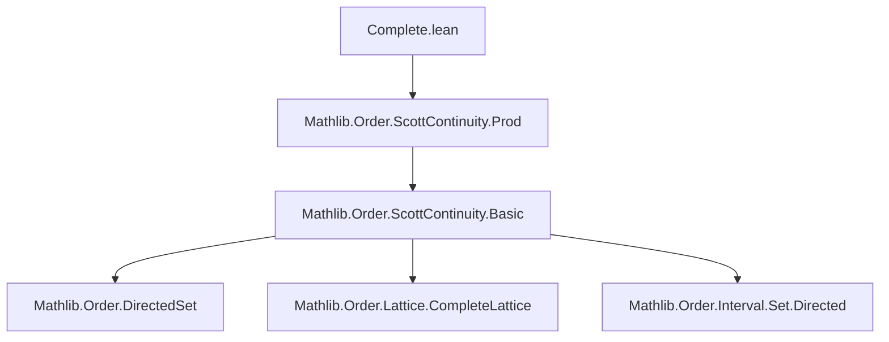

**Technical Brief: Complete.lean — Scott Continuity on Complete Lattices**

---

### 1. **Key Definitions & Theorems**

| Name | Type / Signature | Purpose |
|------|------------------|---------|
| `ScottContinuous` | `f : α → β → Prop` (implicit via `OrderTheory.ScottContinuity`) | Predicate stating that `f` preserves directed suprema (i.e., is Scott-continuous). |
| `scottContinuous_iff_map_sSup` | `∀ f, ScottContinuous f ↔ ∀ d, d.Nonempty → DirectedOn (· ≤ ·) d → f (sSup d) = sSup (f '' d)` | Core equivalence: Scott continuity ⇔ commutation with `sSup` over nonempty directed sets. |
| `ScottContinuous.map_sSup` | `ScottContinuous f → d.Nonempty → DirectedOn (· ≤ ·) d → f (sSup d) = sSup (f '' d)` | Forward direction of the equivalence (used to extract the commuting property). |
| `ScottContinuous.of_map_sSup` | `(∀ d, d.Nonempty → DirectedOn (· ≤ ·) d → f (sSup d) = sSup (f '' d)) → ScottContinuous f` | Reverse direction (constructs Scott continuity from the commuting property). |
| `scottContinuous_inf_right` | `a : β → ScottContinuous (fun b ↦ a ⊓ b)` | Right multiplication (meet) by a fixed element is Scott continuous in a complete linear order. |
| `scottContinuous_inf_left` | `b : β → ScottContinuous (fun a ↦ a ⊓ b)` | Left multiplication (meet) by a fixed element is Scott continuous. |
| `ScottContinuous.inf₂` | `ScottContinuous fun (a, b) ↦ a ⊓ b` | Binary meet operation is Scott continuous (as a function on the product). |

---

### 2. **Naming Conventions**

- **Prefixes**:
  - `scottContinuous_`: for lemmas establishing Scott continuity of specific constructions.
  - `map_sSup`: indicates a property about commuting with `sSup`.
- **Suffixes**:
  - `_iff_`: for equivalences (e.g., `scottContinuous_iff_map_sSup`).
  - `_left`, `_right`: for binary operations where argument order matters (e.g., `inf_left`, `inf_right`).
- **`inf₂`**: indicates a *binary* version of `inf` (i.e., on `α × α`), following Lean’s convention for n-ary operations (`inf₂`, `sup₂`, etc.).

---

### 3. **Tactic Stack**

- `rw`: Used repeatedly to rewrite using equalities (e.g., `inf_sSup_eq`, `sSup_inf_eq`, `isLUB_iff_sSup_eq`).
- `sSup_image`: Rewrites `sSup (f '' d)` as image of `sSup` under `f` when `f` preserves suprema.
- `fromProd`: tactic/constructor from `OrderTheory.ScottContinuity.Prod` to build Scott continuity on product types.
- `aesop`, `simp_rw`, `ring`: *not present* in this file — proof automation is minimal; relies on explicit rewriting and known lemmas.

---

### 4. **Proof Logic**

- **Main equivalence (`scottContinuous_iff_map_sSup`)**:
  - `mp`: Uses `isLUB_iff_sSup_eq` to translate Scott continuity (defined via preservation of LUBs of directed sets) into `f(sSup d) = sSup(f '' d)`.
  - `mpr`: Constructs Scott continuity by showing that `f` preserves LUBs, using the assumption that it commutes with `sSup` on directed sets.

- **Meet continuity proofs**:
  - `scottContinuous_inf_right` / `scottContinuous_inf_left`: Apply `of_map_sSup`, then rewrite using:
    - `inf_sSup_eq` (right meet distributes over `sSup` over directed sets),
    - `sSup_inf_eq` (left meet distributes over `sSup` over directed sets),
    - `sSup_image` to match the image form.
  - `inf₂`: Combines the two unary cases using `ScottContinuous.fromProd`, which lifts Scott continuity of each argument to the binary operation on the product.

---

### 5. **Imports**

- `Mathlib.Order.ScottContinuity.Prod`: Provides `ScottContinuous.fromProd`, used to prove continuity of binary operations on product types.

> **Note**: The file does *not* import full Scott topology definitions (e.g., `Topology.IsScott`) — it focuses on the *order-theoretic* characterization of Scott continuity.

---

### 6. **Mermaid Diagrams**

#### **Dependency Graph (File-Level)**

#### **Conceptual Overview (Theory Flow)**

> **Note**: The final implication (`I → J`) is mentioned in the docstring but not proven in this file — it is referenced for context and points to a related result (`Topology.IsScott.scott_eq_upper_of_completeLinearOrder`).

--- 

Let me know if you'd like the corresponding `scott_topology.lean` theory overview or formalization of the equivalence with the upper topology.
