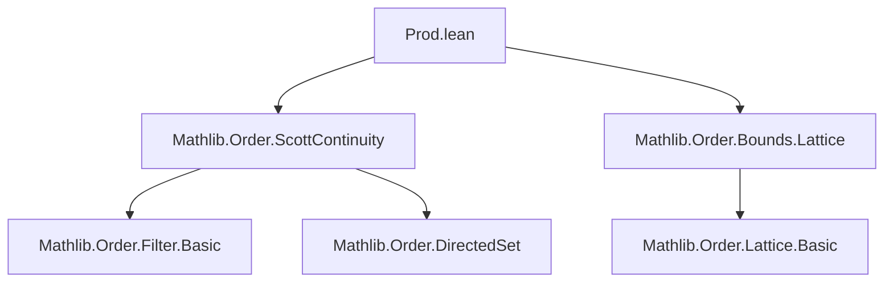

### Technical Brief: `Prod.lean` — Scott Continuity on Product Spaces

---

#### **1. Key Definitions & Theorems**

| Name | Type / Signature | Purpose |
|------|------------------|---------|
| `ScottContinuousOn.fromProd` | `[Preorder α] [Preorder β] [Preorder γ] → {f : α × β → γ} → {D : Set (Set (α × β))} → (∀ a, ScottContinuousOn ((Prod.snd '' _) '' D) (fun b ↦ f (a, b))) → (∀ b, ScottContinuousOn ((Prod.fst '' _) '' D) (fun a ↦ f (a, b))) → (∀ a, Monotone (fun b ↦ f (a, b))) → (∀ b, Monotone (fun a ↦ f (a, b))) → ScottContinuousOn D f` | Establishes Scott continuity of `f` on a directed family `D` under separate Scott continuity and monotonicity in each argument. |
| `ScottContinuous.fromProd` | `[Preorder α] [Preorder β] [Preorder γ] → {f : α × β → γ} → (∀ a, ScottContinuous (fun b ↦ f (a, b))) → (∀ b, ScottContinuous (fun a ↦ f (a, b))) → ScottContinuous f` | Global version: if `f` is Scott continuous in each variable (globally), then `f` is Scott continuous. |
| `ScottContinuous.prod` | `[Preorder α] [Preorder β] [Preorder α'] [Preorder β'] → {f : α → α'} → {g : β → β'} → ScottContinuous f → ScottContinuous g → ScottContinuous (Prod.map f g)` | Product of Scott continuous maps is Scott continuous. |

---

#### **2. Naming Conventions**

- **Prefixes**:
  - `ScottContinuousOn_`: for relative (on a set) Scott continuity lemmas.
  - `ScottContinuous_`: for global Scott continuity lemmas.
  - `fromProd`: indicates construction *from* product arguments.
  - `prod`: indicates construction *of* a product map.

- **Suffixes**:
  - `_of_`: e.g., `fromProd_of_ScottContinuous` (implied in docstring) — derivation from component-wise properties.

- **Variable naming**:
  - `a`, `b`: elements of first/second component domains.
  - `d`, `D`: directed sets / families.
  - `f`, `g`: functions.
  - `p1`, `p2`: components of a pair.

---

#### **3. Tactic Stack**

Frequent tactics used in proofs:

| Tactic | Role |
|--------|------|
| `rw` / `simp_rw` | Rewriting definitions (e.g., `scottContinuousOn_univ`, image of products). |
| `aesop` | Automated simplification and rewriting of set-theoretic identities (e.g., `e1`, `e2`). |
| `exact` / `convert` | Applying known lemmas (`isLUB_prod`, `singleton_nonempty`, etc.). |
| `ext` + `simp_all only [...]` | Extensionality + simplification using `mem_image`, `Prod.exists`, etc. |
| `have` + `rw` | Introducing intermediate equalities (e.g., image of `d` under `(a, g b)`). |

---

#### **4. Proof Logic**

- **Structure of `ScottContinuousOn.fromProd`**:
  1. **Goal**: Show `f` preserves suprema of directed sets in `D`.
  2. **Reduction**: Use `isLUB_congr` and rewrite image of `d` under `f` via Fubini-style decomposition:
     - `f '' d = ⋃ a ∈ fst '' d, {f(a, b) | b ∈ snd '' d}`.
  3. **Apply component-wise Scott continuity**:
     - Outer supremum over `a ∈ fst '' d`, inner over `b ∈ snd '' d`.
     - Use `isLUB_iUnion_iff_of_isLUB` to interchange suprema.
  4. **Monotonicity** ensures applicability of `monotone_prod_iff` and preservation of upper bounds.

- **Structure of `ScottContinuous.prod`**:
  1. Reduce to `ScottContinuous.fromProd`.
  2. For fixed `a`, show `(b ↦ (f a, g b))` is Scott continuous using `singleton ×ˢ g '' d`.
  3. For fixed `b`, similarly use `f '' d ×ˢ singleton`.
  4. Apply `ScottContinuous.prod` lemma for singletons and directed images.

---

#### **5. Imports & Dependencies**

| Module | Purpose |
|--------|---------|
| `Mathlib.Order.ScottContinuity` | Core definitions: `ScottContinuous`, `ScottContinuousOn`, `isLUB`, directed sets, etc. |
| `Mathlib.Order.Bounds.Lattice` | Lattice-theoretic background: monotonicity, bounds, suprema/infima in lattices. |

> **Note**: No explicit lattice completeness assumptions are needed for the main lemmas — only preorders and directedness.

---

#### **6. Mermaid Diagrams**

##### **Dependency Graph (Module-Level)**



##### **Overview of Theory Flow**

```mermaid
flowchart LR
  A[Preorders α, β, γ] --> B[Directed sets D ⊆ P(α×β)]
  B --> C[Component-wise Scott continuity + monotonicity]
  C --> D[ScottContinuousOn D f]
  D --> E[Global Scott continuity via D = univ]
  F[ScottContinuous f, g] --> G[ScottContinuous (Prod.map f g)]
```

##### **Proof Strategy Flow (for `ScottContinuousOn.fromProd`)**

```mermaid
flowchart TD
  Start[Goal: ScottContinuousOn D f] --> Decompose[Decompose f '' d]
  Decompose --> ImageFst[Image under fst: ⋃_{a ∈ fst '' d} ...]
  ImageFst --> ImageSnd[Image under snd: ⋃_{b ∈ snd '' d} ...]
  ImageSnd --> ApplyH1[Apply h₁: Scott continuity in b]
  ApplyH1 --> ApplyH2[Apply h₂: Scott continuity in a]
  ApplyH2 --> UseMonotone[Use monotonicity for lub preservation]
  UseMonotone --> LUBConvergence[Conclude: f preserves lub of d]
```

---

#### **7. Additional Notes**

- The lemmas are **constructive** and rely heavily on the characterization of suprema in product orders via `isLUB_prod`.
- The `Prod.map` result is foundational for building Scott-continuous operations on product types (e.g., in domain theory or denotational semantics).
- The `inf₂` lemma mentioned in the docstring is **not present** in this file — possibly deferred or in a companion module.

--- 

Let me know if you'd like the `inf₂` lemma formalized or a formal proof of Scott continuity of meet in a complete linear order.
